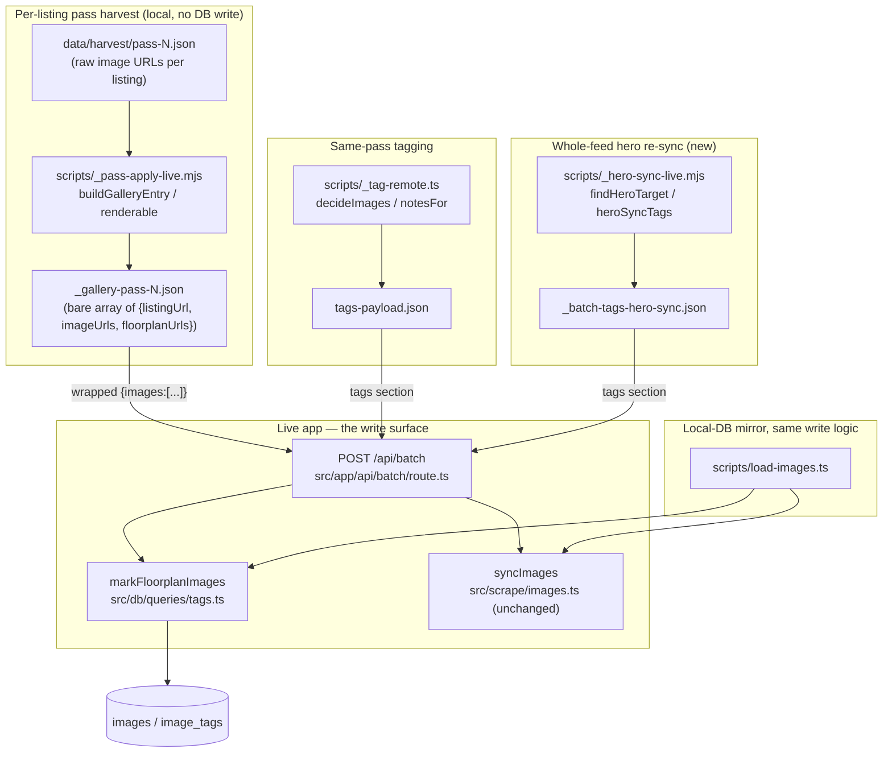

# Walkthrough: Domain floorplans and heroes in the property round

**Branch:** `fix/domain-floorplans-heroes` off `main` (change base `941972b`)
· finishes with a **local merge into `main`**, its actual parent — standing
user rule, no PR. Nothing has been committed on the branch yet, so every
anchor below is `path:line` against the working tree, not a commit hash.

Run `20261003-1801-fix-domain-floorplans-heroes`, full `dev-loop` (the change
touches a public contract — `POST /api/batch`'s `images[]` shape — and spans
app code, round scripts and docs). The user reported two symptoms measured on
the live app on 2026-10-03: 65 of 303 live Domain listings render no
floorplan (64 of those have none stored at all), and 29 heroes don't match
Domain's current cover (4 with two heroes). The lead hand-repaired the *data*
for the hero drift before this run started; this diff is the **code** fix so
the drift and the gap stop recurring.

**Out of scope, stated in the brief and held to:** no new read endpoint that
lists hidden images; no change to `isVisibleImage`/`isPropertyPhoto`; no
change to REA scripts beyond not breaking them; no write to `data/app.db`,
`data/images` or `data/media`, and nothing pushed to the live app from this
run — the lead does the data repair after merge and deploy; no auth on
`/api/batch` (an existing, documented decision, not reopened here).

## Architecture



## Sequence — one floorplan closing the gap end to end

```mermaid
sequenceDiagram
    participant Pass as _pass-apply-live.mjs
    participant Push as batch-push.mjs
    participant Route as POST /api/batch
    participant Sync as syncImages
    participant Mark as markFloorplanImages

    Note over Pass: Listing already has photos; this capture also carries a `_3_` url
    Pass->>Pass: buildGalleryEntry(url, imageCount>0, imgs)
    Note over Pass: imageCount>0 branch -> FLOORPLAN-ONLY entry,<br/>imageUrls = floorplanUrls = just the `_3_` url(s)
    Pass->>Push: {listingUrl, imageUrls:[fpUrl], floorplanUrls:[fpUrl]}
    Push->>Route: POST images:[entry]
    Route->>Sync: syncImages(propId, [fpUrl], listingUrl)
    Note over Sync: content-hash dedup — a genuinely new URL downloads;<br/>a re-signed repeat of an already-stored floorplan is a no-op
    Route->>Mark: markFloorplanImages(propId, [fpUrl])
    Note over Mark: match stored row by exact source_url,<br/>or by basename if Domain-slot-shaped and re-signed
    Mark-->>Route: {marked: 1} (or 0 if already notes='floorplan')
    Route-->>Push: {downloaded, floorplansMarked}
    Note over Push: SKILL.md Finish reports floorplans added from THIS field,<br/>never from the pass summary's floorplanOnlyEntries (req-003/req-005)
```

## Change table

| File | Change | Notes |
| --- | --- | --- |
| `src/db/queries/tags.ts` | `markFloorplanImages()` (new), `MarkFloorplansResult`, `DOMAIN_SLOT_BASENAME_RE`, local `basename()` | Entrypoint for the server-side mark — see The flow |
| `src/app/api/batch/route.ts` | `images[]` entries gain optional `floorplanUrls?: string[]`; `markFloorplanImages` called per entry after `syncImages`; response gains `floorplansMarked` (aggregate + `perListing`) | Backward compatible — see Decisions |
| `scripts/load-images.ts` | CLI mirror: reads `floorplanUrls` from the same item shape, calls `markFloorplanImages` after `syncImages` | Parity with the route per brief's instruction |
| `scripts/_pass-apply-live.mjs` | `isFloorplanBasename` (new, exported); `renderable()` bypasses the shape filter for a `_3_` basename; `buildGalleryEntry()` extracted pure function returns a normal entry, a floorplan-only entry, or `null`; `main()`'s body now calls it and tracks `floorplanOnlyCount`/`newPhotosCount` separately | Entrypoint for root causes 1 and 2 — see The flow |
| `scripts/_tag-remote.ts` | `isFloorplanBasename`, `DetectedImage.sourceUrl`, `heroIndexFor`, `decideImages`, `notesFor`, `shouldClassify` (extended), `ifAbsentFor` (extended), `roomTypeFor` all now decide from each image's own `sourceUrl`, not a shared capture-array index | Round 1 fix for tech-001/req-001 — see Decisions |
| `scripts/_hero-sync-live.mjs` (new) | `buildCoverMaps`, `coverForProperty`, `findHeroTarget`, `heroSyncTags`, `main()` | Entrypoint for root cause 4 — see The flow |
| `.claude/skills/update-properties/SKILL.md` | Step 3 (gallery) and step 4 (tagging) rewritten for the floorplan-only path; new step 5 hero re-sync block; Finish's STOP condition and reporting line rewritten | Deliverable — see Decisions |
| `CLAUDE.md` | One line added to the `/api/batch` table's `images` row | Ignore for behaviour — doc parity only |
| `package.json` | Four new test files appended to the `test` script chain | This repo has no test auto-discovery — mechanical |
| `test/floorplan-mark.test.ts`, `test/pass-apply-live.test.ts`, `test/tag-remote-floorplan.test.ts`, `test/hero-sync-live.test.ts` (all new) | See Tests | |

## The flow

| Entrypoint | Trigger | First changed file it reaches |
| --- | --- | --- |
| Root causes 1 + 2 (capture) | `node scripts/_pass-apply-live.mjs <name>` | `scripts/_pass-apply-live.mjs:36` (`renderable`) → `:82` (`buildGalleryEntry`) |
| Root cause 3 (mark at insert) | `POST /api/batch`, `images[]` section | `src/app/api/batch/route.ts:141` → `src/db/queries/tags.ts:216` (`markFloorplanImages`) |
| Root causes 4 + 5 (same-pass tag + hero) | `npx tsx scripts/_tag-remote.ts <out>` | `scripts/_tag-remote.ts:139` (`decideImages`) |
| Root cause 4 (whole-feed re-sync) | `node scripts/_hero-sync-live.mjs <out>` | `scripts/_hero-sync-live.mjs:102` (`heroSyncTags`) |

**Root causes 1 and 2 are both inside `buildGalleryEntry`
(`_pass-apply-live.mjs:82-91`), and the function is pure on purpose** — no
fs/network — so `test/pass-apply-live.test.ts` can drive it directly instead
of through a harvest file on disk. `renderable()` (`:36-45`) used to drop any
square image outright as an agent card or logo; it now checks
`isFloorplanBasename()` (`:26`, the `_3_` crop code in Domain's own basename
convention, the same ground truth REA's `MediaFloorplan` typename gives for
free) *first* and returns `true` unconditionally for it, because Domain
commonly serves floorplans at exactly the square aspect (1200×1200) this
filter exists to reject. `buildGalleryEntry` then branches on the property's
**currently stored** `imageCount` (`:85-90`): zero photos still gets the old
full-gallery push, now including any `_3_` urls that survived `renderable`;
a property that already has photos gets a **floorplan-only entry** instead of
being silently skipped — `imageUrls` holds only the `_3_` urls, never a photo
already stored, which is the hard constraint against duplicating a gallery
whose URLs Domain re-signs every capture. `main()`'s loop (`:204-217`) feeds
this and tracks `floorplanOnlyCount` separately from `newPhotosCount`, so the
console summary (`:225-239`) doesn't conflate "offered this round" with
"actually new" — see Decisions for why that distinction needed a second pass
of its own (req-003/req-005).

**Root cause 3 is why the mark has to happen on the server, not in a script.**
Follow `buildGalleryEntry`'s output into `POST /api/batch`
(`src/app/api/batch/route.ts:141-175`): each `images[]` entry's optional
`floorplanUrls` is read after `syncImages(prop.id, norm, it.listingUrl)`
(`:156`) completes, then passed to `markFloorplanImages(prop.id,
it.floorplanUrls ?? [])` (`:160`). `markFloorplanImages`
(`src/db/queries/tags.ts:216-259`) re-reads **every stored image of the
property**, not just this call's URLs (`:223-230`), and matches each by exact
`source_url` or — only for a Domain-slot-shaped basename
(`DOMAIN_SLOT_BASENAME_RE`, `:197`) — by basename, because a re-signed Domain
URL can only still match the older stored row that way. A match is skipped
outright when `tagged_by==='user'` or `notes==='hero'` (`:243-244`); otherwise
it keeps the existing `room_type`/`confidence` and writes `notes='floorplan'`
(`:246-256`) — and a row already correctly marked isn't rewritten at all
(`:247`), so `marked` stays an honest "wrote this call" count, not a "matched"
count. `scripts/load-images.ts:8,44` calls the exact same function after its
own `syncImages` call, per the brief's "keep shared logic in
`src/db/queries/`" instruction — there is one `markFloorplanImages`, not a
server copy and a CLI copy.

**Root causes 4 and 5 both live in `_tag-remote.ts`'s per-image decision, and
they share one bug that round 1 found.** `decideImages`
(`scripts/_tag-remote.ts:139-147`) now derives `isFloorplan` from each
`DetectedImage`'s own `sourceUrl` (`:145`, `isFloorplanBasename`) and `isHero`
from `heroIndexFor` matching that same `sourceUrl` against the feed cover
(`:115-123`) — not, as the pre-round-1 version did, from the image's position
in the raw pass capture array (`v.imgs`). **The next section is where that
distinction mattered enough to need its own regression test** — follow
`notesFor` there.

**Root cause 4's whole-feed half is a new script because `_tag-remote.ts`
structurally can't cover it.** `_tag-remote.ts` only ever visits listings in
the current pass; a listing nobody re-captured this round never gets its
hero re-checked. `_hero-sync-live.mjs:131-194`'s `main()` instead walks every
live Domain property via `getAllLiveProperties` (`:141`), resolves each
one's current feed cover with `coverForProperty` (`:61-66`, listingUrl first,
external-id fallback for a relist), finds the stored image that should be the
hero with `findHeroTarget` (`:75-81`), and computes the convergence tag rows
with `heroSyncTags` (`:102-129`) — which is also where the user-tag hard
constraint and the floorplan-demotion rule live; see Decisions.

## Decisions

### Floorplan identity comes from the `_3_` basename, not a position or a model guess
Domain's own basename convention — `<listingId>_<n>_3_<…>` is a floorplan,
`_1_` a photo — is measured ground truth (64 of 80 captured listings this
round carried exactly one `_3_` image), the same kind of signal REA's
`MediaFloorplan` type already gives for free. The alternative this replaces —
"the last image the model classifies as `other`" — depended on gallery
position and therefore on capture order, which is exactly what the next
decision shows can't be trusted. This basename check is now the single
decision point for three different things: the shape filter
(`_pass-apply-live.mjs:26`), the server-side mark
(`src/db/queries/tags.ts:197`), and the hero exclusion
(`_tag-remote.ts:48`, `_hero-sync-live.mjs:26`) — duplicated as a one-line
regex in each rather than shared, which is its own decision below.

### The brief's skip rule was relaxed mid-run, then unrelaxed again by round-1 review
This is carried over context, not new to this diff, but it's why
`markFloorplanImages` and `_hero-sync-live.mjs`'s skip logic look the way
they do: an earlier version of this class of fix (recorded in a prior run's
walkthrough, `docs/walkthroughs/four-reported-defects.md`) relaxed a
guess-avoidance rule and caused a live regression. This run's brief is
written the way it is — basename-only, never position, never a guess —
specifically to not repeat that. Nothing in this diff re-opens that question;
it's recorded here so a reviewer doesn't mistake the basename-only rule for
an arbitrary stylistic choice.

### Server marks floorplans at insert time; three cheaper alternatives were rejected
`markFloorplanImages` runs inside `POST /api/batch`, not a follow-up script,
because an unmarked square floorplan is filtered out by `isVisibleImage` and
image ids are randomly generated (`newId`) — the rendered page is the only
HTTP read path this round has, and it shows visible images only. So no
script running after the fact can ever learn the new row's id to tag it.
Three alternatives were considered and rejected: a new endpoint listing
unfiltered images (adds a read surface for one narrow need); relaxing
`isVisibleImage` for `_3_` basenames (an app-wide behaviour change, explicitly
a non-goal, and it still leaves the image untagged); deterministic image ids
(a schema-level change to fix a tagging gap). Marking at insert time, inside
the one write path that already knows the row's real id, needed none of the
three.

### The basename fallback is gated to Domain-slot-shaped basenames only
The brief's basename-fallback rule ("Domain re-signs URLs, match by basename
too") was tried against REA data during review and found to collide: every
REA image shares the literal basename `image.jpg` (or `.png`), so an
ungated basename fallback would have marked every stored photo of an REA
property as a floorplan the moment any one of its images matched by exact
URL. `DOMAIN_SLOT_BASENAME_RE` (`/^\d+_\d+_\d+_/`, `tags.ts:197`) restricts
the fallback to Domain's own numeric slot shape; a non-matching basename
(REA's) is compared by exact `source_url` only. The alternative — drop
basename matching entirely — was rejected because it's still needed for the
case it was built for: a Domain floorplan re-signed between captures, where
the dedup keeps the *older* row under its *original* URL and nothing but the
basename survives the re-sign.

### tech-001/req-001: the floorplan and hero decision read the wrong array
Round 1 review found that `_tag-remote.ts`'s pre-fix floorplan/hero decision
indexed into the raw pass capture (`v.imgs[i]`) using a stored image's
*position*, not its own URL. Those two arrays are not the same shape or
order — `dedupSlots`, the zero-photo gate, and a floorplan-only append in
`_pass-apply-live.mjs` all shift stored/live order away from capture order —
and the misalignment was reproduced on six real listings. The fix threads
`sourceUrl` through `DetectedImage` (`_tag-remote.ts:58-76`) and
`heroIndexFor`/`decideImages` (`:115-147`) now decide `isFloorplan`/`isHero`
entirely from each image's own `sourceUrl`, never a shared index. The test
suite had the same defect one level up: the first version of
`test/tag-remote-floorplan.test.ts` re-implemented the hero/floorplan
ternary by hand rather than importing it, so a reviewer's mutation of the
real ternary didn't fail any test (tests-001, Critical). The fix extracts
`notesFor` (`_tag-remote.ts:156-158`) as the one place the decision is
written, and the test imports it rather than copying it.

### req-002: hero re-sync needs an external-id fallback for relists
`_hero-sync-live.mjs`'s first version matched the feed to a live property by
`listingUrl` only. A relisted property keeps its *old* `listing_url` (the
server merges the new capture onto the existing row by address) while its
`externalId` already follows the *new* Domain listing id — so a URL-only
lookup misses exactly the listings most likely to have picked up a new
cover, the scenario this whole feature exists for. `coverForProperty`
(`:61-66`) falls back to matching the feed row's trailing listing id against
the property's own `externalId` when the URL lookup misses. The alternative
— inline this matching logic directly in `main()` — was rejected because it
would have been untestable before the fix landed, and this run's rule is
test-first for anything `would_have_been_bug: true`.

### req-004: the brief contradicted itself on which user tags are protected, and the hard constraint won
The brief's hero-sync skip rule named only a current hero tagged `'user'`.
The run's hard constraint — no new path may ever overwrite a `tagged_by='user'`
row — is wider: it also covers the *target* image, which the skip rule as
written didn't protect. The lead's remedy, recorded rather than silently
implemented: a target with `tagged_by==='user'` is skipped (reported
`user-target`) **only when its `notes` is already non-null** — a hand
correction with real content to lose. A user-tagged target whose `notes` is
still `null` carries nothing to lose and may still take the hero mark
(`heroSyncTags`, `_hero-sync-live.mjs:106`). This is the one place in the run
where the brief and the hard constraint actually disagreed rather than one
merely under-specifying the other, so it went to the lead rather than being
resolved by the sidekick.

### req-003 / req-005: counting "offered" as "added" was wrong twice, in two different places
A floorplan-only entry gets re-offered by `_pass-apply-live.mjs` every round
for as long as the capture still carries that `_3_` url — intentionally, so
a transient miss self-heals — but that means the pass summary's
`floorplanOnlyEntries`/`newPhotos` counts "offered," not "added." Round 1
fixed the pass script's own count (`newPhotosCount`,
`_pass-apply-live.mjs:155-156,212-216`, excluded from `newPhotos`) and pointed
`SKILL.md`'s Finish step at `/api/batch`'s response fields instead
(`downloaded`/`floorplansMarked`). Round 2 found the overstatement had moved
rather than vanished: `markFloorplanImages`'s own `marked` counter was
counting a row that *matched* but was already correctly tagged — i.e. the
no-op path — as marked. The fix (`tags.ts:247-256`) counts only rows the call
actually wrote; `SKILL.md`'s Finish line now also states plainly that
re-offers continue every round by design, rather than implying they stop
once marked.

### Hero-sync coverage is reported, not gated, and `SKILL.md`'s STOP condition is keyed on `failedImageIds`, not a bucket name
`_hero-sync-live.mjs` is read-only and always finishes with a report
(`notInFeed`/`noTarget`/`userHero`/`userTarget`/`alreadyCorrect`/`resynced`,
`main():146-154`) rather than failing the run over any of those buckets — a
listing genuinely absent from the current feed, or one with a hand-picked
hero, isn't a defect to gate on. Separately, `SKILL.md`'s own coverage-gap
check (`Finish`, `floorplan:coverage`) was already carrying a stricter rule
from this same run's earlier rounds: its STOP condition fires only when a
property's `noCandidateStored` bucket has an **empty** `failedImageIds` —
non-empty means some candidates simply weren't looked at yet, which a re-run
fixes on its own, not something worth asking the user to approve a browser
capture for.

### The `_3_` basename regex is duplicated three times, by convention, not shared
`isFloorplanBasename` is defined independently in `_pass-apply-live.mjs:26`,
`_tag-remote.ts:48`, and `_hero-sync-live.mjs:26` — three one-line regexes
doing the same check. A `scripts/lib/floorplan-basename.mjs` shared module
was considered and rejected as scope creep: this codebase's round scripts
already mix `.mjs` and `.ts` and already duplicate small basename helpers
this way (`extOf`/`base` appear independently in both
`_pass-apply-live.mjs` and `_hero-sync-live.mjs` too), and
`.claude/review/conventions.md` accepts this specific shape of
producer-side duplication. Introducing one shared module for just this one
helper, while leaving the others duplicated, would have been an inconsistent
half-fix rather than a clean one.

### `_pass-apply-live.mjs` had to be split into exported helpers plus an `isMain`-guarded `main()` before any of this was testable
Before this run, the entire script ran at module scope with no guard —
importing it to test `buildGalleryEntry` in isolation would have run the
whole CLI as a side effect of the import. `isFloorplanBasename`, `renderable`,
`dedupSlots`, and `buildGalleryEntry` were lifted to module-level exports;
the file-reading and `console.log` reporting moved into `main()`, gated by
the same `isMain` check `_tag-remote.ts` and `_hero-sync-live.mjs` already
use (`:265-267`). The selftest's own output was confirmed byte-identical
before and after the refactor — this was a pure lift, not a rewrite of the
script's behaviour, which is why the diff to this file is large but the
production logic in it barely changed.

### One new test file per production file, not folded into the existing suites
`floorplan-mark.test.ts`, `pass-apply-live.test.ts`, `tag-remote-floorplan.test.ts`,
and `hero-sync-live.test.ts` are each new files rather than additions to
`test/batch.test.ts` or `test/tag-remote-detect.test.ts`. `batch.test.ts` is
already roughly 1000 lines and floorplan marking is a separate concern from
what it already covers; `tag-remote-detect.test.ts` owns detection, not the
floorplan/hero decision. Merging the new hero-sync tests into the tag-remote
file was also considered and rejected — the two scripts share no fixture
shape worth reusing.

## Where to look to review this

In priority order:

1. `src/db/queries/tags.ts:192-259` (`DOMAIN_SLOT_BASENAME_RE`,
   `markFloorplanImages`) against `test/floorplan-mark.test.ts` cases 4, 5,
   9 and 10. Confirm a `user`/`hero` row truly cannot be overwritten, and
   that the basename fallback cannot cross-match an REA `image.jpg`.
2. `scripts/_tag-remote.ts:58-194` (`DetectedImage`, `heroIndexFor`,
   `decideImages`, `notesFor`, `shouldClassify`, `ifAbsentFor`) against
   `test/tag-remote-floorplan.test.ts`. This is the tech-001/req-001/
   tests-001 story — confirm every decision reads `sourceUrl`, never an
   array index, and that floorplan outranks hero even when both would be
   true for the same image.
3. `scripts/_hero-sync-live.mjs:61-129` (`coverForProperty`,
   `findHeroTarget`, `heroSyncTags`) against `test/hero-sync-live.test.ts`.
   Confirm the `user-hero`/`user-target` skips (req-004) and the relist
   `externalId` fallback (req-002), and that an already-correct listing
   emits an empty `tags` array.
4. `scripts/_pass-apply-live.mjs:36-91` (`renderable`, `buildGalleryEntry`)
   against `test/pass-apply-live.test.ts`. Confirm a square `_3_` basename
   is kept while a square non-`_3_` basename is still dropped, and that a
   property with photos gets a floorplan-only entry rather than nothing.
5. `src/app/api/batch/route.ts:141-175` against
   `test/floorplan-mark.test.ts` cases 1, 2, 6 and 7. Confirm
   `floorplansMarked` counts only rows actually written this call (req-005)
   and that an entry with no `floorplanUrls` key behaves exactly as before.

## Tests

**Four new files, appended to `package.json`'s `test` script**
(`test/floorplan-mark.test.ts`, `test/pass-apply-live.test.ts`,
`test/tag-remote-floorplan.test.ts`, `test/hero-sync-live.test.ts`). All are
network-free: `floorplan-mark.test.ts` drives the real `POST /api/batch`
route against a temp SQLite DB with pre-seeded image rows (same pattern as
`test/batch.test.ts`) and every `imageUrls` sent through it is `[]`, so
`syncImages` has nothing to download; the other three test pure, exported
functions against in-memory fixtures shaped like the live HTTP helpers'
return values.

`floorplan-mark.test.ts` covers exact-URL and basename-after-resign matches,
room-type preservation, the `user`/`hero` no-overwrite rules, full
idempotency (including `tagged_at` staying untouched on a repeat call), the
REA `image.jpg` collision regression guard (tech-002), and the
Domain-slot-shaped basename fallback still working. `tag-remote-floorplan.test.ts`
exercises `notesFor`/`decideImages`/`heroIndexFor` against the exact
sourceUrl-vs-index misalignment that caused tech-001/req-001, including the
case where hero and floorplan would coincide on the same image.
`hero-sync-live.test.ts` covers `findHeroTarget`'s exact and prefix-fallback
matches, `heroSyncTags`'s `no-target`/`user-hero`/`user-target` skips, the
stray-hero-clear and stray-floorplan-demote paths, idempotency (an
already-correct listing emits `[]`), and `coverForProperty`'s relist
`externalId` fallback (req-002). `pass-apply-live.test.ts` covers the
square-`_3_`-kept vs square-non-`_3_`-dropped shape-filter split (root cause
1) and the `imageCount > 0` floorplan-only branch (root cause 2).

**Mutation-checked at three separate points.** While writing the tests, the
sidekick self-checked 6 behaviours by mutation (the basename fallback, the
user-tag guard, idempotency, the `_3_` shape bypass, the floorplan-only
branch, and the user-hero skip) and left the notes ternary itself unexported
and un-mutation-tested, since it carries no logic beyond calling `notesFor`
in a fixed order. Round 1's tests lane then mutated that exact ternary —
reordering it to check hero before floorplan — and every existing test still
passed: the test covering it reimplemented the ternary by hand instead of
importing it, so no mutation could ever fail it (tests-001, Critical). Round
2's tests lane, after the fix, mutated five more spots across the diff's
production files; four were confirmed as isolated kills, each failing
exactly the test guarding it, and the fifth — `coverForProperty`'s relist
fallback — couldn't be confirmed independently because an earlier mutation in
the same file already failed the test first, so it's logged as unconfirmed
rather than a clean kill. Round 2's tests lane reported 0 findings on its own
account.

**Deliberately not covered, stated rather than silently absent:**

- `req-003`'s fix to `_pass-apply-live.mjs`'s summary wording (floorplan-only
  re-offers excluded from `newPhotos`) has no unit test. The summary block
  is `fs`-bound inside `main()`, and this particular remedy was judged
  `would_have_been_bug: false` — it's a reporting label, not logic a wrong
  value could silently corrupt data through.
- The deep floorplan classification pass (`floorplan:coverage` without
  `--fast`) and the full `update-properties` round itself were not run
  end-to-end against the live app as part of this change — that's a
  multi-hour model sweep plus a live write, and nothing in this diff needed
  it to prove correct; the next scheduled round exercises it as a matter of
  course.

`npm test`, `npx tsc --noEmit`, and lint were the brief's definition of
done. Independent verification re-ran the first two in a scratch worktree:
all 34 files pass, including the 4 new ones, and `tsc --noEmit` is clean.
There is no lint config anywhere in this repo, so that check doesn't apply.

## Open questions

Carried verbatim from `notes.md`'s own Open questions section:

- *"node_modules was emptied when the round-2 scratch worktree (with a
  junctioned node_modules from the tests lane) was removed with --force;
  restored with npm ci. Future scratch teardown: remove the junction first
  (cmd /c rmdir)."* — a process note about this run's review infrastructure,
  not about the shipped code; left here rather than dropped, since the next
  run's teardown step should account for it.
