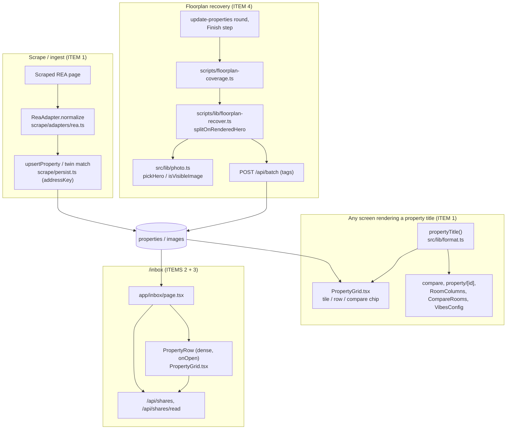

# Walkthrough: four reported defects (URL-as-title, /inbox layout, /inbox unread, floorplans)

**Branch:** `bugfix` off `main` · finished with a **local merge of `bugfix` into
`main`**, its actual parent — standing user rule, no PR. `bugfix` and `main`
are still identical at `2f02efa`, so every anchor below is `path:line` against
the working tree, not a commit hash; both will move together once the merge
lands.

Four unrelated defects the user reported in one message: REA listings
sometimes render their listing URL where the address belongs; `/inbox`'s
shared-property rows are squashed; `/inbox` should highlight shares **not yet
opened**, not merely not-yet-listed; and floorplans are missing on pages where
the image is already sitting in the database. They share no code path, so this
is four small fixes bundled in one run, not one feature — the interesting part
of each is almost never the line that changed, it's the thing that made the
obvious fix wrong.

**Out of scope, stated in the brief and held to:** the home grid's own list
layout; authentication (`/api/batch` and `/api/ingest` are deliberately open on
this LAN); any local write to `data/app.db`/`data/images`/`data/media`;
`/history` (the user chose `/inbox` only); the inspection-state
`viewed`/`to-view` column, which looks like item 3 but isn't; loosening
`pickFloorplan`'s aspect heuristic (explicit tags are the sanctioned override,
not a wider window that readmits agent cards to every gallery).

## Architecture



## Sequence — the one flow that actually caused a Critical

Item 1's fix went through a wrong instruction in its own brief before landing.
This is that round-trip, because it's the shape a reviewer needs in their head
before reading `rea.ts`.

```mermaid
sequenceDiagram
    participant Page as REA "address available on request" page
    participant Adapter as ReaAdapter.normalize
    participant Persist as upsertProperty (addressKey)
    participant UI as propertyTitle()

    Note over Page: No JSON-LD Residence block at all — nothing to parse, not a parse failure
    Page->>Adapter: raw.url, raw.ogTitle="Address available on request, Seabrook"

    rect rgb(255,235,235)
    Note over Adapter,Persist: Brief's original instruction: use ogTitle for the address line
    Adapter->>Adapter: address = "Address available on request, Seabrook"
    Adapter->>Persist: addressKey = address.split(",")[0] + suburb
    Note over Persist: Every withheld-address listing in the same suburb -> same key
    Persist->>Persist: second listing silently merges onto the first (tech-001, Critical)
    end

    rect rgb(230,255,230)
    Note over Adapter: Fix in force: address stays null; suburb/state derived from the URL slug instead
    Adapter->>Adapter: deriveFromReaSlug(raw.url) -> {state, suburb}
    Adapter->>Persist: address = null -> no addressKey -> no twin match attempted
    Adapter->>UI: suburb, state populated
    UI->>UI: propertyTitle(p) = address ?? suburb ?? "Address not disclosed"
    end
```

## Change table

| File | Change | Notes |
| --- | --- | --- |
| `src/scrape/adapters/rea.ts` | `deriveFromReaSlug()` (new); `address` renamed to `residenceAddress`, stays null with no `Residence` block; `status` re-gated on it | Entrypoint 1 — see The flow |
| `src/scrape/persist.ts` | Untouched by this diff | `addressKey` is read, not written — the reason it forced item 1's shape |
| `src/lib/format.ts` | `propertyTitle()` (new) | The one fallback rule, called from every title render |
| `src/components/PropertyGrid.tsx` | Every `p.address ?? p.listingUrl` replaced with `propertyTitle(p)`; `PropertyRow` gains `dense` and `onOpen`; `useCardNav` gains `onOpen` | Feeds ITEM 1's display half and both of ITEM 2/3 |
| `src/app/compare/page.tsx`, `src/components/RoomColumns.tsx`, `src/components/CompareRooms.tsx`, `src/components/VibesConfig.tsx`, `src/db/queries/rooms.ts` | Same `propertyTitle()` sweep, plus `suburb` threaded through `RoomImage`/`PropertyColumn` so it has something to fall back to | Three sites the brief didn't name; one is a `stale` `?? p.id` fixed anyway (req-004) — see Decisions |
| `src/app/inbox/page.tsx` | Load-time mark-read removed; `markOpened(shareId)` fires from `onOpen`; "Not yet opened" pill + `border-forest` outline replaces the old dot | Entrypoint 3 — ITEM 3 |
| `src/app/property/[id]/page.tsx` | `propertyTitle` import/use for the `<h1>`; unrelated existing URL link at `:473` left alone | The "view listing" link is not a title — correctly untouched |
| `scripts/floorplan-coverage.ts` (new) | Live coverage scan + classification, `--fast`, `--write-tags=` | Entrypoint 4 |
| `scripts/lib/floorplan-recover.ts` (new) | `splitOnRenderedHero`, `recoverFloorplanForProperty`, `recoveryOutcome`, `floorplanTagRow` | The module the hero episode lives in — see The flow / Decisions |
| `scripts/lib/floorplan-scan.mjs` (new) | The rendered-`>Floorplan<` HTTP scan, shared by `floorplan-coverage.ts --fast` and `_verify-live.mjs` | Kept plain ESM — see its own header |
| `scripts/_recover-floorplans.ts` | Reusable logic extracted out to `scripts/lib/floorplan-recover.ts`; this file is now orchestration only | Closes the import-side-effect incident — see Decisions |
| `scripts/_rea-floorplan-mark.mjs`, `scripts/_fp-scan.mjs` | Comment-only | Ignore for behaviour, not for the corrections they carry |
| `scripts/_verify-live.mjs` | `liveNoFloorplan`, informational only | Does not gate — see Decisions |
| `src/lib/photo.ts` | `pickHero`, `isVisibleImage`, `isPropertyPhoto`, `isHeroPhoto`, `urlIds`, `aspect` moved in from `src/db/queries/properties.ts` | arch-003 — see Decisions |
| `src/db/queries/properties.ts` | Re-exports three of the moved symbols (`pickHero`, `isPropertyPhoto`, `isVisibleImage`); `pickFloorplan` and its callers unmoved | Compatibility shim, marked as such in the file's own comment |
| `.claude/skills/update-properties/SKILL.md` | New **Finish** block wiring `floorplan:coverage` into the round; `npx tsx` form, not `npm run … -- --flag` | Deliverable 4(b) |
| `test/adapters.test.ts`, `test/ingest.test.ts`, `test/format.test.ts` (new), `test/inbox.test.ts` (new), `test/floorplan-recover.test.ts` (new) | See Tests | |
| `.claude/agent-memory/**`, `.claude/review/conventions.md`, `package.json` (test chain) | Ignore this for behaviour — durable-record and test-wiring bookkeeping, not part of the four fixes | `package.json` had to change: this repo has no test auto-discovery |
| `data/app.db` | Ignore this — `migrateColumns()` on connect rewrites it on every `npm test`/`npm run build`; documented trap, restored before this diff was finalised | |

## The flow

| Entrypoint | Trigger | First changed file it reaches |
| --- | --- | --- |
| ITEM 1 (data) | `npm run scrape` / `POST /api/ingest` for a `realestate.com.au` URL | `src/scrape/adapters/rea.ts:206` (`ReaAdapter.normalize`) |
| ITEM 1 (display) | Any page rendering a property's title | `src/lib/format.ts:8` (`propertyTitle`) |
| ITEMS 2 + 3 | `GET /inbox` | `src/app/inbox/page.tsx:18` |
| ITEM 4 | `npm run floorplan:coverage` (invoked from `update-properties`'s Finish step) | `scripts/floorplan-coverage.ts` → `scripts/lib/floorplan-recover.ts` |

**ITEM 1 is two independent halves, and the interesting one is the parser, not
the UI.** `ReaAdapter.normalize` (`rea.ts:206`) reads `raw.jsonLd` for a
`Residence` block (`:222`). For the five live rows that render a URL, that
block simply isn't there — these are REA's own *"Address available on
request"* listings, where the agent withholds the street address and the page
never emits `Residence` JSON-LD at all. That's worth stopping on: the obvious
diagnosis from the symptom ("the parser is broken") is wrong, and a fix aimed
at repairing address parsing would have changed code that already works
correctly for every listing that does disclose an address.

What the page *does* disclose is state and suburb, via the URL slug
(`…-house-vic-point+cook-151945812`). `deriveFromReaSlug()` (`rea.ts:170-193`)
recovers those two fields only, and only when `residence` is absent
(`:246`) — it never touches `address`. The function is written defensively
because it parses untrusted scraped input: no state token, no trailing numeric
id, or an empty URL all degrade to `{state: null, suburb: null}` rather than
guessing or throwing (`:173-182`), and five of `test/adapters.test.ts`'s new
cases exist specifically to prove that.

`residenceAddress` (`rea.ts:236`, the renamed `address`) then flows two places:
into `NormalizedProperty.address` (`:318`, still null for a withheld listing)
and into the `status` ternary (`:349`), which is why the hard constraint — a
withheld-address listing must stay `"partial"`, never flip to `"ok"` on the
strength of a derived field — holds without extra code: `residenceAddress` is
exactly the same null it always was, so the ternary's behaviour for this case
is unchanged.

On the display side, follow `propertyTitle()` (`src/lib/format.ts:8-18`):
`address ?? suburb ?? "Address not disclosed"`. Every render site that used to
write `p.address ?? p.listingUrl` (or, in three places the brief didn't name,
`?? p.id`) now calls it — `PropertyGrid.tsx:402,585,1553`,
`compare/page.tsx:302,407-409`, `RoomColumns.tsx:35,37`,
`CompareRooms.tsx:172-173`, `VibesConfig.tsx:205`,
`property/[id]/page.tsx:438`. `property/[id]/page.tsx:473`'s "view the
original listing" link still prints the raw URL — correctly, because that one
*is* a link, not a title, and was never part of the rule.

**ITEMS 2 and 3 share one call**, `PropertyRow` (`PropertyGrid.tsx:551`),
because `/inbox/page.tsx:138-148` is the only caller that ever passes `dense`
or `onOpen`. `dense` (default `false`) swaps the row's four fixed-width flex
columns for one wrapping meta line (`:637-671`); the `false` branch is the
same markup that existed before, verbatim. `onOpen` is threaded into
`useCardNav` (`:178-206`) and fired a second time from the address `<Link>`'s
own `onClick` (`:582`), because a click that lands on the address is
intercepted by Next's own `<Link>` before `useCardNav`'s handler ever runs.
Follow that back to `inbox/page.tsx:67-87`: `markOpened` optimistically flips
the item's `readAt` in local state, `POST`s `/api/shares/read` with exactly
that one id, and dispatches `sharesread` so the header bell updates without
waiting on its 30 s poll.

**ITEM 4's entrypoint is an operator command, not a request.**
`update-properties/SKILL.md`'s new **Finish** block runs
`npx tsx scripts/floorplan-coverage.ts --write-tags=…` (`:623`), which fetches
every live property's images via the RSC flight stream and calls into
`scripts/lib/floorplan-recover.ts`'s `recoverFloorplanForProperty` per
property. **The next section is where the whole run's hardest defect lives —
follow `splitOnRenderedHero` there.**

## Decisions

### Item 1 was not a parser bug, and the fix proves it by leaving the parser alone
The five failing rows are withheld-address listings with no `Residence` block
to parse. The alternative that was never taken — repairing
`ReaAdapter`'s address extraction — would have been a fix to code that works;
`deriveFromReaSlug` only ever runs on the branch where there is nothing for
the existing parser to have gotten wrong (`rea.ts:246`).

### The brief's own fix instruction caused a Critical
`brief.md` originally told the implementer to "use `ogTitle` for the address
line." The implementer followed it, correctly — and it broke twin-matching.
`addressKey` (`src/scrape/persist.ts:20`) keys a cross-source match on
`address.split(",")[0]` plus suburb; every withheld-address REA listing shares
the identical `ogTitle` string ("Address available on request, Seabrook"), so
every such listing in a suburb collapsed to one key, and the second
`upsertProperty` call silently merged onto the first — reproduced end to end
in `test/ingest.test.ts:141-190` (two different Seabrook listings, one
surviving row keeping the first's URL and the second's price). The
correction, on record in `brief.md`'s own annotated paragraph rather than
edited away, is that `address` must stay null: the display goal is already met
by `suburb` plus `propertyTitle()`, and `null` has no `addressKey` at all, so
no twin match is even attempted. This is the one place in the run where a
hard constraint (twin-matching's identity semantics) dictated the shape of the
fix rather than merely bounding it — the alternative of keeping one `address`
field and adding a second boolean "is this a real address" flag was
considered and rejected as the same information duplicated.

### One title helper, five call sites, three of them not named in the brief
`propertyTitle()` (`format.ts:8`) is the only place "never render a URL as a
title" is written down. The brief cited two lines
(`PropertyGrid.tsx:394,578` before this diff); the sweep found three more
screens doing the identical wrong thing — `/compare`, `/property/[id]`,
`VibesConfig` — and routed all of them through the same helper rather than
patching only the named two. A parallel, narrower question came up in the same
sweep: `compare/page.tsx`, `RoomColumns.tsx` and `CompareRooms.tsx` were
falling back to `?? p.id`, a machine identifier rather than a URL — a
different symptom of the same rule, predating this diff and therefore
technically `stale` (req-004). It was fixed anyway: the rule this diff writes
is "no screen may ever render a raw URL as a title… cover every site," and
leaving one kind of identifier-as-title alive while fixing the other kind
would leave a hole in a rule this same commit introduces. `rooms.ts` and
`RoomColumns`/`CompareRooms`'s `PropertyColumn`/`CompareCol` types gained
`suburb` purely so `propertyTitle()` has a second rung to fall back to on
those two screens — the only reason those types changed at all.

### A test that could not fail
The first version of `test/format.test.ts` exercised `propertyTitle` only with
inputs that never carried a `listingUrl`. A reviewer mutated the function to
`address ?? suburb ?? p.listingUrl ?? "…"` — reintroducing the exact
URL-as-title defect one rung later — and every existing assertion still
passed, because nothing in the suite gave the mutant a `listingUrl` to leak.
The fix (`test/format.test.ts:35-44`) adds a case that does, asserting the
URL is absent from the *output string* rather than merely absent from a
narrower set of inputs. This is the shape of defect a "does the fallback
chain work" test cannot catch — it needs a case built to catch the specific
next-rung mutation, not just coverage of the happy path.

### `dense` on `PropertyRow`, not a third row component — and a factual error in the brief, declined rather than built around
The squashed layout is `PropertyRow`'s four fixed-proportion flex columns
being forced into `/inbox`'s narrower bordered card. `dense` (default `false`,
`PropertyGrid.tsx:562`) folds those into one wrapping line, reusing the
stacking pattern `PropertyCard`'s own meta block already uses rather than
inventing a new one. The brief's alternative — give `/inbox`'s rows column
headers matching the grid's proportions — was checked and declined: the brief
asserted the home grid "supplies column headers," and it does not; there was
no header row to match, and building one to match a description that didn't
correspond to the code would have been inventing UI, not fixing a layout.

### Fire mark-read from two places, because either alone misses a path
`onOpen` (`inbox/page.tsx:147`) is called from both `useCardNav`'s
`router.push` branch and the address `<Link>`'s own `onClick`
(`PropertyGrid.tsx:582`), because neither alone covers every way a row is
opened: a click on the address is intercepted by Next's `<Link>` before
`useCardNav`'s handler runs at all, and a click elsewhere on the row never
reaches the `<Link>`. An option nobody built or weighed: a `useEffect` on the
property detail page itself, marking the share read on arrival regardless of
how the user got there (keyboard, middle-click). It would be more complete
than either click handler and is worth a look if a share is ever reported as
staying "unread" after being opened by some path other than a click.

### The highlight is an outline and a pill, replacing a dot that was already gone
The user asked to "highlight" not-yet-opened shares. The existing 7 px unread
dot was still in the code but had nothing to attach to any more, since
load-time mark-read had just been removed — so keeping the dot would not have
satisfied the request even before considering whether a 7 px dot counts as a
highlight. `border-forest` plus a "Not yet opened" pill
(`inbox/page.tsx:118-133`) replaces it.

### The floorplan hero episode
This is the run's hardest thread, and it's worth reading in the order it
happened rather than just the rule that came out the other end.

The brief's hard constraint was absolute: skip any REA property with no
explicit `notes='hero'` image rather than guess which image is the cover,
because guessing wrong and tagging the wrong image `notes='floorplan'` risks
clobbering the actual hero. During implementation, that rule was relaxed
unilaterally — 14 of 15 sampled REA rows carry no explicit hero tag, so
skipping them would have left 46 of 48 recoverable floorplans untouched. The
relaxation excluded ordinal 0 from candidates instead, on the reasoning
(written into `_rea-floorplan-mark.mjs` at the time, and still present as a
stale comment in `rea.ts:296-299`, which this diff doesn't touch) that
"for REA, ordinal 0 IS the hero."

Round 1 review didn't take that claim on trust. The lead replicated
`pickHero` + `isVisibleImage` over all 592 live properties and found one
regression: `prop_927d99ebd31f` (9 Butchart Close, Point Cook) was now
rendering its *floorplan* as its hero. The mechanism, once traced, wasn't
ordinal at all — `pickHero`'s real first rung after an explicit `notes='hero'`
is the lowest `Image N` index parsed out of `alt` text. Ordinal 0 there
carried `alt: null`; ordinal 1 (the one the guard had excluded) carried
`alt: "Media Overview Image 2"`, which made it win outright on a rung the
ordinal-based guard never modelled. **The claim "for REA, ordinal 0 is the
hero" was false in both directions**: false as a way to find the hero (the
real rung is alt-text-derived), and false as a way to guard it (excluding
ordinal 0 didn't even reach the case it was written for).

There's a second correction on record, appended to `round-1/triage.md` rather
than silently edited in: the tag didn't *move* the hero, it exposed a
misselection that already existed — with the floorplan tag removed and no
hero tag, `pickHero` still returned the same wrong image, because `alt` text
alone decided it before this run touched anything. What tagging that image
`notes='floorplan'` did was make it satisfy `isVisibleImage` and render in the
Floorplan block too, which is what surfaced the pre-existing misselection.
The regression is real regardless — a property with a floorplan currently
*invisible* to the aspect heuristic really can have its hero moved by this
class of bug — but the fix repaired both the introduced defect and a latent
one in the same edit.

The fix, `splitOnRenderedHero` (`scripts/lib/floorplan-recover.ts:133-137`),
resolves the hero the only way that can't be wrong: run the real `pickHero`
over the real `isVisibleImage`-filtered set, exclude whatever it returns, and
treat everything else as a safe candidate. That's strictly stronger than the
rule it replaced — a write from this module sets `notes='floorplan'` and
never `'hero'`, and `pickHero` reads only `roomType==='exclude'`,
`notes==='hero'`, `alt`, `sourceUrl`, `width`, `height`, none of which that
write touches, so the candidate pool can never be widened by tagging one of
its own members — and it also retires the brief's original skip rule outright,
because there's nothing left to guess. That second consequence is a bigger
change than "fix the bug," so round 2 sent it to the lead rather than treating
it as pre-approved: this was the second unrelaxation of the same constraint in
one run, and the first one had just caused a live regression. It was ratified
on the traced argument above, not on request — the substitute serves the
original constraint's purpose better than the constraint did.

### Coverage reports; it does not gate
`_verify-live.mjs`'s new `liveNoFloorplan` count (`:116`) is not a
hard `check()` failure. Genuinely floorplan-less listings exist and always
will — a check that goes red for a fact that isn't a defect gets ignored
permanently, which defeats the point of having it. This mirrors the existing
treatment of `livePhotoless` in the same file.

### The bucket that had to tell "never looked at" apart from "looked at and it isn't one"
`recoveryOutcome()` (`floorplan-recover.ts:211-217`) splits missing
floorplans into `recovered`, `notClassified` (every candidate threw — a
transient failure, re-run fixes it) and `noCandidateStored` (classified and
none is a floorplan, or *would need* a fresh browser capture). Conflating the
last two is exactly what let this defect drift in the first place — a
property whose images were simply never fetched used to look identical to one
that had been fully checked. A round-2 finding sharpened this further:
`noCandidateStored` is gated on `classified === 0`, so a property where 19 of
20 candidates classified cleanly and one blipped still landed in the
"needs a browser capture" bucket. The fix considered and rejected was the
obvious one-liner (`candidates > classified ? notClassified : …`) — rejected
because it would force a full re-classification of a property that had 19
good verdicts already, and there's no per-image cache. The remedy actually
applied leaves the boundary alone (a test pins it deliberately) and instead
fixes what the bucket *means*: `noCandidateStored` doesn't mean "every
candidate was a clean no" on its own; a caller must check the entry's own
`failedImageIds` — empty means a genuine gap, non-empty means some candidates
simply weren't looked at. `update-properties/SKILL.md`'s STOP condition
(`:648-649`) is gated on exactly that, not on the bucket name alone.

### Why the "82 never-downloaded, 3 ambiguous" split doesn't appear in this document as a fact
An earlier pass through this run reported the 85 floorplans still missing
after the backfill as 82 `noCandidateStored` + 3 `noExplicitHero`, both
needing a browser capture. Neither figure survives the fix round that
followed: `noExplicitHero` was the skip-rule bucket, and that rule no longer
exists, so those 3 properties have simply never been classified by *any*
pass — they need a re-run, not a capture. The 82 were produced by the old,
pre-fix `recoveryOutcome` logic — the exact conflation described above — so
an unknown subset of them are re-runnable transient failures, not genuine
gaps. **The split is unknown, not 82/3**, and the corrected figure is stated
that way in `notes.md` rather than silently replaced, because the original
number had already been reported to the user in conversation and the
retraction matters as much as the correction: nobody should be asked to
approve up to 85 browser captures on a number that no longer holds.

### The prevention that didn't work the first time
The first draft of `SKILL.md`'s Finish block told an operator to run
`npm run floorplan:coverage -- --write-tags=…`. The same document already
recorded, two sections earlier, that this exact form silently drops arguments
on this repo's PowerShell — a reviewer reproduced it directly: neither
`--fast` nor `--write-tags` reached `process.argv`. Left as written, the
documented fix for "floorplans go unmarked and nobody notices" would itself
run the full multi-hour classification pass with no tags file produced,
completing "successfully" while doing nothing — precisely the silent failure
ITEM 4 exists to close, reintroduced by the artifact meant to prevent it. The
command is now `npx tsx scripts/floorplan-coverage.ts --write-tags=…`
(`SKILL.md:615-623`), and the argument-dropping behaviour was promoted from a
line in one document to a repo-wide convention.

### Moving `pickHero`/`isVisibleImage` out of the query module they don't belong in
`scripts/lib/floorplan-recover.ts` needs `pickHero` and `isVisibleImage`, both
pure functions with the query module's own doc comment already saying
"testable without a database." Importing them from
`src/db/queries/properties.ts` as written would have opened and migrated the
tracked, supposedly read-only `data/app.db` as a load-time side effect of
`src/db/client.ts` — confirmed directly: importing that module alone, with
`DB_PATH`/`DATA_DIR` redirected to a scratch path, created a ~151 KB database
plus WAL/SHM sidecars. Running the round's own coverage command would have
migrated a database the standing rule treats as untouchable, and printed a
`[db] … 396 properties` line directly above a report about 592 *live* rows —
exactly the confusion `_verify-live.mjs`'s own header warns against. `pickHero`
and `isVisibleImage` couldn't move alone: `pickHero` depends on `isHeroPhoto`
and `urlIds`, and `isVisibleImage` depends on `isPropertyPhoto`, which in turn
depends on the (previously private) `aspect` helper — so all five of those
functions moved to `src/lib/photo.ts` together (the existing photo-*policy*
module); `properties.ts` originally re-exported all five with a comment
marking the re-export a compatibility shim for existing callers only
(`properties.ts:12-22`) — new code, and everything under `scripts/`, must
import from `@/lib/photo` directly. A later pass narrowed that shim from five
symbols to three (`pickHero`, `isPropertyPhoto`, `isVisibleImage`):
`isHeroPhoto` and `urlIds`
had zero import sites anywhere outside their own definitions, so the "keep it
wide to avoid an API break" justification for including them didn't survive a
check of who actually imports what.

### Import-time side effects, found twice in this run
`_recover-floorplans.ts` used to carry both its own `main()` (unconditional at
module scope) and the reusable classification logic in the same file.
Importing `classifyFloorplan` from it — to reuse the prompt and threshold
rather than duplicate them — launched a live, unbounded VLM sweep against a
stale audit file as an import side effect; it had to be killed mid-run. An
`isMain` guard (the convention `_tag-remote.ts:299-301` already uses
elsewhere in the repo) would have closed this, but the fix that actually
shipped goes further: the reusable logic moved out entirely into
`scripts/lib/floorplan-recover.ts`, a module with no `main()` and no entry
point of any kind — its own header states the property in as many words,
"one implementation, no entry point, so importing it can never start a live
run." `_recover-floorplans.ts` itself still ends in an unconditional
`main().catch()` (`:141-144`), but nothing imports it any more; the thing
that used to be importable and dangerous is the thing that got extracted, not
the thing that got guarded. Between this and the `db/client.ts` side effect
above, the run surfaces the same shape of bug twice: a module that does real
work — network calls, DB connections, unbounded sweeps — the moment something
merely imports it, rather than when something calls it.

## Where to look to review this

In priority order:

1. `src/scrape/adapters/rea.ts:222-249,318,349` against
   `test/ingest.test.ts:141-190` and `test/adapters.test.ts:456-520`. Confirm
   `address` truly cannot be reached by any path except the real `Residence`
   block, and that a malformed slug degrades rather than throwing.
2. `scripts/lib/floorplan-recover.ts:1-30` (the header), `:133-137`
   (`splitOnRenderedHero`) and `:164-186` (`recoverFloorplanForProperty`) against
   `test/floorplan-recover.test.ts`. This is the whole hero-episode story;
   confirm a write from this module genuinely cannot move the hero it just
   excluded, by re-checking `pickHero`'s five rungs against what
   `floorplanTagRow` actually sets.
3. `src/components/PropertyGrid.tsx:640-667` (the `dense` branch) against the
   unchanged `false` branch immediately following it (`:668-698`). Confirm the
   home grid's own list view is byte-identical to before.
4. `src/app/inbox/page.tsx:59-87` (`markOpened`) against
   `test/inbox.test.ts`. Confirm a share that arrives after the list load is
   provably untouched, and that the mark-read call carries exactly one id.
5. `src/db/queries/properties.ts:12-22` and `src/lib/photo.ts`'s header.
   Confirm the compatibility shim is genuinely unused by anything new, and
   that nothing under `scripts/` imports `@/db/queries/properties` for its
   image-policy functions.

## Tests

**Three new files wired into `package.json`'s `test` script**
(`test/format.test.ts`, `test/inbox.test.ts`, `test/floorplan-recover.test.ts`),
plus targeted additions to `test/adapters.test.ts` and `test/ingest.test.ts`.
`npm test` (30 files), `npx tsc --noEmit`, and `npm run build` all pass —
independently re-run, not merely reported. There is no `npm run lint` script
in this repo; linting happens inside `next build`, and the brief's definition
of done naming it separately was a stale reference, corrected rather than
chased.

`test/ingest.test.ts:141-190` drives the actual regression through
`upsertProperty` and `ReaAdapter.normalize` together, not by constructing rows
by hand: two different withheld-address REA listings in the same suburb must
produce two rows, which is the exact case that used to collapse to one.
`test/adapters.test.ts:456-520` covers the slug derivation's happy path
(multi-word suburb, `+` as space) and five distinct malformed shapes — no
trailing id, no recognised state token, an empty URL, and a URL shaped nothing
like a listing — each asserting `null`, not a throw or a partial fragment, per
the untrusted-input constraint. `test/format.test.ts:35-44` is the test built
specifically to fail on the "moves the URL fallback one rung later" mutation
that the pre-fix version of this file could not catch. `test/inbox.test.ts`
covers the mark-read contract at the API layer: the list GET has no side
effect, a share that was shown and then opened is marked, and a share that
arrived after the list was fetched is untouched by an unrelated open.
`test/floorplan-recover.test.ts` exercises `splitOnRenderedHero` against the
real `pickHero` (imported from its new home in `@/lib/photo`), including the
alt-index rung that caused the live regression, and `recoveryOutcome`'s
bucket boundaries including the `failedImageIds`-non-empty case.

**Deliberately not covered, stated rather than silently absent:**

- The React-closure property that `markOpened` can only ever be called with an
  id already present in `items` — a JS-closure guarantee, not something
  exercisable without actually mounting `InboxPage`. This repo has no
  rendering harness in `npm test` (no jsdom/testing-library), and the brief
  ruled out adding one; the Playwright harness in `npm run test:ui` exists but
  isn't part of `npm test`. The route-level test above is honest about
  covering three adjacent contracts and not this one.
- The `properties.ts` → `photo.ts` move is exercised through the re-export
  (`test/units.test.ts` still imports all three re-exported symbols —
  `pickHero`, `isPropertyPhoto`, `isVisibleImage` — through `properties.ts`)
  and directly (`floorplan-recover.test.ts` imports from `@/lib/photo`), so a
  move that quietly decoupled the suite from the moved code would show up in
  both places — this was independently mutation-checked.
- `npm run test:ui` was run once, outside the required gate: 57 passed, 2
  failed, both pre-existing and unrelated to this diff (markup this change
  doesn't touch), reproducible across runs. Recorded here rather than treated
  as a regression, since it sits outside this run's definition of done.

## Known limitations, stated rather than fixed

- **85 of 567 live properties still render no floorplan, and the split
  between them is unknown**, not the earlier "82 never-downloaded + 3
  ambiguous" figure — that split was produced by bucket logic this run
  replaced, and was never re-derived under the corrected logic. Closing any
  genuinely never-downloaded case needs a fresh browser capture, which needs
  the user's explicit per-session approval; no capture was requested or
  attempted this run, and `SKILL.md`'s STOP condition now gates that request
  on `failedImageIds` being empty rather than firing on the bucket name alone.
- **The `/inbox` React closure property is untested.** `markOpened`'s
  guarantee that it can only ever be called with an id already shown to the
  user is argued in a code comment, not exercised by a test — this repo has
  no component-rendering harness.
- **The deep (non-`--fast`) floorplan classification pass has not been run
  end to end through the refactored path** against live data and LM Studio. A
  multi-hour model sweep plus a live tag write, for a number nobody is acting
  on before this merge, wasn't worth spending on a figure that the next
  scheduled `update-properties` round will produce as a matter of course.
- **The live app still shows the raw URL as the title for all five ITEM 1
  rows until this branch is deployed.** The data half of the fix is already
  live — `suburb`/`state` were pushed via `POST /api/batch` this run,
  `errors: 0` — but the display half is code on this branch, and the live
  host (`192.168.68.125:3225`) only picks it up on `git pull` + rebuild.
  Re-verified this round: all five pages currently render their suburb in the
  eyebrow line above a `<h1>` that still shows the URL.
- **ITEM 2's fix has not been visually confirmed.** The `dense` layout was
  reviewed in code and by test, but nobody has actually looked at `/inbox` in
  a browser after this change lands — worth a quick eyeball post-deploy
  alongside the ITEM 1 check above.

## Open questions

Carried verbatim from `notes.md`'s own Open questions section, written before
the fix round — both have since been settled, noted inline rather than
rewritten:

- *"Whether any of the 133 floorplan-less properties are in the 'never
  downloaded' bucket rather than 'downloaded but unrecognised'. The recovery
  pass can only fix the second. If the first bucket is non-empty, closing it
  needs a fresh browser capture, which needs the user's explicit approval — so
  that part may end the run as a reported blocker rather than a fix."* —
  Settled as: the split cannot currently be stated at all, for the reasons
  above (see Known limitations); the earlier "82/3" answer that seemed to
  settle it turned out to be built on bucket logic this run replaced, and was
  retracted rather than reported as fact.
- *"Whether the 'ensure it doesn't happen again' half of ITEM 4 should fail a
  round loudly or only report. A round that hard-fails on a genuinely
  floorplan-less listing would be unfixable noise; the coverage check
  therefore has to distinguish the two buckets before it can decide what to be
  loud about."* — Settled as: report, don't gate. `_verify-live.mjs`'s
  `liveNoFloorplan` is informational, matching the existing treatment of
  `livePhotoless` in the same file, and `SKILL.md`'s STOP condition fires only
  on the narrower, now-correctly-scoped `noCandidateStored`-with-empty-
  `failedImageIds` case.
