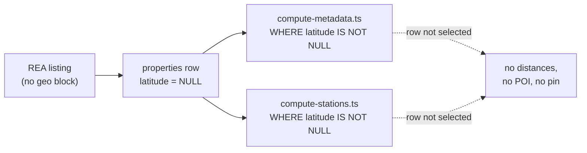
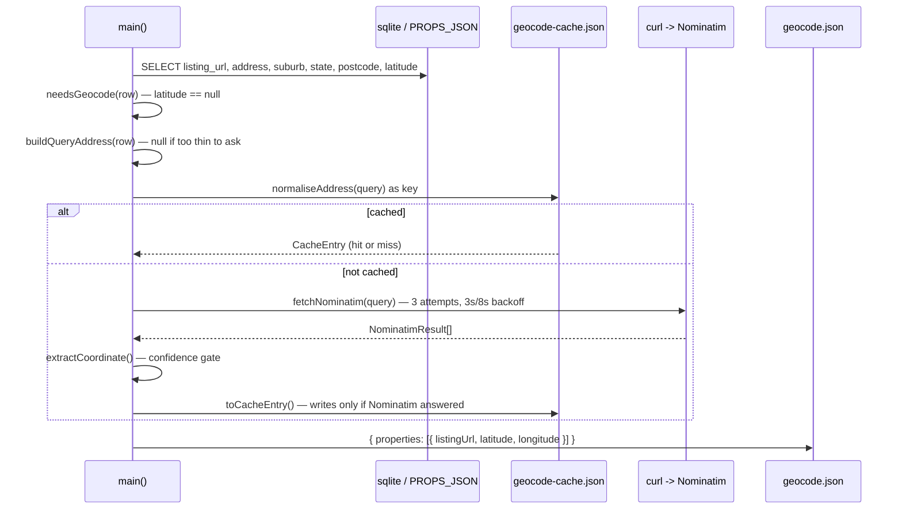

# Walkthrough: geocoding properties that arrive without coordinates

**Branch:** `realestate` · **Diff base:** `c7ab2fc` (the REA source commit) · **Commit:** none yet
— written against the uncommitted working tree. Anchors are file+line as the files sit on disk.

Domain listings hand us coordinates for free: their JSON-LD carries a `geo` block, which is why
all 396 existing rows have a latitude. realestate.com.au listing pages carry no coordinates at
all. So the change that made REA a working source (`c7ab2fc`) also made it possible to create a
property row that is *invisible* to half the app. This change fills that gap by geocoding the
address we already stored.

**Out of scope:** nothing is pushed to the live app by this run. The script writes a
`POST /api/batch` payload; sending it is a separate, deliberate step. No schema change —
`LoadItem` already carries `latitude`/`longitude`.

## Why a missing latitude is worse than it looks



Both derivation scripts select `WHERE latitude IS NOT NULL`. A row without one is not *rejected*
— it is never considered. It appears in the grid and on the compare page looking complete, while
silently having no distance-to-anything, no nearest station, no travel time and no map pin. That
is the failure this change exists to prevent, and it shaped every decision below.

## Following one address through the script

`scripts/geocode-missing.ts` is the whole change. Follow one row:



The file is split by a pair of comment dividers: `scripts/geocode-missing.ts:66` opens the pure,
network-free, fs-free block (the gate, the parsing, the cache decision), and `:162` opens the
block below it that actually touches curl, the filesystem and the rate-limit delay. That split is
what makes the interesting logic testable offline, which matters here more than usual: the
interesting logic is a safety gate, and a gate you can only exercise by hitting a live third-party
API is a gate you will not exercise.

### Nominatim, not Google

You asked about Google Maps specifically. Google's Geocoding API would work, but it needs an API
key with billing attached, and scraping Maps result pages would be brittle and against their
terms. Nominatim needs neither.

The question of whether Nominatim is *good enough* was settled with measurement rather than
argument. Ten live requests went out against real addresses — eight sampled from this database's
own Point Cook / Williams Landing rows, which already carry Domain-supplied coordinates and
therefore provide a known answer to score against. All eight agreed with Domain to within about
6 m at worst, and under a metre for several. That retired the Google question outright, so no
provider abstraction was built for a second provider nobody needs.

### The confidence gate is the point of the script

`isHouseLevelMatch()` at `scripts/geocode-missing.ts:111` is where the real risk sits:

```ts
return result.place_rank === 30 && result.type === "house";
```

A geocoder's dangerous failure is not a miss. A miss is loud and a human looks at it. The
dangerous failure is a **silent near-miss** — Nominatim happily returning a suburb centroid or a
road when the street address didn't match. Accept that and every downstream distance, station and
travel-time figure is quietly wrong, with nothing about the row looking suspicious. That is the
same invisible wrongness the missing latitude caused, just harder to notice.

So the gate rejects rather than guesses. `place_rank: 30` is Nominatim's finest granularity — an
individual building or address point. During the ten-request measurement, a unit-style address
(`2/15 Dunnings Road`) came back as the *road* at rank 26 and was correctly refused. That is the
gate doing its job on a real address, not a synthetic one.

The `type === "house"` half of that condition has a history worth knowing. The first version also
accepted `addresstype === "place"` as an alternative branch, documented in comments and exercised
in tests as a verified real response shape. It wasn't. The capture it was based on had both fields
present *together*, never as alternatives — the fixture for that branch was invented. The
ultralight review caught it, and the ten-request run was made specifically to settle it with
evidence: rank 30, `type: "house"`, `addresstype: "place"` and `class: "place"` always arrived as
a set, and `addresstype: "place"` was never observed without `type: "house"`. The unevidenced
branch was deleted, and the surviving condition now requires both, so a future rank-30 result of
some unfamiliar kind can't slip through on rank alone.

### Rejecting a coordinate takes more than a range check

`extractCoordinate()` at `scripts/geocode-missing.ts:117` validates in three steps, and the order
matters:

```ts
if (typeof top.lat !== "string" || typeof top.lon !== "string") return null;
const lat = Number(top.lat);
const lng = Number(top.lon);
if (!Number.isFinite(lat) || !Number.isFinite(lng)) return null;
if (lat < -90 || lat > 90 || lng < -180 || lng > 180) return null;
```

The Security lane raised the missing range check — a latitude of `999` is perfectly finite, and
the value flows into the live database and every distance derived from it. Fixing it exposed
something better than the finding: **a range check alone is demonstrably insufficient.**
`Number(true)` is `1` and `Number(["-37.9"])` is `-37.9`. Both are finite *and* in range, so a
boolean or a single-element array in the `lat` field would have sailed past finiteness and range
both. Nominatim documents `lat`/`lon` as strings, so the type check goes first and the coercion
never sees anything else. The accepted defect was real, but the obvious remedy would have left the
hole half-open.

Note also that the range check *rejects* rather than clamps. Clamping produces a plausible-looking
wrong answer, which is the one thing this whole file is arranged to avoid.

## The cache distinction that escalated this change

`toCacheEntry()` at `scripts/geocode-missing.ts:155` is four lines and is the reason this ran as a
lite loop instead of an ultralight one.

```ts
if (outcome.kind === "transient-error") return null;
```

The cache is consulted *before* requesting, and a `CacheEntry` has exactly two states: hit and
miss. There is no "retry me". So the original code — which caught a curl failure and wrote
`{ hit: false }` — made a row that failed once due to a network blip **permanently ungeocodable**
without a manual cache edit. It also inverted the fail-loud behaviour of
`scripts/lib/overpass-poi.ts`, the precedent this script was briefed to follow.

The fix is the `FetchOutcome` union at `scripts/geocode-missing.ts:143`, which forces the two
cases apart at the type level rather than trusting a comment:

- `resolved` — Nominatim answered. That covers a coordinate *and* a genuine low-confidence
  rejection (`coord: null`). Both are real answers and both are cacheable.
- `transient-error` — retries exhausted with no answer at all: network down, curl missing,
  timeout, malformed JSON. Not an answer, so nothing is cached and the row is retried next run.

`main()` keeps that distinction visible all the way to the console: misses and errors are counted
and printed separately, with the errors labelled "NOT cached, retry next run", and a non-zero
error count repeats itself on stderr at the end. Two piles of failed rows that need opposite
responses should not look identical in the output.

This defect is why the loop escalated. On paper the change met every ultralight criterion — one
new script, no auth, no schema, no new dependency, rollback is deleting a file. What those
criteria don't capture is that the script's core is a confidence gate against a third-party
service where being wrong means *silently plausible* coordinates. "Small and reversible" was true.
"Low consequence if wrong" was not, and that was the criterion actually missing. Escalation is
one-way, so the fix landed in a fresh lite run rather than in place.

### Curl, and the rate limit that isn't a tuning knob

`fetchNominatim()` shells out to curl rather than using Node's `fetch`. Not a style preference:
this repo's own agent memory records Node's fetch failing against OSM-adjacent endpoints from this
machine while curl succeeds, and `scripts/lib/overpass-poi.ts` already shells out for exactly that
reason.

`NOMINATIM_DELAY_MS = 1100` and the identifying `USER_AGENT` are Nominatim's published usage
policy, called out as such in the file's header comment — the delay's own inline comment goes
further and labels it "not a tuning knob" precisely because the next person to find this script
slow will otherwise lower it. The retry backoffs (`3000, 8000`) are separate and labelled
transient-only, so they can't be confused with policy.

## Running it

```
npx tsx scripts/geocode-missing.ts
```

Reads the local DB, or a harvest file if `PROPS_JSON` is set — the latter matters because rows
that live only on the live app were never loaded locally, and all writes go over HTTP. Writes
`data/harvest/geocode.json` (override with `OUT_JSON`), which is a `POST /api/batch` body ready
for `scripts/batch-push.mjs`. It never touches `data/app.db` or `data/images`.

The cache is written incrementally after every live request, so an interrupted run resumes instead
of re-requesting at one second per row.

## Tests, and a trap in them

`test/geocode-missing.test.ts` covers the pure half offline — the gate in both directions, the
type/finiteness/range rejections, address building, normalisation, and both sides of the
transient-vs-cacheable distinction. The Tests lane mutation-tested it in a scratch worktree and
caught 9 of 9 injected mutations, including both halves of the gate and both directions of the
cache distinction. That last one is the hole that made the escalating Major invisible in the first
place, so it is the one worth having covered.

One trap for whoever adds to these files next: they are plain `node:assert` scripts, not a
framework, so **they abort at the first failure**. Confirming that four new assertions each fail
before their fix required isolating them one at a time — an aggregate run would only ever have
proven the first one failed. Any future multi-assertion addition here has the same trap.
