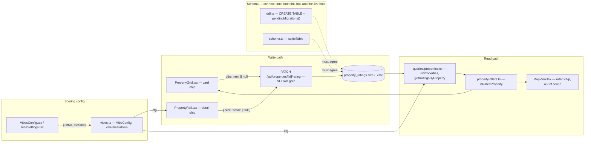
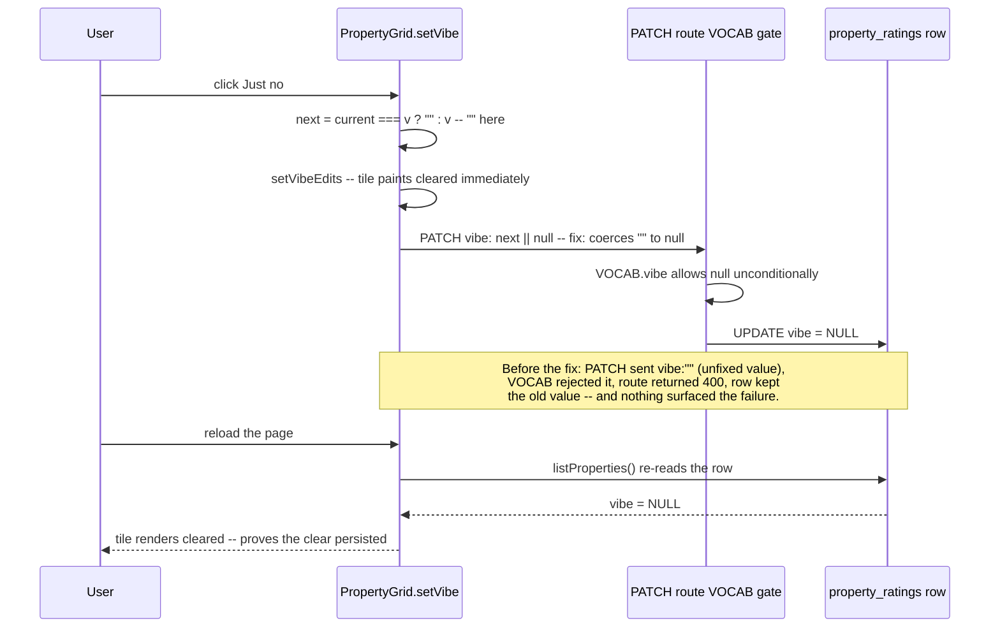

# Walkthrough: "just no" and "too small" ratings

**Branch:** `feat/just-no-and-too-small-ratings` · **Diff base:** `f57b86f`
(`main`) · **Files:** `src/app/api/properties/[id]/rating/route.ts`,
`src/db/ddl.ts`, `src/db/schema.ts`, `src/db/queries/properties.ts`,
`src/lib/vibes.ts`, `src/lib/property-filters.ts`,
`src/components/PropertyRail.tsx`, `src/components/PropertyGrid.tsx`,
`src/components/VibesConfig.tsx`, `src/components/VibeSettings.tsx`,
`package.json`, `test/features.test.ts`, `test/property-filters.test.ts`,
`test/ui.test.ts`, `test/rating-clear.test.ts` (new),
`test/rating-size-migration.test.ts` (new).

The user asked for two rating options: *"just no"* (−250, on both the card and
the detail view, alongside like/meh/dislike/hate) and *"too small"* (−100,
detail view only). Nothing here is committed — this diff is the working tree
against `main` at `f57b86f`.

**Out of scope:** backfilling anything, a "too small" chip on the card view, a
size filter chip, exposing either rating through `POST /api/batch` (ratings
have never travelled that path), and changing any existing rating's points.

## Architecture

## Sequence — clearing a "just no" on a grid tile

This is the flow the round-1 Major lives in, so it is the one worth walking
rather than a generic "set a rating" happy path.

## Change table

| File | Change | Notes |
| --- | --- | --- |
| `src/db/ddl.ts` | `CREATE TABLE property_ratings` gains `size TEXT` (`:121`); `pendingMigrations()` gains a guarded `ALTER TABLE ... ADD COLUMN size TEXT` (`:267-269`) | The schema change that set the loop |
| `src/db/schema.ts` | `propertyRatings` gains `size: text("size")` (`:206-208`), with a comment naming it an axis independent of `kitchen` | Must agree with `ddl.ts` byte-for-byte or the drift this repo's convention exists to prevent recurs |
| `src/db/queries/properties.ts` | `size` added to the `Pick<PropertyRating, ...>` projection and to all four query sites that hand-list rating columns | The file the brief's reconnaissance missed — see Decisions |
| `src/app/api/properties/[id]/rating/route.ts` | `VOCAB.vibe` gains `"justno"`; `VOCAB.size = ["small"]` added | The write gate; `size` here is what makes the schema change reachable at all |
| `src/lib/vibes.ts` | `VibeConfig`/`DEFAULT_VIBE_CONFIG` gain `justNo: 250` and `tooSmall: 100`; `Rating` gains `size`; `vibeBreakdown` gains both scoring branches | Where the two point values actually live |
| `src/lib/property-filters.ts` | `isRatedProperty`'s existing-ratings check gains `\|\| r.size` (`:118`) | The integration point the brief called out by name — see Decisions |
| `src/components/PropertyRail.tsx` | `REACTIONS` gains "Just no" (🚫, `#3D0F0F`); `QUALITY` gains a `size`/`Too small` row and is restructured from a literal `pts` string to a derived `configKey`/`sign` pair via `qualityPts()` | Detail view — both requirements land here, plus the derivation fix for `req-001` |
| `src/components/PropertyGrid.tsx` | `VIBE_OPTS` gains "Just no" (🚫); `setVibe`'s PATCH body changes from `vibe: next` to `vibe: next \|\| null` | Card view; the second change is `tech-001`'s fix, not part of either requirement |
| `src/components/VibesConfig.tsx` | `justNo` row added to Reactions; new "Size" group with `tooSmall` | Config editor — enumeration site 5 of 6 |
| `src/components/VibeSettings.tsx` | `justNo` and `tooSmall` rows added to `FIELDS` | Settings panel — enumeration site 6 of 6 |
| `package.json` | `test` script gains the two new test files | Ignore this — wiring only |
| `test/features.test.ts` | Unit coverage for both `vibeBreakdown` branches, retuned-magnitude cases, and "no row when null" | See Tests |
| `test/property-filters.test.ts` | Unit coverage for `isRatedProperty` on a size-only rating | See Tests |
| `test/ui.test.ts` | Two new UI regressions: the reload-survives-clear test (`tech-001`) and the quality-chip-renders-configured-points test (`tests-001`) | See Tests |
| `test/rating-clear.test.ts` (new) | Offline route-contract test: PATCH accepts `null`, rejects `""` | Deliberately **not** the regression guard for `tech-001` — see Decisions |
| `test/rating-size-migration.test.ts` (new) | `pendingMigrations`/`migrateColumns` against a DB built from an old DDL missing `size` | Proves the column reaches an existing database, not just a fresh one |

## The flow

| Entrypoint | Trigger | First changed file it reaches |
| --- | --- | --- |
| `PATCH /api/properties/[id]/rating` | Click a vibe/quality chip on the grid or the detail rail | `src/app/api/properties/[id]/rating/route.ts:6-11` |
| `listProperties()` / `getRatingsByProperty()` | Any page render that needs ratings — home grid, map, detail page | `src/db/queries/properties.ts:267-270` |

Both new values write through the same `PATCH` handler every existing rating
already uses — the handler's shape (a generic `VOCAB` loop, `null` always
clears) did not need to change; only its two `VOCAB` entries and the client
payload that reaches it did. From there the row lands in `property_ratings`,
and every read of that row — `listProperties` (`:263-274`),
`getPropertyRatings` (`:408-421`), `getRatingsByProperty` (`:424-447`), all in
`src/db/queries/properties.ts` — had to learn the new column or it would
exist in the database and never reach the client. `isRatedProperty`
(`src/lib/property-filters.ts:108`)
is the one place that reasons about the *presence* of a rating rather than
displaying it, and it is what the grid's Rated filter and the map's rated chip
both call.

## Decisions

### `size` is a new column, not a fifth `vibe` value

This is the decision that decided the loop, so it comes first. The cheap
option was `vibe: "toosmall"` alongside `vibe: "justno"` — no schema change,
no migration, and the whole change would have stayed in `dev-loop-lite`. It
was rejected because `vibe` values are mutually exclusive (setting one clears
the last), and "I like this house and it's too small" is a coherent, expected
state — exactly the distinction the repo already models by keeping `look` and
`kitchen` as separate columns rather than folding "ugly" and "small kitchen"
into one enum. The more expensive option is the one that matches the
architecture already in force; the schema change, and therefore the full
loop, is the honest price of it rather than something to design around.

### `"justno"` as the wire value, one glyph in both components

Matches the existing unpunctuated single-word vocabulary
(`like`/`meh`/`dislike`/`hate`) — `"just-no"` was rejected for introducing
punctuation no other value has, `"nope"` for naming a different word than the
UI shows. The colour (`#3D0F0F`, `src/components/PropertyRail.tsx:19`) is
deliberately a near-black maroon, darker than `hate`'s `#8E2F22`
(`PropertyRail.tsx:16`), for a deduction five times larger. 🚫 was picked over
💀 and 🤢 as more legible at card-view icon size.

Worth noting explicitly: `hate` already uses *different* emoji in the two
components — 😤 in `REACTIONS` (`PropertyRail.tsx:16`), 🤮 in `VIBE_OPTS`
(`PropertyGrid.tsx:59`). "Just no" uses 🚫 in both places
(`PropertyRail.tsx:19`, `PropertyGrid.tsx:60`). That divergence is an existing
inconsistency, not a convention — this change does not copy it forward.

### The integration point named in the brief before it could be missed

`isRatedProperty` (`src/lib/property-filters.ts:117-119`) previously returned
true on `r.look || r.kitchen || r.score != null`. A property whose only
rating is "too small" would have counted as unrated, silently hiding it from
the grid's Rated filter and the map's rated chip — the opposite of what a
rating is for. This was found in reconnaissance and written into the brief,
because it is invisible from the diff of the files the feature obviously
touches: nothing about adding a `size` column forces a change here, and
nothing would have failed loudly if it had been missed.

### The file the brief's own reconnaissance missed

`src/db/queries/properties.ts` hand-lists `vibe`/`look`/`kitchen`/`score` in a
`Pick<PropertyRating, ...>` type (`:34`) and at four query sites — the two
halves of `listProperties`' rating fetch (`:270`, `:283`),
`getPropertyRatings` (`:415`), and `getRatingsByProperty` (`:441`). The
brief's file map was built from
where the *vocabulary* is enumerated (six sites, all named) and missed where
the *columns* are projected. Without `size` added to all five of these, the
column would exist in the database and in `schema.ts` and never reach the
client — the rating would appear to save (the PATCH succeeds, the optimistic
UI paints) and then vanish on the next reload, because the row the page reads
back would be missing the field. The implementer found it by grepping every
`.look`/`.kitchen` reference in `src/` rather than trusting the given file
map — the behaviour that catches this class of bug, and worth calling out
because the brief itself did not.

### `tech-001` — a pre-existing Major, fixed anyway, and why the override rule wasn't the wrong call to break

`PropertyGrid.setVibe` computed `next = current === v ? "" : v` and PATCHed
`{ profile, vibe: next }` to clear a rating. The route's `VOCAB` gate exempts
`null`, not `""` (`route.ts:34`), so a clear returned **400** and the stored
value survived. Nothing surfaced this: the fetch carries only a `.catch()`
(`PropertyGrid.tsx:956`), which does not fire on an HTTP 400, so the tile
looked cleared until the next navigation, when the old rating reappeared and
the property silently rejoined the Rated filter and the map's rated chip it
appeared to have left. The reviewing lane demonstrated this against the real
handler rather than arguing it, with observed output (`vibe: ""` → 400, row
unchanged).

This predates the branch — `git show main:` confirms `vibe: next` on `main` —
and the lane correctly classified it `stale`, recommending it go in the PR
description rather than be fixed. **The lead overrode that classification.**
The `stale` rule exists to stop diffs ballooning around unrelated pre-existing
bugs, and it wasn't doing that job here: the fix is one line
(`vibe: next || null`, `PropertyGrid.tsx:955`), there is no design surface to
hide behind, and — the decisive point — this diff deliberately routes a
*fifth* rating value through the exact broken path. Shipping a "just no"
button whose second click silently does nothing would have been shipping the
request broken, even though it was broken in a way its four siblings already
were. The four pre-existing card ratings are fixed by the same line as a side
effect — an improvement to working-as-broken behaviour, not scope creep into
working behaviour. Recorded explicitly as an override, and as the first one:
a lead who overrides the same gate routinely has stopped using it.

### `req-001` — the fix was widened past the single new row, deliberately

The "Too small" chip was going to hard-code `−100` (as `look`/`kitchen`'s four
existing chips already do) while `tooSmall` is a retunable `VibeConfig` field
surfaced in both config UIs. Retune it to 40 and the chip would still read
"Too small −100" while the breakdown directly above it read −40 — a new
instance of a divergence that already existed for the other four chips, but
the only place "too small" would have advertised a number at all.

The fix (`PropertyRail.tsx:22-42, 202-216`) does not stop at the new row: it
replaces all five chips' literal `pts` strings with a `configKey`/`sign` pair
and a shared `qualityPts(cfg, configKey, sign)` function. Fixing only the new
row was rejected because it would leave one derived label sitting next to
four literals — an inconsistency a future reader would plausibly "fix" by
reverting the correct line back to a literal. The reviewing lane's proposed
alternative — reject the widening and record the literal-`pts` pattern in
`conventions.md` as an accepted convention — was also rejected: that pattern
is an oversight that happens to be consistent, not a decision, and enshrining
it would make the config UI's retuning quietly lie for the other four chips
too.

### The first regression test for `tech-001` proved the wrong thing

The initial attempt exercised the route directly: PATCH `vibe: ""`, assert
400; PATCH `vibe: null`, assert success. It was rejected because the route
was never broken — its `null` handling predates this branch entirely — so the
test would still pass with the client-side fix (`|| null`) reverted. It was
testing a fact about the server that was already true, not the regression
that mattered.

What shipped instead (`test/rating-clear.test.ts`) keeps a version of that
route-contract test, but its own header comment states plainly that it does
**not** exercise the client and would still pass if the fix were reverted —
it points the reader at the real guard. That guard
(`test/ui.test.ts:460-496`, *"clearing a grid tile's vibe survives a
reload"*) drives the actual browser: click Just no, click it again to clear,
wait for the PATCH to settle, then **reload the page** and assert the tile is
still cleared. The reload is the whole test — without it, the assertion only
re-proves the optimistic local state, which was never wrong; the bug only
exists in what the database still holds after the optimistic UI has moved on.
The agent flagged the first test's weakness itself, as "a judgment call worth
a second look," rather than presenting a green suite — that self-report is
what made the correction cheap rather than something review had to dig up.

### Round 2's finding is the same shape as `req-001`, one layer down

`req-001`'s fix (the `configKey`/`sign` derivation) shipped in round 1 with no
test at any level touching it: `qualityPts` is unexported inside a client
component so no unit test can reach it, `test/features.test.ts` covers
`vibeBreakdown`'s arithmetic (a different code path entirely), and the one
`ui.test.ts` test that visited the detail rail clicked Like and read the
total score without ever reading a chip's own text. Wiring `tooSmall`'s row
to `smallKitchen`'s `configKey` by mistake would render a wrong number on a
live chip with both suites green. That is precisely the class of defect
`req-001` was raised to fix in the first place — a chip's advertised number
silently diverging from the config it claims to reflect. The instance was
fixed and the mechanism it runs on shipped unguarded. Closed with one
assertion (`test/ui.test.ts:532-536`) reading three of the five chips' rendered
text — both signs of the `look` axis plus the new `size` row — including the
U+2212 minus sign the UI actually uses rather than a hyphen. The suggested fix
asked for the new row plus one existing one as a floor, not full coverage; the
shipped assertion clears that floor without claiming to close the gap for
`kitchen`'s two rows.

### The mutation that proves the guard isn't just checking one exact byte sequence

`reviewer-tests` did not accept the fix on report; it mutated `setVibe`'s
payload three ways in its own scratch worktree and reran the reload test
against each:

| mutation | payload sent | result |
| --- | --- | --- |
| revert the fix | `vibe: next` (`""` on clear) | test **fails** |
| the shipped fix | `vibe: next \|\| null` | test passes |
| a different regression | `vibe: next \|\| undefined` | test **fails** |

The third row is the one worth explaining. `JSON.stringify` drops
`undefined`-valued properties entirely, so that payload PATCHes with no
`vibe` key at all — the route returns **200**, not 400, a completely
different failure shape from the original bug. The test still catches it,
because it asserts persisted state after a reload rather than the exact wire
value the original bug happened to produce. A guard sensitive only to the
specific `""` byte sequence of the one shipped bug would have missed this
mutation cleanly.

## `node_modules` was emptied mid-round-2

Partway through round 2, `node_modules` went from 84 packages to 0 (directory
intact, no `npm` process running when found — a complete wipe, not one caught
in flight). `reviewer-requirements` and `reviewer-technical` therefore
reviewed without being able to run anything and returned 0 findings each — but
both stated the limitation themselves rather than reporting a clean pass. The
Tests lane was unaffected in substance: it found the gap, installed
dependencies **inside its own scratch worktree only**, and ran all three
mutations above there — the load-bearing verification of the round is
therefore real. `node_modules` was restored before commit, and Phase 8's
independent verification re-ran all four required checks (`tsc`, `npm test`,
`npm run build`, `npm run test:ui`) against the final tree itself rather than
trusting either blind lane's silence.

## Where to look to review this

In priority order:

1. `src/components/PropertyGrid.tsx:947-959` — `setVibe`. Confirm the PATCH
   body really does send `vibe: next || null` and not `next` — this is
   `tech-001`'s entire fix, and the four pre-existing ratings depend on it
   too.
2. `src/lib/property-filters.ts:108-120` — `isRatedProperty`. Confirm `r.size`
   sits alongside `r.look`/`r.kitchen` in the "any profile's rating counts"
   branch (`:118`), not just the caller's own profile branch.
3. `src/db/ddl.ts:115-125` (the `CREATE TABLE` block) against `:267-269`
   (`pendingMigrations`) against `src/db/schema.ts:196-213` — the three-way
   agreement this whole loop exists to protect. All three must name `size` as
   a nullable `TEXT` column.
4. `src/components/PropertyRail.tsx:22-42` — `QUALITY` and `qualityPts`.
   Confirm each row's `configKey` actually matches its own axis (`tooSmall`
   for the `size` row, not accidentally `smallKitchen` or another neighbour)
   — this is exactly the mis-wire `tests-001` was raised to guard against.
5. `test/ui.test.ts:460-496` — the reload regression test. Confirm it really
   reloads the page (`page.reload(...)`) before its final assertion, not just
   before the optimistic-UI check partway through.

## Tests

**Unit coverage** (`test/features.test.ts:187-222`) pins both new
`vibeBreakdown` branches at their default magnitudes (−250, −100), proves both
read from `cfg` rather than a literal (retuned to −999 and −40 respectively),
proves "too small" and "small kitchen" coexist as independent rows on the same
rating, and proves no row renders when `size` is `null`.
`test/property-filters.test.ts:321-347` proves a size-only rating counts as
rated from both profiles, and that an all-null rating row still doesn't.

**Migration coverage** (`test/rating-size-migration.test.ts`, new) builds a
database from the current DDL, drops the `size` column to reproduce the shape
of an existing database, runs `migrateColumns`, and asserts the column
appears, existing data is untouched, and running the migration twice does not
duplicate the column — the same idempotency guarantee
`test/migration-concurrency.test.ts` already protects under an 8-way race.

**UI coverage** (`test/ui.test.ts`) has the two regressions detailed above:
the reload-survives-clear test for `tech-001` (`:460-496`) and the
configured-points chip test for `tests-001` (`:532-536`). Both were verified
independently in Phase 8 against the final tree: `npm test` 19 files green,
`npm run test:ui` 54 passed / 2 failed — the 2 being the pre-existing
"squashed text on mobile" pair this repo has tracked as `stale` across five
prior runs, unrelated to this diff.

**Not covered, stated rather than silently absent:** no test writes `size`
through the PATCH route and reads it back end-to-end. The rest of that path
is bound by types instead — `Pick<PropertyRating, ... "size" ...>`
(`src/db/queries/properties.ts:34`) forces all four projection sites to agree
with the schema, and a missing one is a compile error rather than a runtime
gap, which `tsc --noEmit` already confirms clean. The only unbound link left
is three string literals (`VOCAB.size`, `QUALITY`'s `{ field: "size", value:
"small" }`, and `schema.ts`'s column name) agreeing by inspection rather than
by a shared constant. Judged not worth a new test file for three literals
that already read the same value in three places.

## Open questions

1. **The three `"size"`/`"small"` string literals agree by inspection, not by
   a shared constant.** `VOCAB.size` (`route.ts:10`), `QUALITY`'s `field`/
   `value` pair (`PropertyRail.tsx:30`), and `schema.ts`'s column name all have
   to say the same two words independently. Nothing currently forces that;
   `tsc` catches a missing *column* (via the `Pick<>` projection) but not a
   misspelled *value* inside a string literal. Not fixed — recorded because
   the next axis added the same way inherits the same gap.
2. **`node_modules` was emptied mid-round with no established cause.** Two
   review lanes lost the ability to run anything as a result. Mitigated —
   the load-bearing verification (the Tests lane's mutation testing, and
   Phase 8's independent re-run of all four required checks) happened for
   real, against a scratch worktree or the restored tree respectively — but
   the cause itself was never found, so it is recorded rather than closed.
