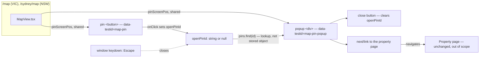
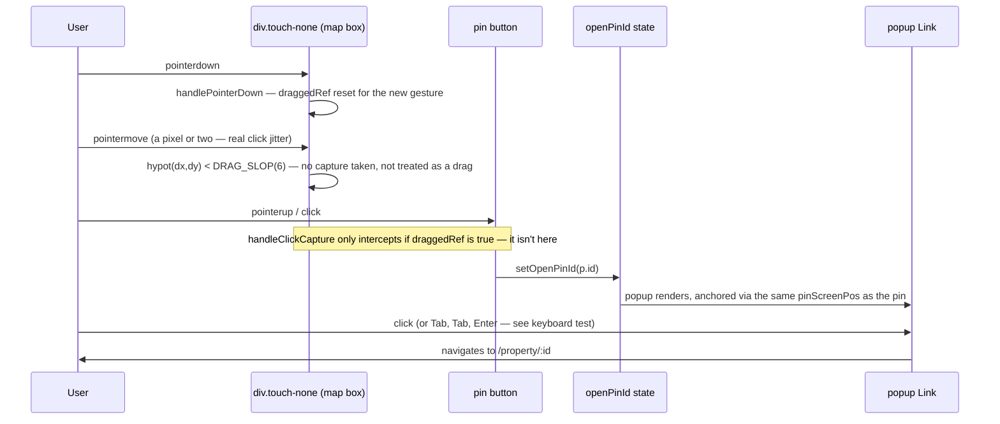

# Walkthrough: map pin popup (hero image, address, price)

**Branch:** `feat/map-pin-popup` · **Diff base:** `b58ffc1` (`main`) · **Files:**
`src/components/MapView.tsx`, `test/ui.test.ts`.

Clicking a property dot on `/map` or `/sydney/map` used to navigate straight to
the property page. It now opens a popup anchored to the pin — hero image,
address, price — and the popup itself is what navigates. Both routes get this
for free because both render `MapView`.

**Out of scope:** clustering, hover previews, an animation library, any change
to what the map filters, pin sizing, the vibe scale, the region split, touch
gestures beyond what `touch-none` already gives, and the two pre-existing
mobile squashed-text `test:ui` failures (`cause: stale`, unrelated to this
diff).

## Architecture

`pinScreenPos` (`src/components/MapView.tsx:380-386`) is the one function that
computes a pin's screen position and size; both the pin loop and the popup
anchor call it, so the two cannot drift apart — see Decisions below.

## Sequence — click a pin, then click the popup

## Change table

| File | Change | Notes |
| --- | --- | --- |
| `src/components/MapView.tsx` | Pin `onClick` opens a popup instead of calling `router.push()` (`useRouter` import removed entirely); `pinScreenPos` extracted (`:380-386`); popup position/clamping computed (`:388-408`); popup JSX with close button and a `next/link` navigate surface (`:496-540`). 107 insertions, 11 deletions (`git diff --numstat`). | The whole production change |
| `test/ui.test.ts` | Six new popup tests, new helpers (`mapPopupFixtures`, `pinIndex`, `clickPin`), two existing tests repaired in place, one import. 341 insertions, 29 deletions. | See Tests below |

## The flow

| Entrypoint | Trigger | First changed file it reaches |
| --- | --- | --- |
| Click on a pin `<button data-testid="map-pin">` | Pointer click that survives drag-suppression | `src/components/MapView.tsx:475` |
| Click on the popup's `<Link>`, or Tab/Tab/Enter from the pin | Keyboard or pointer activation of the popup's navigate surface | `src/components/MapView.tsx:515-538` |

The pointer machinery this pin click passes through first —
`handlePointerDown`, `handlePointerMove`, `endDrag`, `handleClickCapture`,
`DRAG_SLOP` (`src/components/MapView.tsx:219-297`) — is **byte-for-byte
unchanged** by this diff. Only the pin's `onClick` body changed, from
`router.push(...)` to `setOpenPinId(p.id)` (`:475`). That machinery is where
this exact component shipped two prior defects (a `setPointerCapture` call
that silently ate every pin click, and a `draggedRef` left armed after a
click-less drag) — worth reading once before judging the new code, because the
new code's safety rests entirely on not having touched it.

Once `openPinId` is set, `openPin` and `anchor` are recomputed
(`:391-392`) from the current `pins` and `effectiveView` — the same two
values that already drive every pin's own position — and the popup renders as
a normal sibling of the pin loop (`:496-540`), positioned by `popupLeft` /
`popupTop` / `popupAbove` (`:398-408`).

## Decisions

### The interpretation: popup *and* navigation, not popup *instead of* navigation

The brief read "show ... when clicking" as add-a-step, not replace-the-route —
navigation moved from the pin to the popup rather than disappearing, on the
grounds that a map pin the user cannot get to the property from would be a
regression, and this is the same behaviour Domain's own map (the model
`CLAUDE.md` cites for this view) uses. This was recorded as an interpretation,
not a fact, and Correctness — the lane that owns requirements conformance —
was explicitly asked to challenge it. **It did not.** That is worth noting
explicitly: the lane's silence is evidence the reading is uncontroversial, but
it is silence, not a second opinion independently arrived at — record it as
such rather than reading more into it than a reviewer disagreeing would have
produced.

### The popup follows the pin through pan and zoom, rather than closing

`anchor = openPin ? pinScreenPos(openPin) : null` (`:392`) is recomputed on
every render from `pins`/`effectiveView`, exactly like a pin's own position —
there is no second source of truth to keep in sync, so this costs zero extra
code. Closing on any view change was considered and rejected: it would need an
effect watching `view`/`effectiveView` (more code, not less) to produce worse
behaviour — the popup vanishing on a one-pixel pan nudge while the user is
mid-inspection of the property it's showing.

### Close is ✕ (`:503-510`) plus `Escape` (`:102-109`) — deliberately not click-outside

This is the one decision in the diff that looks like it should have gone the
other way, so it earns the explanation. `ShareButton.tsx`'s own small anchored
popover uses click-outside, which is arguably the closer shape match, and it
was seriously considered here too. It was rejected specifically because of
*this* component's click path, not as a general preference:

- a `mousedown`-based outside check fires at the **start** of a drag-pan
  gesture, before `DRAG_SLOP` is even evaluated — so the popup would close the
  instant the user began panning, directly undoing the follows-the-pin
  decision above;
- a bubble-phase `click`-based check runs **after** a pin's own `onClick` in
  the same synthesized event — so clicking a second pin while one popup is
  open would open the new popup and the outside-check would immediately
  re-close it, since the new pin's button reads as "outside" the popup.

Both are fixable (guard the mousedown on drag state; exempt pin elements from
the outside check), but each fix adds logic to the exact area that has already
shipped two defects, for a convention match that is marginal at best. ✕ +
`Escape` already satisfies "there must be an obvious way to close," which is
all the brief asked for, and it matches three other in-repo examples —
`Lightbox.tsx`, `MapModal.tsx`, `CompareRooms.tsx` — three consistent examples
being a convention rather than a coincidence.

### `openPinId` holds an id, not the property object

`useState<string | null>` (`:100`), looked up from `pins` on every render
(`:391`) rather than storing the `PropertyListItem` directly. The payoff: a
pin that drops out of `pins` because a filter changed while its popup is open
closes itself for free — the lookup simply stops finding it. Holding the
object was rejected because it would leave a popup open for a property no
longer on the map, a stale-reference bug with no natural trigger to notice it.

### `pinScreenPos` extracted rather than duplicating the projection math

One function (`:380-386`) returns `{x, y, d, hit, score}`, called by both the
pin loop (`:469`) and the popup anchor (`:392`). The popup has to sit exactly
where its pin is; two copies of the projection/diameter/hit-area math would be
free to drift, and the failure mode of that drift is a subtly misplaced popup
rather than an obvious break — worse than the near-zero line cost of inlining
it would have saved.

### The keyboard-accessibility fix: a real `<Link>`, not `tabIndex` + `onKeyDown`

The lead noticed, before review, that the popup's navigate action sat on a
bare `onClick` on a `
` — no `tabIndex`, no key handler —
and handed that observation to both lanes **without a verdict**, on the stated
grounds that a previous run's lead observation had turned out to rest on a
wrong premise. Structure (`struct-001`, Major) and Correctness (`corr-001`,
Minor) found it independently, seeing neither each other's work nor the lead's
note. That independent agreement — not the lead's original hunch — is why this
shipped as a fix rather than a deferred note.

**Why it was a regression and not just a pre-existing gap:** before this diff,
the pin was a native `<button>` calling `router.push()`, so Tab-to-pin then
Enter reached the property page. After it, the pin still opens the popup by
keyboard (it is still a real button), but the one action the popup itself
performs — navigate — lived on an element that cannot receive focus and
whose `onClick` does not fire on Enter or Space. Correctness argued this
should be Minor: single-user local app, no stated accessibility requirement,
and the repo already has an inaccessible click target elsewhere
(`PropertyGrid.tsx`'s `<article onClick={...}>`). Both points are true, and
neither moved the severity down — the finding is not "inaccessible like its
neighbours," it is "a working keyboard path was removed," and the existing
`<article>` pattern is `cause: stale` where this is `cause: introduced`.

**The remedy that was rejected, and why the smaller one wasn't the safer
one.** Correctness proposed keeping the `
` and adding `tabIndex={0}` +
`role="link"` + a hand-written `onKeyDown` for Enter/Space. It reads as the
smaller diff. It was rejected anyway: hand-rolled key handling has to
reimplement everything a real `<a>` already gets for free — Enter *and*
Space, the focus ring, the correct implicit role, middle-click and
modifier-click behaviour — and each of those is a fresh thing to get wrong
later, on a component whose click path has already produced two shipped bugs.
Structure's remedy — make it a real focusable control — is smaller in the way
that matters (fewer new behaviours to hand-maintain) even though the line
count is comparable.

Shipped as `<Link href={...} aria-label={popupLabel}>` (`:515-538`) wrapping
the image and text, with the ✕ kept as a JSX sibling rather than nested inside
it (a nested interactive element is invalid HTML), a `focus-visible` ring, and
`alt=""` on the hero image — `popupLabel` (`:395-397`) already carries address
and price as the link's accessible name, so a screen reader announcing the
image too would say the property twice. `role="dialog"` was removed in the
same edit: it asserted modal semantics the element never had (no
`aria-modal`, no focus moved on open, no focus trap), so it was actively
misdescribing an anchored preview card to assistive technology on top of
being unreachable.

## Where to look to review this

In priority order:

1. `src/components/MapView.tsx:503-538` — the popup's two actionable elements
   (close button, navigate link). This is where the Major lived and where the
   fix landed; confirm the `<Link>` really is a real anchor with no nested
   interactive children.
2. `src/components/MapView.tsx:219-297` — confirm this block is untouched.
   The new pin `onClick` (`:475`) is the only line that changed in the whole
   click path; if anything else here moved, the "two prior shipped defects
   were in this exact code and it wasn't touched" argument stops holding.
3. `test/ui.test.ts:1244-1278` — the keyboard regression test. Confirm it
   drives real `page.keyboard.press` calls rather than `.click()`, and that it
   asserts on `document.activeElement`, not just that the popup opened.
4. `test/ui.test.ts:947-979` and `:1004-1070` — the two repaired tests. Both
   used to assert immediate navigation on a plain click; confirm the repair
   (asserting the popup opens, then that clicking it navigates) still proves
   "the click reached the pin at all" and didn't quietly weaken to something
   that would also pass if pin clicks stopped firing.

## Tests

**Positive controls preserved, not just repaired.** Two existing tests
asserted immediate navigation and were falsified by this change — the jitter
test (`test/ui.test.ts:947-979`, ~3.6px of pointer wobble under `DRAG_SLOP`)
and *"a drag cancelled without a click still allows the next click through"*
(`:1004-1070`). Both are the positive controls for the component's two prior
shipped defects (no click firing at all; `draggedRef` left armed after a
click-less drag). Repaired in place — asserting the popup opens, then that
clicking it navigates — rather than deleted, and mutation confirms the guard
still holds: pin `onClick` → no-op fails 9 tests including the jitter test;
`DRAG_SLOP` disabled fails only the jitter test (the two dedicated drag tests
move well past the 6px threshold regardless, so this is the one test actually
exercising that guard — recorded as a stated residual, not a defect).

**The keyboard regression was proved against the real pre-fix file, not a
mutation.** The fix agent stopped before confirming fail-first, so the lead
extracted `MapView.tsx` as it existed at the reviewed tree snapshot
(`852b89b`, before the `<Link>` fix) and ran the suite against it directly:
50 passed / 4 failed pre-fix, 52 passed / 2 failed post-fix (the 2 remaining
are the pre-existing, unrelated mobile squashed-text failures).

**`clickPin()` bypasses the real event path — deliberately, and only for the
popup-content tests.** Several Point Cook listings share a screen coordinate
(redacted "Address By Request" entries), so `locator.click()` times out on
"subtree intercepts pointer events." `clickPin()` (`:638-643`) dispatches the
DOM node's own `.click()` via `locator.evaluate()` instead. This is exactly
the kind of shortcut that let a prior defect hide for a whole run, so it
matters that the drag and jitter tests do **not** use it — they still drive
real `page.mouse` gestures, because `draggedRef` is only ever armed by a real
`pointerdown`→`pointermove` sequence, which `.click()` never produces. The
Tests lane re-derived this independently rather than taking the author's word
for it, and drew the same line.

**Not covered:** the "no image" fallback (`:530-532`) has no fixture — no
property in the DB this suite snapshots lacks a `thumbPath` (checked for zero
image rows and for all-images-`exclude`, both empty) — so only the
has-an-image half of `test/ui.test.ts:1108-1143` runs; the test logs this
rather than asserting anything on the untaken branch. It's three lines of JSX
with no logic, and manufacturing a fixture was judged more machinery than the
branch is worth. `DRAG_SLOP` (see above) is exercised by exactly one test.

Round 1 review: 3 lanes applicable (Security skipped — no input handling,
query, serialization, file/network I/O, dependency, or authn/authz touched),
1 round, no escalation. 1 Major + 1 Minor accepted (the same defect, found
twice — see Decisions), zero `rejected_wrong`. `npx tsc --noEmit` clean,
`npm test` 17 suites green, `npm run test:ui` 52 passed / 2 failed (the 2
pre-existing, documented across four prior runs). Tree hash `852b89b…`
confirmed identical before and after review.

## Open questions

Carried from the implementation notes, with dispositions:

1. **The popup's "no image" fallback is not covered by any test.** No
   property in the fixture DB lacks a `thumbPath` — checked for zero image
   rows and for all-images-tagged-`exclude`, both empty. Logged rather than
   fabricated. **Stated, not fixed.**
2. **`DRAG_SLOP` is exercised by exactly one test.** Disabling the guard
   fails only the jitter test; the two dedicated drag tests move well past
   the 6px threshold regardless. The Tests lane judged one boundary test
   adequate for a threshold guard. Recorded so the thinness is visible if
   that guard is ever changed.
3. **The interpretation was never challenged.** Correctness owns whether
   "show hero image, address and price when clicking a dot" should have
   *replaced* navigation rather than adding a step in front of it, and it did
   not raise it. Recorded because a requirements finding is informative by
   its absence too — the reviewer read the brief the same way the
   implementer did.
