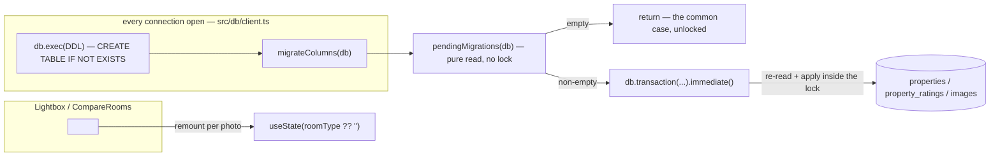
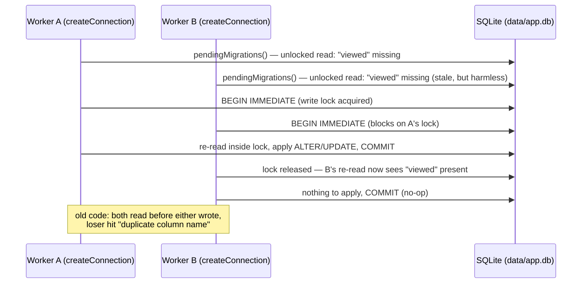

# Walkthrough: concurrency-safe migration + TagSelect remount

**Branch:** `fix/migration-race-and-tagselect-key` · **Diff base:** `3b98cd4` ·
**Files:** `src/db/ddl.ts`, `src/components/Lightbox.tsx`,
`src/components/CompareRooms.tsx`, `package.json`,
`test/migration-concurrency.test.ts` (new), `test/ui.test.ts`.

Two defects, both carried and root-caused across earlier runs. First:
`migrateColumns` (`src/db/ddl.ts`) was idempotent when called serially but not
when called concurrently — five check-then-act sites with no lock, so two
Next.js build workers connecting in parallel could both decide to add the same
column, and the loser died with `SqliteError: duplicate column name: viewed`.
Second: `<TagSelect>` had no `key`, so browsing photos in the lightbox kept
showing the previous photo's room. Both are fixed here; a third call site of
the second bug, found but out of diff scope, was fixed too — see below.

**Out of scope:** what `migrateColumns` migrates (same columns, same backfill,
same order — only how it guards itself), any migration framework, any refactor
of `TagSelect`'s internals, and `client.ts:32`'s `db.exec(DDL)`, which still
runs outside the new lock (see Open questions).

## Architecture

`migrateColumns` runs on every connect (`src/db/client.ts:33`), which is what
makes it live on the production path rather than a one-off script: it is what
executes on `192.168.68.125` the moment the app first connects to a freshly
pulled, unmigrated `data/app.db`.

## Sequence — two workers connecting to an unmigrated DB

## Change table

| File | Change | Notes |
| --- | --- | --- |
| `src/db/ddl.ts` | `migrateColumns` split into pure `pendingMigrations(db): string[]` (`:194`) and a caller (`:288`) that re-reads and applies inside `db.transaction(...).immediate()`; new `MigrationDb`/`MigratedTable` types (`:176`, `:178`) and a `columnsOf` helper (`:183`); new type-only `better-sqlite3` import (`:1`) | The whole production fix |
| `src/components/Lightbox.tsx:176` | `key={img.id}` added to `<TagSelect>` | One line |
| `src/components/CompareRooms.tsx:243` | Same `key={img.id}` added to the second, identical `<TagSelect>` call site | Not in the original brief — see Decisions |
| `package.json:12` | Registers `test/migration-concurrency.test.ts` in the `test` chain | Line is 535 chars; pre-existing, unwrappable — recorded in `conventions.md`, not a finding |
| `test/migration-concurrency.test.ts` | New. Deterministic two-process race harness | See Tests below — this file was the source of the run's Critical |
| `test/ui.test.ts` | New case (`:1373`) plus `isVisibleImageLike` and `adjacentRoomChangePhoto` fixture helpers (`:162`, `:184`) | Proves the `key` fix through the real UI, not just unit-level |

## The flow

| Entrypoint | Trigger | First changed file it reaches |
| --- | --- | --- |
| `createConnection()` | Every new SQLite handle (app boot, each `npm run` script, each Next.js build worker) | `src/db/client.ts:33` → `migrateColumns` in `src/db/ddl.ts` |
| Browsing to the next lightbox photo | `ArrowRight` / next-photo click | `src/components/Lightbox.tsx:176` |

### Why `BEGIN IMMEDIATE`, not `BEGIN` — this is the whole fix

A plain `BEGIN` is deferred: SQLite takes its read snapshot before it takes the
write lock, so a second connection racing the first still reads the
pre-migration column set and decides to add a column the first connection is
about to add (or just added). That is exactly the bug — `busy_timeout`
(`src/db/client.ts:28`, already 5000ms) does not touch it, because the two
workers were never contending for a lock; each was acting on a read that was
already stale by the time it wrote.

`BEGIN IMMEDIATE` takes the write lock *before* anything else runs inside the
transaction, so the re-read that happens inside it — `db.transaction(() => {
for (const statement of pendingMigrations(db)) db.exec(statement); }).immediate()`
(`src/db/ddl.ts:289-292`) — is the read that actually decides. Whichever
connection loses the race to acquire the lock simply blocks, then re-reads
after the winner commits, sees the columns already there, and applies nothing.
No process ever acts on a read another process has since invalidated. That
one substitution — `IMMEDIATE` instead of deferred — is the entire fix; nothing
else in the diff carries the guarantee.

### Why there's an unlocked pre-check at all, rather than just always taking the lock

The obvious minimal diff is to drop the pre-check and always open a
`.immediate()` transaction. It was tried and rejected on a measurement, not a
style preference: doing so makes *every* connect take the write lock, so a
connect racing any in-flight write on the same DB (`/api/ingest`, `/api/batch`'s
image section, `npm run load`) blocks behind it — measured at 5534ms before
failing with `database is locked`. `pendingMigrations(db)` (`:194-231`) is a
plain, lock-free read that returns an empty list on the overwhelmingly common
case — an already-migrated DB — and `migrateColumns` returns immediately
(`:289`) without ever asking for the lock. Measured at 0.092ms per call
uncontended and 0.150ms against the real 11.6MB DB, versus 0ms-to-5534ms if
every connect took the lock unconditionally.

**Why the unlocked pre-check is sound, not just fast:** every migration step
here is monotonic — no column this function adds is ever dropped, and
`attended_at`'s presence only ever decreases as it's renamed away. So a stale
pre-check can only err in the direction of deciding there's work to do when
there might not be (harmless — the re-read inside the lock corrects it), never
in the direction of deciding there's nothing to do when there actually is. If a
future migration step could ever be undone — a column dropped, a rename
reversed — this argument breaks and the pre-check would need to move inside the
lock too. That's stated as the doc comment on `migrateColumns` (`:279-287`)
specifically so the next person adding a migration step doesn't reintroduce the
race by adding a non-monotonic one.

### Why `pendingMigrations` returns the list, and is called twice

`pendingMigrations(db)` is called once outside the transaction (the pre-check,
`:289`) and once again inside it (`:291`) — the second call is the one whose
result actually gets executed. This was a free choice, not a forced one: a
separate `hasPendingMigrations(): boolean` predicate beside the applier was
considered and rejected only because it would be a second copy of the same
column-comparison logic to keep in sync, and drift between "is there work" and
"what is the work" would be silent.

### Why `columnsOf`'s table parameter is a closed union, not `string`

`columnsOf(db, table)` (`:183-188`) interpolates `table` directly into
`` `table_info(${table})` `` — a `PRAGMA`, which cannot bind an identifier as a
parameter, so string interpolation is the only option SQLite offers here. The
Standards and Security lanes both raised this against the "parameterise every
query" baseline rule and both independently concluded it doesn't apply: the
parameter is `MigratedTable` (`:178`), a three-member literal union with three
hardcoded call sites, nothing runtime-supplied. The reason it matters at all —
and the reason it's a closed union rather than plain `string` — is that
`table_info(typo)` against a table that doesn't exist returns an **empty set**,
not an error, so a typo'd table name would silently read as "nothing to
migrate here" and re-run every migration step for that table on every connect,
forever. The union closes that off at the type level rather than at runtime.

### `key={img.id}` at the call site, not a `TagSelect` refactor

`TagSelect` holds its selection in `useState(roomType ?? "")`
(`src/components/TagSelect.tsx:47`), which runs once per component instance.
Without a `key`, React reuses the same instance as the user browses photos, so
that initialiser never re-runs and the dropdown keeps the previous photo's
value — worse than a stale label, since this repo's tagging rule is that a room
is never guessed, and a wrong-but-confident dropdown value invites exactly
that. `key={img.id}` forces a remount per photo, which is the built-in answer
to "this component's derived state needs to reset on a prop change" — syncing
`TagSelect`'s state to `roomType` with an effect was considered and rejected as
reintroducing the identical bug class in a costlier form, and the brief
explicitly ruled out touching `TagSelect`'s internals.

## Decisions

### A stale finding, promoted and fixed anyway — `CompareRooms.tsx:243`

The Architecture lane found, during review, that `CompareRooms.tsx` has the
*identical* `<TagSelect>` call with no `key` — same defect, same cause, `img`
cycling under a stable position (the `{at + 1} / {imgs.length}` counter at
`CompareRooms.tsx:236` is the tell). The lane correctly judged this outside its
own lane and outside the diff, and logged it rather than raising it — that
call was right, and the loop's rule that a `stale` finding is recorded, not
fixed, exists precisely to keep a diff honest about its own scope.

It was fixed anyway, and that is a deliberate, stated departure from that rule,
not an oversight. `grep -rn "<TagSelect" src/` returns exactly two call sites
in the whole repo. Shipping the brief's fix as scoped would have delivered "the
room dropdown now shows the right room — in the lightbox, but still wrong in
compare," which is half a fix for a defect whose two instances are provably
identical and adjacent in the codebase. The line added is the same one-word
fix (`key={img.id}`) at the only other place the bug exists — not a new
pattern, not a refactor, not scope creep into unrelated code. This is called
out here, in the PR description, and in `round-1/triage.md`, rather than left
for a reviewer to notice from the diff and wonder whether it was intentional.

### Why the loop stayed `dev-loop` (full) rather than escalating to `dev-loop-ultra`

Two of `ultra`'s named triggers are arguably in play — this is a migration, and
it does run against production on first connect after a deploy. It was kept at
full because the change doesn't alter *what* is migrated, only how the
existing five steps guard themselves against concurrency, and because
`data/app.db` is tracked in git, so a bad outcome is a `git checkout` away
rather than a restore-from-backup. If a later round had needed to touch the
backfill's semantics, that reasoning would have lapsed and the run would have
escalated — it didn't come up, because the fix is entirely at the transaction
boundary.

### A one-line UI fix riding along in a full-loop run

`TagSelect`'s missing `key` had been deferred three times across earlier runs
for being too small to justify a loop of its own. It rides along here because
the migration fix mandates the full loop regardless of what else is in the
diff, the full loop's review is a strict superset of what a lighter loop would
have given the one line on its own, and the alternative — a fourth deferral, or
a whole separate loop for one line — is worse on both counts.

## Where to look to review this

In priority order:

1. `src/db/ddl.ts:279-292` — the doc comment and the function it documents.
   Confirm `.immediate()` is really there (an easy typo to make silently
   compile as a deferred transaction) and that the monotonicity argument in
   the comment actually holds for all five migration steps below it.
2. `src/db/ddl.ts:194-231` (`pendingMigrations`) — confirm nothing in here has
   a side effect; if it ever gained one, the "pre-check is harmless when
   stale" argument stops holding.
3. `test/migration-concurrency.test.ts:147-153` — the exit-listener
   attachment, immediately after `spawn` and before the hold. This is the line
   the Critical (below) was about; confirm it's still attached first.
4. `test/ui.test.ts:1373-1404` — the `TagSelect` regression case, and
   `CompareRooms.tsx:243` / `Lightbox.tsx:176` for the two fixes it and the
   concurrency harness are meant to cover.

## Tests

**Migration race — demonstrated, not just asserted, with unusually strong
evidence:**

- **Deterministic harness** (`test/migration-concurrency.test.ts`): process A
  holds `BEGIN IMMEDIATE`; a real child process runs the actual
  `migrateColumns`. Against the pre-fix code this reproduces the exact reported
  error, `duplicate column name: viewed` (three variants across scenarios,
  including `duplicate column name: pros`). Against the fix: the child blocks
  for the hold, then returns cleanly with the backfill correct.
- **Statistical**: N real processes running the full connect sequence against
  a fresh unmigrated 300-row DB. Old code: 9/15 rounds failed at 8-way
  concurrency, 5/20 at 12-way — including the exact production error. New
  code: **0/15, 0/20, 0/20 — 680 concurrent invocations, zero failures.**
- **Equivalence**: the real committed DB migrated through old and new code
  produces an identical `sqlite_master` and identical rows across all 396
  properties — the fix changes only how the migration guards itself, nothing
  about what it does.
- **Cost of the fast path**: 0.092ms/call uncontended, 0.150ms on the real
  11.6MB DB, versus 5534ms-then-failure for the always-locked alternative that
  was rejected.

**The Critical this run found — and what it says about trusting a green
test:** `test/migration-concurrency.test.ts` could report success while
executing nothing at all, and it did so twice in this run, by two different
mechanisms, before either was caught.

First (Phase 2): the child was spawned via `npx` with `shell: true`. This
repo's absolute path contains a space, `cmd.exe` re-tokenizes a shell command
line on whitespace, and the child died instantly trying to import a mangled
path. That was found and fixed by spawning `process.execPath` with `tsx`'s CLI
directly — an array argv, no shell (`test/migration-concurrency.test.ts:136-146`).

Second (round 1, Tests lane): fixing the spawn left a deeper bug in the same
file untouched. `child.on("exit", ...)` was originally attached only *after*
the 2-second hold. If the child exits before that — which is exactly what
happens when a mutation makes it fail fast on `SQLITE_BUSY` in ~3ms — Node's
EventEmitter fires `exit` to zero listeners and discards it. The awaited
promise inside `runRace` never resolves, nothing after it runs, and with no
live handle keeping the event loop alive, **Node exits the whole process with
code 0 and no output.** `npm test` would have reported this suite green while
testing nothing.

What makes this worth dwelling on: the lead had already independently re-run
the old-vs-new demonstration before this was found, and correctly saw it fail
against the old code with `duplicate column name: viewed`. That check was
genuinely sound — for the case it happened to run. It worked *only* because,
under the pre-fix code, the child blocks on the lock for the full hold and
therefore exits *after* the listener attaches, so the early-exit path was never
exercised by that verification. A passing demonstration on one path is evidence
about that path, not about the harness overall. The fix — attaching the exit
listener immediately after `spawn`, before the hold
(`test/migration-concurrency.test.ts:147-153`) — was then proved in the
required order: unfixed test + the `.immediate()`-reverting mutation reproduced
exit 0 with zero output (bug confirmed); fixed test + same mutation failed
loudly with `database is locked`, exit 1; fixed test + real code passed with a
1848-1853ms overlap against the 2000ms hold.

**The Major this run found:** the original fixture built every test DB by
executing the current `DDL`, which already contains all the migrated columns —
so `migrateColumns` was a no-op for three of the five check-then-act sites (the
`add` map, `property_ratings.score`, `images.alt`) in every single test run.
The brief was explicit that fixing one site "would leave four identical bugs";
a suite blind to three of five couldn't have held that line. Confirmed by
mutation both ways: disabling the `images.alt` or `property_ratings.score`
guard left the whole suite green before the fix, and each is now caught after
it (`domain_notes` column-skip mutation caught too).

**TagSelect regression** (`test/ui.test.ts:1373`): drives the real Chrome UI
through the lightbox with two adjacent, differently-tagged photos
(`adjacentRoomChangePhoto`, `test/ui.test.ts:184`), confirms the dropdown opens
on the clicked photo's room, presses `ArrowRight`, and asserts the dropdown now
shows the *next* photo's room rather than the one it left. Demonstrated to fail
against the unfixed code (44/47 passed without `key={img.id}`, 45/47 with it).

**Not covered:** the `CompareRooms.tsx` fix rides on the same one-line pattern
already proven correct at the `Lightbox` call site and was not given its own
UI test — a judgment call, not stated as a rejected alternative in the notes,
worth a second look if you think the two surfaces could plausibly diverge in
behavior. `client.ts:32`'s `db.exec(DDL)`, which still runs outside the new
lock, is unchanged and out of scope (see Open questions).

Round 1 review: 9 lanes, 1 round, no escalation. 1 Critical + 1 Major (both
above) + 1 Minor accepted, zero `rejected_wrong` across all nine lanes.
`src/db/ddl.ts` itself — the production fix — drew **zero findings** from
Technical, Security, Architecture, Standards, Dead code, Minimalism or
Artifacts; everything accepted was about the tests proving the fix, or
validation not yet run. `npx tsc --noEmit` clean, `npm test` green (17 suites),
`npm run build` run cold against a verified-unmigrated DB and green — closing
the one Minor (`req-001`: the brief's own DoD item had no recorded result).
`src/db/ddl.ts`'s blob hash was confirmed unchanged after the fix phase — the
reviewed production fix did not move.

## Open questions

Carried from the implementation notes, with dispositions:

1. **Atomicity granularity changed** — five independently-guarded sites became
   one transaction. Put to Technical and Architecture; neither raised it.
   Settled: strictly stronger, and required for the pre-check to be sound.
2. **`src/db/ddl.ts` now imports `better-sqlite3`'s type surface for the first
   time.** Put to Architecture explicitly; zero findings, and this repo's
   architecture is only inferable from convention (tier 3) here, where a
   finding couldn't have blocked regardless. Settled: type-only, erased at
   compile time.
3. **`db.exec(DDL)` in `client.ts:32` runs before `migrateColumns`, outside any
   lock.** Flagged to Technical and Artifacts as knowingly untouched; neither
   raised it. `CREATE TABLE IF NOT EXISTS` re-checks on `SQLITE_SCHEMA`
   conflicts, and 680 concurrent runs produced no DDL-level failure — but this
   diff does not prove that path safe the way it proves `migrateColumns` safe,
   it only reports that it wasn't observed to fail. Left alone; stated here so
   nobody assumes this change covers it.
4. **The Tests lane's scratch worktree copy was left holding a pre-refactor
   `ddl.ts`** during the run. Harmless — the fix agent noticed and didn't rely
   on it, and the scratch directory has since been removed — but recorded as a
   reminder that a reviewer's scratch copy is explicitly allowed to be written
   to and shouldn't be assumed to mirror the tree it was copied from.
