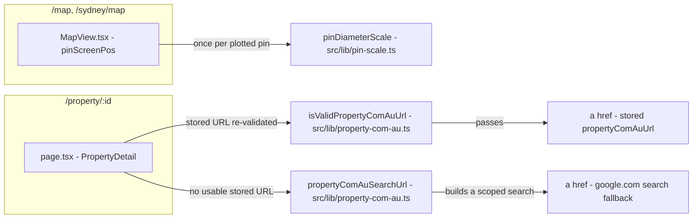
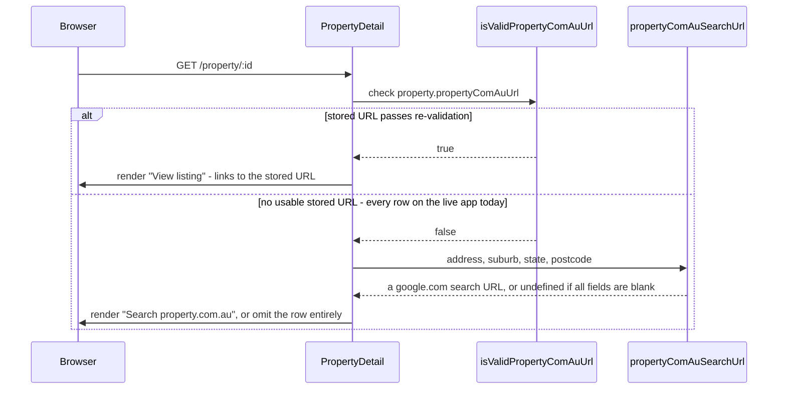

# Walkthrough: pin rank scale and property.com.au search link

**Diff base:** `main` @ `f57b86f` (working tree — nothing committed yet). **Files:**
`src/lib/pin-scale.ts`, `src/lib/property-com-au.ts`, `src/app/property/[id]/page.tsx`,
`src/components/MapView.tsx`, `test/pin-scale.test.ts`, `test/property-com-au.test.ts`,
`test/ui.test.ts`.

Two unrelated user-reported gaps, fixed together under one `dev-loop-lite` run:
map pins already scaled with vibe score but the scale compressed most
properties into an imperceptible band, and the property detail page's
"View listing" row for property.com.au has never once rendered in production
because the column it reads has never been backfilled. Neither fix touches the
other's code; they are bundled here only because they landed in the same round.

**Out of scope:** `PIN_MIN`/`PIN_MAX`, `vibeScore` itself, pin hit target,
colour or the popup, backfilling `propertyComAuUrl`, scraping property.com.au,
adding the link to the grid view, `yearBuilt`.

## Architecture

`pin-scale.ts` and `property-com-au.ts` are both pure functions with no shared
callers — the diagram has two disconnected halves because the change does.

## Sequence - rendering the property.com.au row

## Change table

| File | Change | Notes |
| --- | --- | --- |
| `src/lib/pin-scale.ts` | `pinDiameterScale` rewritten: dense rank over deduplicated scores instead of a linear value map. The 3-arg `pinDiameter(score, min, max)` export is gone. | The whole scale fix |
| `src/lib/property-com-au.ts` | New `propertyComAuSearchUrl(address, suburb, state, postcode)` — Google-search fallback | The whole link fix |
| `src/app/property/[id]/page.tsx` | `else` branch on the existing `isValidPropertyComAuUrl` check now builds and renders the fallback instead of rendering nothing | Wires the fallback in |
| `src/components/MapView.tsx` | One stale comment corrected (`:151-153`); nothing else in this file changed | See Decisions |
| `test/pin-scale.test.ts` | Rewritten for the rank scale | See Tests |
| `test/property-com-au.test.ts` | New cases for the fallback, including a hostile-input matrix | See Tests |
| `test/ui.test.ts` | One e2e assertion updated — it previously asserted the row does *not* appear when the URL is NULL, which is now the wrong behaviour by design | See Tests |

## The flow

| Entrypoint | Trigger | First changed file it reaches |
| --- | --- | --- |
| `MapView` renders a pin | `pinDiameter(score)` call inside `pinScreenPos` (`MapView.tsx:383`) | `src/lib/pin-scale.ts:48` |
| `GET /property/:id` | Server-rendered detail page, `PropertyDetail` (`page.tsx:33`) | `src/app/property/[id]/page.tsx:92` |

**Pin scale.** `MapView.tsx:154-155` builds one `pinDiameterScale([...scoreOf.values()])`
closure per render and calls the returned function once per pin inside
`pinScreenPos` (`:382-383`) — this call site is unchanged; only the function it
calls got rewritten. `pinDiameterScale` (`pin-scale.ts:48-86`) does all the
sorting, deduplication and rank-to-diameter mapping once, in the closure
builder, so the returned function stays an O(1) `Map` lookup per pin. That is
what the O(1)-per-pin constraint in the brief actually buys: it fixes where the
O(n log n) sort is allowed to happen (once, building the closure) rather than
where it's forbidden (inside the per-pin call).

**property.com.au link.** `PropertyDetail` (`page.tsx:92`) is unchanged as an
`if`; only the `else` (`:105-130`) is new. It calls
`propertyComAuSearchUrl(address, suburb, state, postcode)` (`property-com-au.ts:60-74`)
— follow that call next, since it's where both the URL-construction logic and
the security-relevant encoding live.

## Decisions

### Rank scheme: dense rank over deduplicated values, not raw-index rank or frequency-weighted rank

`pinDiameterScale` (`pin-scale.ts:52-63`) sorts and dedupes the input scores,
then maps the i-th distinct value to `i / (k - 1)` across
`[PIN_MIN, PIN_MAX]`, and looks a score up by its own value rather than its
position. This is not the only way to rank, and the two obvious alternatives
were rejected for specific, different reasons:

- **Sort the raw array and use index as rank.** This is the trap the brief
  named directly: two equal scores land at adjacent array indices and would
  render at different diameters. Two identical properties must be the same
  size on the map, so tie-equality wasn't negotiable.
- **Fractional/average rank weighted by tie-group frequency.** This also
  satisfies tie-equality, but it changes the semantics from "position among
  distinct values" to "percentile among all instances". A large cluster of
  identically-scored properties would then absorb most of the visual range,
  re-compressing whatever sits outside the cluster — reintroducing the exact
  failure this change exists to fix, just relocated to a different part of the
  distribution instead of removed.

Why this was the right layer to fix at all: measured on the live app across
345 plotted pins, the old linear map already reached both extremes (`min=5px`,
`max=50px`) but put the middle half of all properties — p25 to p75 — inside an
8px band of the 45px range. "Pins don't scale" would have been a `MapView`
bug; "pins scale but imperceptibly" is a property of the scale function alone,
which is why `pin-scale.ts` is the only file with logic changes in this half
of the diff.

### The out-of-array fallback: accepted as necessary, its interpolation rejected as unnecessary

`nearestBelow` (`pin-scale.ts:68-79`) exists for a score that was never in the
array the scale was built from. In production this branch is unreachable —
`MapView` builds the score array from the same map it reads scores from
(`MapView.tsx:154-155, 382`), so the exact-match path always hits. Review
flagged that the implementation had gone further than the requirement: the
first version returned a linear *interpolation* between the two
rank-neighbours, which is a division and a double map lookup defending a path
nothing runs, where the brief's own bar was only "clamp".

The proposed fix went one step further and asked to drop the binary search too,
clamping straight to `PIN_MIN`/`PIN_MAX`. That was rejected: without the
search, a score strictly between two known values has no order-respecting
answer, and monotonicity — a strictly higher score must never yield a
strictly smaller diameter — is the one invariant the whole rank feature rests
on. Trading that away to remove five lines from a path nothing executes was
the wrong direction. What shipped instead keeps the binary search but returns
the lower rank-neighbour's diameter outright, dropping only the interpolation
arithmetic — smaller than both the original code and the proposed fix, and the
only version of the three that keeps every stated guarantee.

### The 3-arg `pinDiameter(score, min, max)` export was deleted, not deprecated

Its only callers were the module's own tests. `MapView.tsx` has a local
`pinDiameter` too, but it's bound to the *return value* of `pinDiameterScale(...)`
(`MapView.tsx:155`) — a name collision with the old export, not a usage of it.
Under rank scaling there is no meaningful pure `(score, min, max) -> diameter`
function left to keep: diameter now depends on a score's position within the
whole plotted set, not on two scalars. Keeping the old export around would
have meant either dead code, or a second, linear scale function quietly
disagreeing with the one actually driving the map.

### `MapView.tsx`'s comment: fixed as a stale side effect, not re-explained

`MapView.tsx:151-153` used to describe the diameter as mapping "linearly onto
[PIN_MIN, PIN_MAX] across whatever range is actually present" — true before
this change, backwards after it, since rank scaling is deliberately
range-independent. This is the one line touched in a file the rest of the
diff doesn't reach, and it's worth calling out precisely because of that: the
comment didn't rot on its own, it rotted because a file the diff *did* change
(`pin-scale.ts`) changed the behaviour it was describing. A maintainer reading
only `MapView.tsx` — not `pin-scale.ts` — would have kept believing outliers
still stretch the visible range, the exact misconception this change exists to
remove, and could plausibly have "restored" a linear scale believing they were
preserving documented behaviour. The fix re-points the comment at the new
behaviour in three lines rather than re-explaining the rank rationale inline —
that rationale already lives in `pin-scale.ts`'s docstring, and duplicating it
here would only give it a second copy to drift out of sync with, which is the
exact failure being repaired.

### The fallback is a Google search, not a scrape, and it says "Search", not "View listing"

`GET /api/batch` on the live app reports `propertyComAuUrl: 0` across every
row — the conditional link shipped complete in an earlier round and has never
once rendered, because the column it depends on was never backfilled. A
column nobody populates is indistinguishable, from the outside, from a
feature nobody built. Scraping property.com.au to backfill it was out of
scope here; the user's own bug report pre-authorised the remedy actually
shipped — "if you can't do a link, do a google search url" — which is why
`propertyComAuSearchUrl` builds a search URL rather than attempting to locate
the real listing.

The link text went through three rejected candidates before landing on
"Search property.com.au ↗" (`page.tsx:126`): "Find on property.com.au" still
reads as though the listing was located; "property.com.au (search)" buries the
distinction in a parenthetical easy to miss at a glance; an icon or badge
instead of wording was more machinery than a text row warrants. The wording
matters because the row sits directly below one that, when the URL *is*
present, says "View listing" — a reader skimming down the list must not read
the fallback as confirmation a listing was found.

### `propertyComAuSearchUrl` takes four nullable strings, not a `Property`

`property-com-au.ts:60-65` takes `address`/`suburb`/`state`/`postcode`
individually, matching the shape of the sanitizers already in the same module,
which all take primitive values rather than the whole row. This keeps the
function pure and trivially testable against hostile strings without needing
a fixture `Property` object.

### Untrusted input, encoded through `URLSearchParams`, not string concatenation

Every field reaching `propertyComAuSearchUrl` is externally scraped DB text,
rendered straight into a live `href`. `property-com-au.ts:71-72` builds the
query through `new URL(...)` and `url.searchParams.set(...)` rather than
template-literal concatenation, which is what makes `&`, `#`, `?`, `//`, `\`,
a `javascript:` prefix, newlines, quotes and angle brackets in an address land
as inert, percent-encoded characters inside the `q` parameter instead of
breaking out of it or the URL entirely. This is also the reasoning that kept
this run out of `dev-loop-ultralight` despite qualifying on file count and
blast radius alone: constructing a *new* live href out of unvalidated input is
untrusted input reaching an output sink, and the repo already treats this data
as untrusted at both ends — the *stored* URL is re-validated on the render
path even though the write path already sanitised it. Adding a second,
constructed URL to the same row and reviewing it with a single generalist
sweep would have been inconsistent with the care the existing line already
gets, so the Security lane was kept in scope.

One asymmetry was raised and deliberately not fixed:
`propertyComAuSearchUrl`'s inputs are typed `string | null | undefined` and
`.trim()`ed with no runtime `typeof` guard, while its sibling
`sanitizePropertyComAuUrl` in the same file (`:19-35`) carries an explicit
`typeof v !== "string"` check with a comment explaining why. The guard on the
sanitizer defends the `LoadItem` path — a compile-time cast over unvalidated
JSON, where a non-string genuinely can arrive at runtime. `address`/`suburb`/
`state`/`postcode` come from SQLite `TEXT` columns, where they don't; adding
the same guard here would be defending against an input shape this call site
cannot receive.

## Where to look to review this

In priority order:

1. `src/lib/pin-scale.ts:48-86` — the whole rank rewrite. Confirm the closure
   builder does the sort/dedupe/rank once and the returned function is a pure
   `Map` lookup (or, off the hot path, the binary search in `nearestBelow`),
   with no scan reachable from the per-pin call site.
2. `src/lib/property-com-au.ts:60-74` — `propertyComAuSearchUrl`. Confirm
   every field lands inside `URLSearchParams` and nothing reaches the query
   string via concatenation.
3. `src/app/property/[id]/page.tsx:105-130` — the new `else` branch. Confirm
   it only ever renders when `isValidPropertyComAuUrl` is false, and that a
   missing/blank address still omits the row rather than linking to an empty
   search.
4. `src/components/MapView.tsx:151-153` — confirm this is the only change in
   the file, and that the corrected comment now matches the rank behaviour
   rather than the old linear one.

## Tests

**`pin-scale.test.ts`** covers degenerate inputs collapsing to `PIN_MID`
(empty array, a single distinct score, all-equal scores), NaN handling, rank
spread reaching both `PIN_MIN` and `PIN_MAX` regardless of a single outlier
(`test/pin-scale.test.ts:48-66` — the `[1, 2, 3, 4, 1000]` case is the direct
regression test for the reported bug), tie-equality, and monotonicity across a
mixed array (`:82-95`). The out-of-array test (`:101-111`) was reshaped rather
than dropped when interpolation was removed: its old assertion ("lands
strictly between the two neighbours") is false by design now, so it asserts
the new exact contract (`between == scale(10)`, line 104) while keeping a
range check (`:105-108`) so the order-preservation guarantee stays under test
rather than being replaced by a bare equality on a magic number. The
`interpolate` helper was also renamed to `nearestBelow` as part of the same
fix — not requested by the fix brief, but adopted, on the grounds that leaving
a function named `interpolate` after it stopped interpolating recreates the
exact stale-name problem the `MapView.tsx` comment fix (above) exists to
repair.

**`property-com-au.test.ts`** adds cases for `propertyComAuSearchUrl`: a full
address builds a scoped search, all-blank fields return `undefined` so a
caller can omit the row, and a single usable field is still enough. The
hostile-input matrix — `&`, `#`, `?`, `//`, `\`, `javascript:`, newline/CR,
quotes, angle brackets — is executed rather than reasoned about
(`:167-182`): it asserts the protocol, host and path stay pinned to
`www.google.com/search` regardless of address content, and that hostile text
survives only as inert, percent-decoded text inside `q`.

**`test/ui.test.ts`** had one test that directly contradicted the second
requirement and was rewritten rather than deleted: it used to assert that the
property.com.au row does not appear when the stored URL is NULL, which was
correct before this change and is the wrong behaviour after it, since NULL is
now exactly the case the fallback exists for. The rewritten test
(`test/ui.test.ts:1745-1774`) checks the row now always renders, that the
link text is "Search property.com.au" and never "View listing" when the URL
is NULL, and that the `href` both points at `google.com/search` and is scoped
with `site:property.com.au` in the decoded query. This test was not in the
brief's stated file list; it surfaced only because the implementer noticed
the existing assertion would fail against the intended behaviour.

**Not covered:** hostile *combinations* of all four fields at once (only
`address` was hostile in the matrix; `suburb`/`state`/`postcode` were plain
strings alongside it). This is a narrower gap than it first looks: all four
fields are joined into the same string and passed through the identical
`map`/`join`/`URLSearchParams` path (`property-com-au.ts:66-72`), so a second
or third hostile field exercises no code the address case didn't already
cover — the untested part is a fuller string, not a different encoding step.

Round 1 review: 4 lanes applicable, none skipped, 1 round, no escalation.
**0 Critical, 0 Major, 2 Minor**, both accepted, zero `rejected_wrong`. One
lane's proposed remedy was rejected in favour of a narrower fix (see Decisions
above) — that is a lane doing its job, not a defect in the lane. `npm test`
and the Security lane's hostile-input execution both passed; the tree-digest
integrity check between review rounds initially failed, traced to
`data/app.db` being rewritten by `migrateColumns()` on every `npm test` /
`npm run build` connection open — not a reviewer edit — and confirmed clean
after restoring the file and re-diffing. That trap and its recovery procedure
are now recorded in `.claude/review/conventions.md` specifically so a future
run doesn't skip naming the changed files on a plausible-looking repeat of the
same failure.

## Open questions

Carried from the implementation notes, with dispositions:

1. **Whether "O(1) per pin" and "must not be linear in the number of pins" are
   the same constraint.** The task brief said the former; `brief.md` said the
   latter. The out-of-array fallback is O(log n), which satisfies the second
   phrasing but not literally the first. Flagged by the implementer rather
   than assumed. **Settled:** both phrasings are satisfied by what shipped,
   since the O(log n) path only runs on the defensive branch that never
   executes in production; whether that branch should exist at all is the
   separate question resolved under "The out-of-array fallback" above.
2. **Whether "Search property.com.au ↗" against "View listing ↗" satisfies
   the requirement that a search must not read as a confirmed listing.**
   Asked directly of the lane that owns requirements conformance. It did not
   raise a finding. **Recorded, not resolved further** — a requirements
   finding is informative by its absence too: the reviewer read the wording
   the same way the implementer did.
