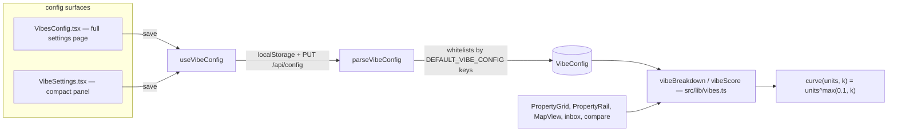
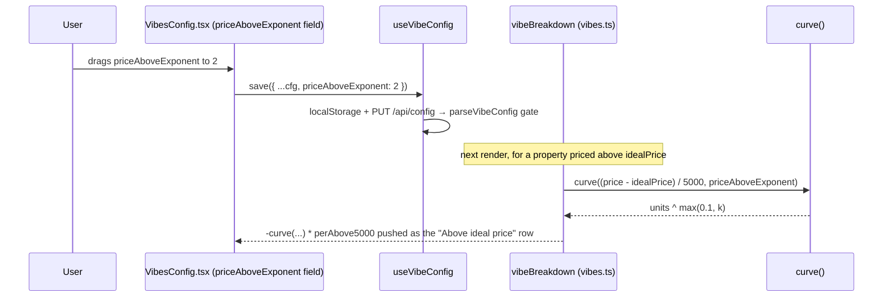

# Walkthrough: exponential price-deviation penalty

**Branch:** `feat/price-exponent` · **Diff base:** `d801ff2` · **Files:** `src/lib/vibes.ts`,
`src/components/VibesConfig.tsx`, `src/components/VibeSettings.tsx`, `test/features.test.ts`.

The vibe score already lets distance-to-station and transit-to-Flinders grow
super-linearly with a per-field exponent. Price deviation from the ideal could
not — both the above-ideal and below-ideal deductions were flat linear. This
change routes both through the same `curve()` helper the two distance fields
already use, behind two new config fields, `priceAboveExponent` and
`priceBelowExponent`, both defaulting to `1`.

**Out of scope:** any retuning of default weights, any cap on the resulting
deduction (the two existing exponents have none either — a huge deduction at a
high exponent is the user's tuning problem), and any change to how `VibeConfig`
is stored, synced or validated.

## Architecture

`vibeBreakdown`/`vibeScore` are the one scoring function every list surface in
the app calls — the grid, the map pins, the compare view, the rail, the inbox
score badge. That fan-out is exactly why the "defaults stay byte-identical"
constraint below is the load-bearing one: a mistake here moves every score in
the app, not one screen's worth.

## Sequence — a config edit changing one property's price term

## Change table

| File | Change | Notes |
| --- | --- | --- |
| `src/lib/vibes.ts` | Two new `VibeConfig` fields + defaults; both price branches in `vibeBreakdown` now call `curve()` instead of a bare linear multiply | The whole domain change lives here |
| `src/components/VibesConfig.tsx` | Two new `GROUPS` entries in the `Price` group, each with a worked-example hint | Placed directly under the weight each modifies, matching the `stationExponent`/`flindersExponent` placement already in this file |
| `src/components/VibeSettings.tsx` | Two new `FIELDS` rows, same placement convention | Compact-panel mirror of the above |
| `test/features.test.ts` | New assertions: default-inertness (row + whole-score), the exponent biting, mutual independence across all four exponents, clamp-stays-finite, at-ideal produces no row | See Tests below for what one deleted assertion turned out to prove |

## The flow

| Entrypoint | Trigger | First changed file it reaches |
| --- | --- | --- |
| Drag either new field in the full settings page or the compact panel | User interaction | `src/components/VibesConfig.tsx` / `src/components/VibeSettings.tsx` |
| Any render of a property list (grid, map, rail, inbox, compare) | Existing `vibeScore`/`vibeBreakdown` call, unchanged call sites | `src/lib/vibes.ts` |

### Why two exponents, not one shared one

`perAbove5000` and `perBelow10000` (`src/lib/vibes.ts:14,16`) were already
asymmetric before this diff — different weights *and* different unit sizes
($5k vs $10k) — because overpaying and being suspiciously cheap are different
signals about a listing, not mirror images of the same one. A single shared
`priceExponent` would have collapsed that asymmetry and foreclosed the most
likely tuning: over-budget escalating hard while under-budget stays linear. The
rejected alternative of exponentiating only the above-ideal side and leaving
below linear was rejected for a different reason — it guesses which side the
user actually cares about, which the requirement never said. Two independent
fields, `priceAboveExponent` and `priceBelowExponent` (`src/lib/vibes.ts:15,17`,
defaults at `:47,49`), preserve the asymmetry the config already committed to.

### Why both branches call the existing `curve()` rather than a fresh `Math.pow`

`curve` (`src/lib/vibes.ts:106`, doc comment `:99-105`) already carries the
clamp — `Math.max(0.1, k)` — that keeps a hand-edited `0` or negative exponent
from flattening the penalty to a constant or, worse, returning `Infinity` at
zero deviation, which would `NaN` every score, sort position and grid badge at
once. `stationExponent`/`flindersExponent` (`src/lib/vibes.ts:127`, `:149`)
already lean on that clamp; `src/lib/vibes.ts:130-139` is this diff routing the
two price branches (`push("Above ideal price", ...)` and
`push("Below ideal price", ...)`) through the same function rather than
inlining a second `Math.pow` that would have had to duplicate — or silently
drop — that reasoning.

### Why this needed no migration, despite adding fields to a persisted type

`VibeConfig` is not a table — it's a JSON blob, held in `localStorage` under
`vibeConfig` and in a server settings row read through `parseVibeConfig`
(`src/lib/vibes.ts:207-216`, gate loop `:211`). That function iterates
`Object.keys(DEFAULT_VIBE_CONFIG)` and fills any key absent from a stored blob
with the default, dropping anything non-numeric. A field added to
`DEFAULT_VIBE_CONFIG` therefore needs no DDL, no coordinated deploy, and no
backfill: every existing stored config picks up `priceAboveExponent: 1` and
`priceBelowExponent: 1` on the next read, and an older client that has never
heard of these keys simply ignores them when it writes its own config back.
This is genuinely non-obvious from the diff alone — it's only visible by
reading the parser — and it is now recorded as its own entry in
`.claude/review/conventions.md` specifically so the next vibe-config change
doesn't have to re-derive it: adding a *field* to `VibeConfig` is not a schema
change, adding a *column* still is.

That fact is also what decided the review loop: `dev-loop-ultralight`, on the
strength of the no-migration/no-schema/no-generated-artifact criterion holding
for a reason a diff-only reader wouldn't otherwise have, plus the other five
criteria (4 files, one project, pure arithmetic, no new dependency, revert to
roll back) holding plainly.

## Decisions

### Defaults must be byte-identical — and that's what makes this diff safe despite touching every score in the app

`Math.pow(u, 1) === u`, so with both new exponents at their default of `1`,
`curve(units, 1)` degrades to the exact linear expression the two price
branches computed before this diff. That single algebraic fact is why a change
that runs through `vibeBreakdown` — the function every list surface in the app
calls — is safe to ship without re-auditing every consumer individually. It is
pinned by two assertions, not one: `term("Above ideal price", {})` still
equals `-10` (`test/features.test.ts:116`), and the *whole* default-config
score, `vibeScore(p, ratings, DEFAULT_VIBE_CONFIG)`, still equals `942.2`
(`test/features.test.ts:117-121`). The whole-score assertion is the one that
matters more: a regression in an unrelated field of the breakdown could still
leave the single-row assertion green while moving the aggregate that every
sort, badge and comparison actually reads.

### The hint worked-examples, and why they weren't just copied from the station hint

Each new hint (`src/components/VibesConfig.tsx:31`, `:38`) states a concrete
compensating weight — `0.025` for above-ideal, `0.05` for below — derived from
a $200k reference deviation: $200k / $5k = 40 units, and `0.025 * 40² = 40`,
reproducing today's linear deduction at that point exactly; $200k / $10k = 20
units, `0.05 * 20² = 20`, same story. The two pre-existing hints
(`stationExponent` at `:50`, `flindersExponent` at `:57`) already carry the
same kind of worked number, so a new hint without one would be the odd one
out — and a bare exponent knob with no sense of the offsetting weight is a
knob that quietly wrecks the ranking the moment someone touches it. Copying the
station hint's `0.06` verbatim was considered and rejected outright: price
units are an order of magnitude larger than station units, and the number
would have actively misled rather than helped.

Worth knowing as a reviewer: neither existing hint had ever written down *how*
its number was derived, and this run rediscovered the method by working
backward from each hint's own stated example — 4 km / 250 m = 16 units for
station, 16² = 256, 16/256 ≈ 0.0625 ≈ `0.06`; 25 minutes / 5 = 5 units for
Flinders, 5² = 25, 5/25 = `0.2`. All four hints answer the same question —
what weight keeps power-2 matching the linear default at a typical bad case —
it was just never stated before. That's now recorded so a fifth exponent field
doesn't have to rediscover it a third time.

### A test assertion that was deleted because it could never have passed

An early draft asserted that `term("Below ideal price", { priceAboveExponent: 2 })`
is `undefined` for the above-ideal fixture. `term`'s implementation ends in
`.find(...)!.pts` — the non-null assertion means a missing row throws rather
than returning `undefined`, so this assertion could not have passed regardless
of what the code under test did; it would have failed for a reason unrelated
to price-exponent independence. Rewriting it to assert the row's absence
properly was considered and rejected too — that would only re-test the
pre-existing `if`/`else if` control flow in `vibeBreakdown`
(`src/lib/vibes.ts:130-139`), not anything this diff adds. It was deleted
outright. The reviewer, working independently, enumerated the same conclusion
from the other direction (see Tests below).

### Why `dev-loop-ultralight`, and what that bought here

One reviewer, one round, the full 9-item sweep, no mutation testing — this
loop doesn't offer a scratch worktree to mutate against. Be straight about
what that means: a clean result here is one Sonnet reviewer's single pass, not
three lanes cross-checking each other or an adjudicated adversarial round. What
makes this particular zero-finding result worth more than "the sweep said
nothing" is that all nine concerns carry a substantive, checkable verdict
rather than a rubber stamp — three specifically show independent work rather
than assent: the hint arithmetic was recomputed by hand against the code
(`round-1/ultralight.log.md` concern 2), the flagged line-length candidate was
re-measured with a UTF-8-correct tool rather than trusted either way (concern
6, see next section), and all twelve ordered pairs among the four exponents
were enumerated to check which were actually asserted and which were
structurally impossible to violate (concern 8).

### The line-length finding-candidate that rested on a wrong premise — three mis-measurements of the same two lines

`round-1/plan.md` handed the reviewer an observation, not a verdict: that the
implementer had compressed its two new hint strings to fit under 120
characters, on a limit the lead believed didn't exist — reasoning that this
repo has no `.claude/standards.md` and that a neighbouring `stationExponent`
hint in the same `Price` group already runs 147 characters. **Both halves of
that premise were wrong.** The 120-character limit is a real MUST, from the
`coding-standards` skill — the cross-project baseline that applies precisely
*because* this repo has no standards file of its own to override it — and the
147-character count was itself a mis-measurement.

Three separate people mis-measured these same two lines during this run: the
implementer's own tool read 124-129 and rewrote the hint text twice trying to
fit; the lead's `awk` count read 147 on the neighbouring line; the reviewer's
own first pass, via PowerShell's `Get-Content`, read 121/122. All three inflate
lines containing `—`, `²` and `…` — this codebase uses multi-byte characters
freely in UI copy, and both byte-oriented counts and console-encoded counts
overcount them. Measured as UTF-8 (`[System.IO.File]::ReadAllText`, matching
how the compiler actually reads the file), the two new hint lines
(`src/components/VibesConfig.tsx:31,38`) are **118 and 119 characters** — both
inside the limit — while the neighbouring `stationExponent` hint really is 145,
a genuine pre-existing breach this diff doesn't touch and isn't responsible
for. Classified `wrong`, charged to the lead rather than the reviewer, because
with one reviewer and no second opinion this is the only calibration available
on whether the sweep is producing true findings — and it's more useful pointed
at where the error originated than dropped quietly. Both the tool-choice
lesson and the "adding a field needs no migration" fact are now their own
entries in `.claude/review/conventions.md`.

## Where to look to review this

In priority order:

1. `src/lib/vibes.ts:130-139` — the two price branches now calling `curve()`.
   Confirm both still gate on the pre-existing `>`/`<` (not `>=`/`<=`) against
   `idealPrice`, so a price exactly at ideal still produces no row at any
   exponent.
2. `test/features.test.ts:113-121` — the default-inertness pair (single row +
   whole score). This is the assertion that actually backs the "safe to ship"
   claim; everything else is regression coverage for the new behaviour, not
   for the old.
3. `test/features.test.ts:124-154` — the mutual-independence assertions across
   all four exponents. If you're checking whether the twelfth ordered pair
   (does `priceBelowExponent` leave the above-ideal term alone) is really
   untestable rather than merely untested, the answer is in the `if`/`else if`
   exclusivity at `src/lib/vibes.ts:130-139` — the below branch cannot execute
   at all while pricing above ideal.
4. `src/components/VibesConfig.tsx:27-39` and `src/components/VibeSettings.tsx:19,21` —
   confirm the placement matches `stationExponent`/`flindersExponent`'s
   existing convention (directly under the weight each modifies) rather than
   grouped separately.

## Tests

`test/features.test.ts` gained: default-inertness for both the single
`"Above ideal price"` row and the full default-config `vibeScore`
(`:113-121`); the exponent actually biting for both branches (`:124`, `:137`);
mutual independence enumerated across all twelve ordered pairs among the four
exponents (station, flinders, priceAbove, priceBelow) — eleven asserted
directly (`:127-154`), the twelfth left unasserted because it is structurally
guaranteed by the branch exclusivity noted above, not because it was missed;
clamp-stays-finite for a `0` and a negative exponent on both new fields
(`:157-176`); and price-exactly-at-ideal producing no price row regardless of
exponent (`:178-184`).

Round 1 review (`dev-loop-ultralight`, one reviewer, one round, no mutation
testing) raised **zero findings** across all nine concerns, each with a
recorded verdict rather than a pass-through. No escalation — there was no
Critical, no Major, and nowhere near the four accepted findings that would
trigger it. `npx tsc --noEmit` and `npm run build` were run directly by the
reviewer and came back clean. `npm test` was deliberately *not* run by the
reviewer, because it rewrites the tracked `data/app.db` via the connect-time
migration (`.claude/review/conventions.md`); the lead ran it separately after
the sweep — **16 suites green** — and restored the DB afterwards.

**Three mutations were run against the finished tree, and all three were
caught.** This loop does not offer mutation testing and the reviewer judged the
assertions by reading them, which is the weaker check; the previous run in this
repo produced two separate tests that passed while the behaviour they covered
was broken, so reading was not treated as sufficient here:

| Mutation | Expected to break | Result |
| --- | --- | --- |
| `DEFAULT_VIBE_CONFIG.priceAboveExponent: 1 → 2` | default-inertness | **caught** — `features.test.ts:116`, actual `-100` vs expected `-10` |
| Above-ideal branch reverted to the bare linear multiply (drop `curve()`) | the exponent biting | **caught** — `:124`, actual `-10` vs expected `-100` |
| The two price exponents swapped between branches | mutual independence | **caught** — `:124`, actual `-10` vs expected `-100` |

`src/lib/vibes.ts` was confirmed byte-identical (`git hash-object`) to its
pre-mutation state afterwards, and the suite re-run green.

**Not covered:** any cap on the resulting deduction (explicitly out of scope,
per the brief and the two pre-existing exponents' own precedent), and any
retuning of the default weights.

## Open questions

None outstanding. The one open question raised mid-run — how the two
pre-existing hints' worked examples had originally been derived, since the
implementer could not reverse-engineer it — was answered by checking: both use
the same "what weight keeps power-2 matching the linear default at a typical
bad case" method as the two new hints, they had just never written it down.
