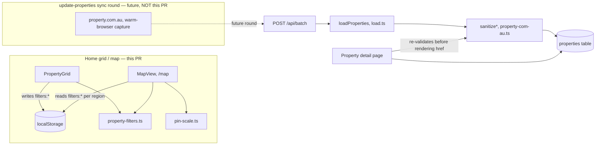
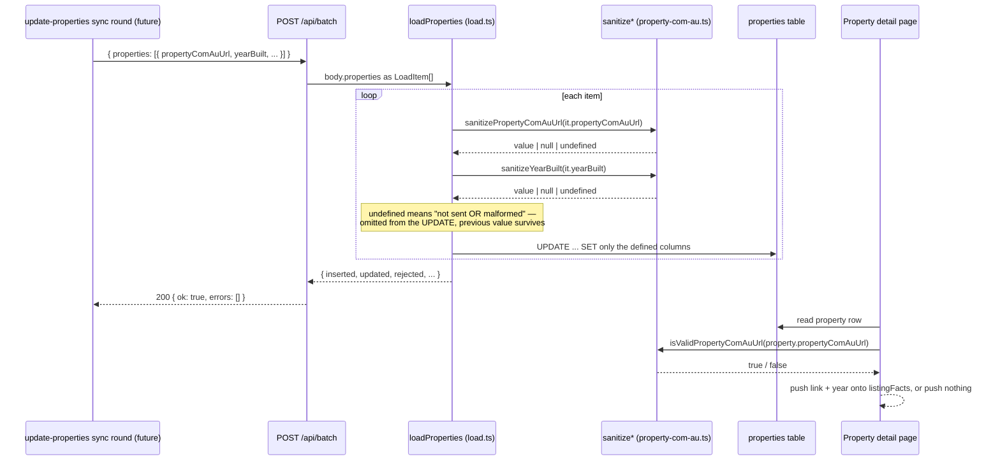

# Walkthrough: property.com.au enrichment, map filters, vibe-scaled pins

**Branch:** `feat/property-detail-and-map` · **Diff base:** `c6d242a` · **Commit:** none yet —
this was written against the uncommitted working tree. Line-number anchors below are file+line
as the files currently sit on disk, not against a commit hash; don't expect `git show <hash>:file`
to match them. They will hold once this change is committed as part of the PR.

Four requirements landed together: store and show a per-property property.com.au link and
build year (items 2–3); make `/map` honour the home grid's filters (item 4); scale map pins
5–50px by vibe score (item 5). A fifth item was added mid-run at the user's request after it
surfaced as a side effect of investigating the original ask: arrow keys were silently rewriting
photo room tags while browsing the lightbox (item 6).

**Out of scope:** item 1, the original "arrow keys don't work" report, is dropped — it could not
be reproduced (see Decisions, item 6, for what was actually found instead). No backfill: this
change ships the columns, the write path and the UI, but populates nothing. No acquisition
mechanism: fetching property.com.au and extracting the build year is a future
`update-properties` sync round, not code in this PR. Do not read this as "listings now show a
property.com.au link" — on day one every row is NULL and neither field renders anywhere.

## Architecture



`property-filters.ts` and `property-com-au.ts` are both new modules this PR introduces
specifically to be the one place their concern is defined, so two independent surfaces
(grid+map; batch API+detail page) cannot drift.

## Sequence — a future sync round writes the enrichment, the detail page renders it



Today, `Sync` never runs, so every row entering the top of this diagram is empty and the
detail page always takes the "push nothing" branch. That is the intended day-one state, not
a bug to chase.

## Change table

| File | Change | Notes |
| --- | --- | --- |
| `src/db/schema.ts` | Two nullable columns: `propertyComAuUrl`, `yearBuilt` | Drizzle side of the schema |
| `src/db/ddl.ts` | Same two columns in `CREATE TABLE` and in `migrateColumns()`'s `add` map | **This is the migration** — see Decisions, "no `migrations/` folder" |
| `src/lib/property-com-au.ts` | New. `sanitizePropertyComAuUrl`, `sanitizeYearBuilt`, `isValidPropertyComAuUrl` | The tri-state validation contract; entrypoint for the write-side thread |
| `src/db/queries/load.ts` | `loadProperties()` calls both sanitizers, tracks a `rejected` counter | Binary to git — see below |
| `src/app/api/batch/route.ts` | `GET` reports `propertyComAuUrl`/`yearBuilt` coverage counts | `POST` needed no change — already passes `body.properties` through untouched |
| `src/app/property/[id]/page.tsx` | Pushes "Year built" / a property.com.au link onto `listingFacts` when present | Re-validates the URL rather than trusting the DB |
| `src/lib/property-filters.ts` | New. `FilterState`, `parseFilterState`, `filterProperties`, `filterKey`, `loadRegionFilters` | The one filter-predicate definition; entrypoint for the filter thread |
| `src/components/PropertyGrid.tsx` | Filter state/logic replaced with calls into `property-filters.ts` | No behavioural change — predicate moved verbatim |
| `src/components/MapView.tsx` | Reads both regions' saved filters, applies each to its own subset; pins become scaled circles | Entrypoint for `/map` |
| `src/lib/pin-scale.ts` | New. `pinDiameter`, `pinDiameterScale` — pure linear scale, clamped [5, 50] | |
| `src/components/TagSelect.tsx` | `onKeyDown` guard blocking 8 keys on the closed `<select>` | The item-6 fix |
| `test/property-com-au.test.ts`, `test/property-filters.test.ts`, `test/pin-scale.test.ts` | New unit suites | |
| `test/batch.test.ts` | Round-trip coverage for the new batch fields | |
| `test/ui.test.ts` | New map-pin/filter tests, item-6 regression tests | |
| `package.json` | Wires the three new unit suites into `npm test` | Ignore this — mechanical |

## The flow

| Entrypoint | Trigger | First changed file it reaches |
| --- | --- | --- |
| `POST /api/batch` (`properties` section) | Future sync round, HTTP | `src/db/queries/load.ts:loadProperties` |
| `GET /map` | Browser navigation | `src/components/MapView.tsx` |
| Lightbox open, arrow key pressed | Browser keydown | `src/components/TagSelect.tsx` |

### Thread 1 — property.com.au URL and build year

**Why a column at all, rather than deriving the link at render time.** This was the thing
that decided the whole design, established by counter-example during a research spike
(`.claude/review/runs/20260820-2043-feat-property-detail-and-map/notes.md`): the real
property.com.au URL is
`https://www.property.com.au/{state}/{suburb}-{postcode}/{street-slug}/{number}-pid-{pid}/`,
and the naive guess — `/property/vic/point-cook-3030/20-villiers-drive/` — 301s to the
homepage. Two things make it underivable: an opaque numeric `pid` that only their own search
can supply, and a street slug that abbreviates (`Villiers Drive` → `villiers-dr`) in a way
that isn't a mechanical transform. There is no render-time fallback, so the URL has to be
captured once (by a human-in-the-loop browser session, same shape the repo already uses for
Domain) and stored.

**Why the build year comes from `year_built` inside an embedded GraphQL cache, not the visible
`Built: 2008` tile.** The tile's DOM hangs off styled-components class hashes
(`Feature__ValueWithUnit-sc-187mi65-0.clXXEK`) that rotate on every deploy of that site. The
`"year_built": 2008` field inside `window.ArgonautExchange[...].URQL_CACHE` is a stable data
field instead of a presentation artifact. It also has to be read from the inline `<script>`
element's text, not the live `window` object — that object is cleared after hydration.
None of this extraction code ships in this PR (see Out of scope, above); it's recorded here because it
constrains the shape `sanitizeYearBuilt` had to accept, next.

`loadProperties` (`src/db/queries/load.ts:162-163`) is where both fields enter the DB:

```ts
propertyComAuUrl: sanitizePropertyComAuUrl(it.propertyComAuUrl),
yearBuilt: sanitizeYearBuilt(it.yearBuilt),
```

Follow the call into `src/lib/property-com-au.ts:19-62` — see Decisions for the tri-state
contract those two functions implement, and why it had to be tri-state rather than
throw-or-null.

At the far end, `src/app/property/[id]/page.tsx:88-107` reads the stored row and re-validates
before it ever reaches an `<a href>` — `isValidPropertyComAuUrl` is the exact same predicate
`sanitizePropertyComAuUrl` uses, so a row written by some other path (not just `loadProperties`)
can't get a malformed value onto the page as a live link.

### Thread 2 — `/map` honours the grid's filters, pins scale by vibe score

`src/components/PropertyGrid.tsx` owned all filter state, its `localStorage` persistence, and
the inclusion predicate, entirely locally. `src/lib/property-filters.ts` is the extraction:
`FilterState` (the 15 fields that decide *inclusion*, not sort order or display), `filterKey`
(the `localStorage` key format), `parseFilterState` (back-compat parse of a saved blob), and
`filterProperties` (the predicate itself, moved verbatim so "grid behaviour unchanged" is
checkable by inspection, not just by test).

`src/components/MapView.tsx:59-70` is the new consumer: it restores both regions' saved filters
via `loadRegionFilters` on mount/profile-change, then in the `pins` `useMemo`
(`MapView.tsx:77-91`) splits the incoming properties on `p.state === "NSW"` — the same
condition `sydney/page.tsx` already uses — and runs `filterProperties` against each region's
own saved `FilterState`. MapView never writes a `FilterState`; it is a pure reader, which is
why the extraction is functions and not a shared hook (see Decisions).

Vibe-scaled pins are the same `pins` memo feeding a second one:
`scoreOf`/`pinDiameter` (`MapView.tsx` around the `useMemo` calls after `pins`) compute each
plotted pin's vibe score and hand the whole set to `pinDiameterScale` in `src/lib/pin-scale.ts`,
which is the pure, unit-tested [min,max]→[5,50] linear scale. The render
(`MapView.tsx:210-232`) replaced the old price-bubble-on-a-stem with a centre-anchored circle
(`data-testid="map-pin"`) sized to `d`, wrapped in a button whose hit area floors at 24px
(`PIN_HIT_MIN`) regardless of how small the visible dot gets.

### Thread 3 — arrow keys no longer silently retag a photo

`src/components/TagSelect.tsx:22-36` adds `blockClosedSelectArrowKeys`, wired as the
`<select>`'s `onKeyDown` (`TagSelect.tsx:76`). See Decisions for why this had to live on the
`<select>` itself and not on `Lightbox`'s existing keydown handler — that's the one finding in
this thread most likely to look like a missed easier fix.

## Decisions

### `sanitizePropertyComAuUrl` / `sanitizeYearBuilt` — tri-state, not throw-or-null

- **Decided:** each sanitizer returns `undefined` for "not sent, or sent but malformed",
  `null` for "caller explicitly wants this cleared", and the value itself once validated.
  `loadProperties`'s existing `if (v !== undefined) set[k] = v` loop is reused unchanged —
  `undefined` simply never reaches the `UPDATE`.
- **Why:** `loadProperties` has no per-item try/catch. Throwing on a malformed field (the
  precedent `markSold` sets for a bad price) would 500 the *entire* batch, breaking the
  documented "one dud can't discard the other 300" guarantee (`CLAUDE.md`). Writing `null` for
  garbage was also rejected: this is a *partial* update path, and a malformed sync payload
  would silently erase a previously-good value it had no business touching.
- **Forced by:** `loadProperties`'s no-throw, partial-update contract — a constraint the brief
  named indirectly (item 4's "CLI and endpoint cannot drift") but the tri-state shape itself was
  the implementer's call in response to it.

### `sanitizeYearBuilt` accepts a numeric string, not just a number

- **Decided:** `"2008"` passes validation exactly like `2008`.
- **Why:** the documented extraction path (Thread 1, build-year source) is a regex over an
  embedded JSON blob whose capture group is a string. A number-only validator would reject
  every real value the future sync round sends, silently leaving the column NULL on the one
  round that exists to populate it — found and fixed as `tech-003` in round 1 review.
- **Alternatives considered:** returning a per-item error list so a caller could see which rows
  were rejected was raised alongside this and rejected as more machinery than the finding
  warranted; a batch-level `rejected` count (visible via `GET /api/batch`) was judged enough to
  make a malformed round visible without adding a second response shape.

### Filter extraction — pure functions consumed by both, not a shared hook

- **Decided:** `property-filters.ts` exports plain functions and a `FilterState` type.
  `PropertyGrid` still owns all ~19 `useState` hooks and every write; `MapView` calls
  `filterProperties`/`loadRegionFilters` and writes nothing.
- **Why:** `MapView` has no filter *controls* — there's nothing on `/map` to change a filter
  with. A `usePropertyFilters()` hook owning 17 writable state slices for a page that only ever
  reads would be dead weight, and would recreate the exact drift risk the extraction exists to
  remove: a stray setter call on the map's copy silently diverging from the grid's.
- **Forced by:** the asymmetry between the two callers (one writes and persists, one only
  reads) — a hook shape is the natural choice when both sides need to write; neither this
  requirement nor this codebase's convention supported it here.

### `/map` applies each region's own saved filters to its own properties — a decision, not a given

- **Decided:** properties are split `p.state === "NSW"` vs. not, and each half is filtered
  against its own `filterKey("vic"|"nsw", profile)` blob.
- **Why this needed deciding at all:** `PropertyGrid` runs as two separate instances (`/` for
  VIC, `/sydney` for NSW) with two disjoint suburb lists and two independent saved filter
  blobs. `/map` shows both regions on one page with no region prop, so "apply the grid's
  filters" (the requirement's literal wording) doesn't parse without picking one of: apply only
  VIC's filters (which would drop or silently unfilter every NSW property), or apply each
  region's own filters to its own subset (chosen).
- **This is stated plainly because the requirement did not settle it.** The practical
  consequence: a user who has only ever filtered the VIC grid sees their filtered VIC set
  **alongside every NSW property, completely unfiltered**, because the NSW `localStorage` key
  is absent and parses to `DEFAULT_FILTER_STATE`. This needs the user's confirmation — flagged
  in review (`req-002`) as defensible but unseen, and carried here unresolved rather than
  silently accepted as correct.

### Pins — circular markers, not the old price bubble, scaled 5–50px

- **Decided:** a centre-anchored circle whose diameter is linear in vibe score across
  [`PIN_MIN=5`, `PIN_MAX=50`], clamped at both ends; price and score moved from an
  always-visible label into the button's `title` tooltip.
- **Why:** the requirement's own numbers rule out the old form — a 5px pin cannot contain a
  price label. This is the assumption the brief itself flagged as needing challenge; using
  `title` for the demoted info matches the codebase's existing pattern of `title` for auxiliary
  detail rather than a custom hover card.
- **Degenerate ranges (0 or 1 score, or every plotted score equal) render at the midpoint,
  27.5px** — `pin-scale.ts`'s `pinDiameter`. `PIN_MAX` would assert every plotted property is
  top-tier and `PIN_MIN` the opposite; with no spread in the data, the midpoint is the only
  reading that claims nothing.
- **Hit area floors at 24px** (`PIN_HIT_MIN`, `MapView.tsx`) even when the visible dot is 5px.
  44px (WCAG 2.5.5 AAA) was considered and rejected — this map plots up to ~300 properties and
  that much overlap between adjacent pins would be worse than the smaller-target tradeoff.
  24px (WCAG 2.5.8 AA) was the number chosen.
- **A filtered-to-empty map must still show a basemap.** Routing pins through the grid's
  filters made an existing branch reachable for the first time: filters that exclude every
  plotted property used to be unreachable (nothing filtered pins before this change), and now
  produce a featureless grey box with no explanation on a page that has no filter UI to
  discover or clear the cause from. Fixed by falling back the map's extent to the unfiltered
  `pinsWithCoords` (or a fixed Melbourne-CBD centre if nothing has coordinates at all) and
  adding a "N more properties are hidden by your grid filters" notice
  (`MapView.tsx`, near line 260).

### Item 6 — the fix has to live on the `<select>`, not on `Lightbox`

- **Decided:** `blockClosedSelectArrowKeys` calls `preventDefault()` inside the `<select>`'s
  own `onKeyDown`, for `ArrowUp/Down/Left/Right`, `Home`, `End`, `PageUp`, `PageDown` — every
  key that steps a *closed* native select's value, minus `Alt+ArrowDown` (the gesture that
  opens the popup) and plain letter keys (type-ahead, the intended way to pick an option by
  keyboard).
- **Why the obvious fix — copying `PropertyPager`'s focused-control guard
  (`PropertyPager.tsx:41-47`, which skips `INPUT`/`TEXTAREA`/`SELECT`) into `Lightbox`'s
  handler — is wrong, not just less good.** Arrow keys on a focused, closed `<select>` are
  handled by the *browser*, not by application code. Guarding `Lightbox`'s handler stops the
  photo from advancing but does nothing to the native select — the user presses an arrow, sees
  nothing move, and the room tag is still silently rewritten. That's strictly worse than the
  pre-fix behaviour, where at least the photo visibly advanced. The fix has to stop the select
  from consuming the arrow in the first place; `Lightbox.tsx` is untouched by this change, and
  that untouched-ness is itself the confirmation the analysis was right — `preventDefault()`
  stops the native value change but the event still bubbles to `window`, so photo navigation
  keeps working with no guard needed on that side at all.
- **`PropertyPager`'s guard was misleading twice in this run**, not once: it first falsified
  the original "arrow keys don't work" hypothesis (the guard was already correct, so a missing
  guard wasn't the cause — item 1 turned out unreproducible), then it suggested exactly the
  fix shape that doesn't work for item 6. Worth knowing before proposing "just copy the pager's
  guard" as a fix for anything else in this file.
- **Round 1 review found the fix was incomplete**, not merely under-tested: the first version
  only handled the four arrow keys. `End`, `Home`, `PageUp`, `PageDown` step a closed select
  identically and were still reachable — accepted and reclassified from `stale` to
  `missing-required`, because this diff's own doc comment claimed the defect family was closed
  when three of seven relevant keys were still live.

### No `migrations/` folder — the migration is the `add` map in `ddl.ts`

**Rarely used pattern, worth stating so it isn't hunted for:** this repo does not version
migrations as separate files. `src/db/ddl.ts`'s `migrateColumns()` holds an additive
`name → SQL type` map (`ddl.ts:215-224`) that `npm run db:migrate` (via `src/db/migrate.ts`)
and every DB connection open both run — see `src/db/client.ts`. Adding the two new columns to
that map *is* the migration; there is no separate `migrations/2026...sql` to look for, unlike
the pattern the bundled exemplar for this document shows.

## Where to look to review this

In priority order:

1. `src/lib/property-com-au.ts:19-62` — the tri-state contract both the batch write path and
   the render path depend on. Everything else in Thread 1 is plumbing around this.
2. `src/lib/property-filters.ts:154-171` (`filterKey`, `loadRegionFilters`) and
   `src/components/MapView.tsx:59-90` (filter restore and `pins` useMemo) — the region-split decision that the
   requirement didn't settle; confirm you agree with the reading before accepting it silently.
3. `src/components/TagSelect.tsx:22-36` — confirm the key list matches what a real, headed
   browser does for a closed `<select>` (Alt+Down excluded, type-ahead excluded); headless
   Chromium can't render a native popup, so this line list is where residual risk concentrates.
4. `src/lib/pin-scale.ts:19-39` — the clamp and degenerate-range behaviour; check against
   `test/pin-scale.test.ts` rather than re-deriving it by eye.
5. `src/db/queries/load.ts:162-170` (use `git diff -a` — see below) — confirm the `rejected`
   counter's two conditions actually distinguish "not sent" from "sent but rejected".

**`src/db/queries/load.ts` is binary to git** — it contains 4 NUL bytes, pre-existing in `HEAD`,
used as a delimiter in a price-history dedup key (`` `${date}\0${event}\0${priceDisplay}` ``).
A plain `git diff` on this file shows nothing at all. Use
`git diff -a -- src/db/queries/load.ts`, or you will review an empty change and report no
findings, which reads identically to "this file is clean." (Recorded as a durable repo fact in
`.claude/review/conventions.md`.)

## Tests

New unit suites: `test/property-com-au.test.ts` (both sanitizers — tri-state boundaries,
numeric-string acceptance, host/scheme gating), `test/property-filters.test.ts`
(`filterProperties` predicate, `parseFilterState` back-compat, `filterKey` format),
`test/pin-scale.test.ts` (clamp at both ends, degenerate-range midpoint). `test/batch.test.ts`
gained round-trip coverage for the two new fields through `POST`/`GET /api/batch`.

`test/ui.test.ts` gained map-pin tests (filters applied via `filterKey`-written `localStorage`
blobs, asserted on `button[data-testid="map-pin"]` count) and the item-6 regression tests,
which were run failing-first per the `would_have_been_bug: true` protocol: a first test draft
recorded 4 PATCH writes to `/api/images/*/tag` from the four arrow keys before the fix landed,
then confirmed 0 after. The test asserts on the network write, not the `<select>`'s DOM value —
necessary, not just cleaner: `TagSelect` has no `key` prop in `Lightbox` (a second, related
latent defect found and deliberately left unfixed — see below), so navigating photos doesn't
reset the select's internal value, and a DOM-value assertion can pass for reasons unrelated to
the fix.

**What round 1 review found that would have shipped as bugs, not just style:** three Criticals,
all in the Tests lane, all proven by mutation — meaning the *code* was correct and the *test*
was missing or too weak to fail if it weren't. `!== undefined` mutated to `!== null` survived
the whole suite (the "explicit clear" half of the tri-state contract had no test, for any
column in the upsert loop, not just the new two). Requirement 4 (map honours filters) had zero
behavioural test — bypassing `filterProperties` entirely in `MapView` left `npm run test:ui`
green, and the one existing map assertion (`dimmed >= 0`) is true by construction. And
`inspectingFilter` specifically was never exercised through `filterProperties` in any test, so
inverting its branch still passed. All three were fixed by writing the missing test, confirming
it failed against the original code (via the reviewer's own mutation, re-applied), then
confirming it passed. Separately, `arch-001`'s `filterKey` extraction was verified in round 2
to produce a byte-identical key string to the original inline format — had it drifted at all,
every user would have silently lost every saved filter, on both the grid and the map, with no
error and no symptom beyond "my filters reset."

**Not covered, deliberately:** true native-popup keyboard interaction (Alt+Down opening the
OS-rendered dropdown, arrows/Enter inside it) — native select popups are OS-rendered and
headless Chromium cannot render them. The equivalent functional path (Playwright's
`selectOption()`, which exercises the real `onChange`/PATCH route) stands in; a headed run
would be needed for strict coverage of that one gesture.

**Known pre-existing failures, unrelated to this change:** two `no squashed/over-wrapped text
on mobile` UI tests fail — data/font-driven, examined and confirmed `stale` in round 1.

## Open questions

- **`/map` splitting filters per region (VIC/NSW) instead of applying one region's filters
  globally is this change's own interpretation of an underspecified requirement — it needs the
  user's sign-off, not just review sign-off.** See Decisions above for the concrete consequence:
  a VIC-only filter habit leaves every NSW property unfiltered on the map.
- **Two `no squashed/over-wrapped text on mobile` UI tests fail on this branch, unrelated to this
  change.** Pre-existing, data/font-driven, confirmed `stale` in round 1 review — flagged here so
  a reviewer who sees red in `npm run test:ui` doesn't spend time chasing a defect this PR didn't
  introduce.
- `TagSelect` has no `key={img.id}` in `Lightbox`, so its displayed value goes stale when
  navigating photos by any means other than arrow keys (e.g. clicking the filmstrip) — found
  while building the item-6 test, deliberately left unfixed as out of scope, wants its own
  ticket.
- The original item 1 ("arrow keys in the photo carousel") is closed as unreproducible, not
  fixed. If it resurfaces, the investigation notes rule out two hypotheses already (a missing
  `PropertyPager` guard; a broken `HeroGallery` regression, which never had keyboard support to
  begin with) — worth reading before re-investigating from scratch.
