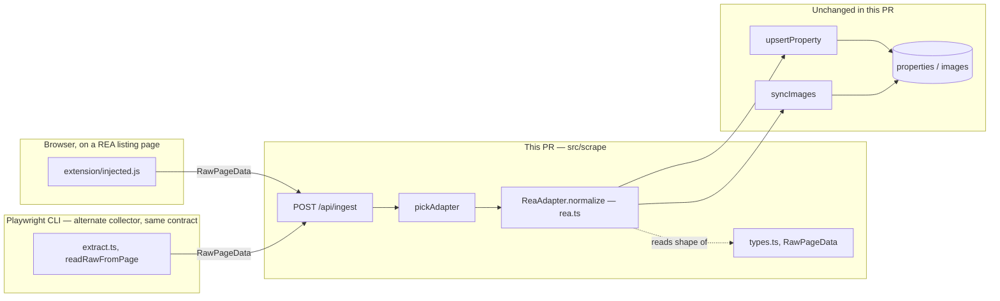
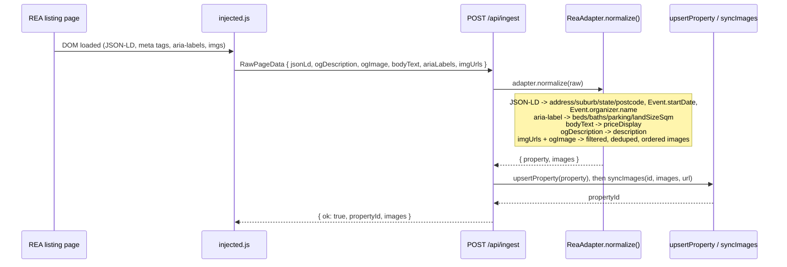

# Walkthrough: realestate.com.au becomes a working ingest source

**Branch:** `realestate` · **Diff base:** `481010e` (branch point on `main`) · **Commit:** none
yet — written against the uncommitted working tree. Anchors below are file+line as the files
currently sit on disk; they will hold once this lands as the PR's commit.

realestate.com.au has been a nominally supported ingest source since the scraper was written and
has produced zero rows: 396 Domain properties in the database, none from REA. This change makes
`ReaAdapter.normalize()` actually populate a row from a real REA listing page.

**Out of scope:** no REA search-feed / bulk harvest — `update-properties` stays Domain-only, this
is the per-listing capture path only (extension + Playwright CLI). No schema change, no new auth,
no change to Domain's own adapter behaviour.

## Architecture



`normalize()` is the only place REA-specific knowledge is allowed to live — both collectors
(`injected.js`, `extract.ts`) stay generic and feed it the same `RawPageData` shape.

## Sequence — one listing, from browse to stored row



Before this change, `Rea` in this diagram read `raw.nextData ?? raw.globals` instead of JSON-LD
and the DOM bag — see Decisions for why that path is now dead weight rather than deleted.

## Change table

| File | Change | Notes |
| --- | --- | --- |
| `src/scrape/types.ts` | Three new optional `RawPageData` fields: `ogDescription`, `ogImage`, `bodyText`, `ariaLabels` | Generic, no REA semantics in the type itself |
| `src/scrape/extract.ts` | Widens the existing `body.innerText` read; adds the four new field captures | Reuses one read for wall-detection and `bodyText`, not two |
| `extension/injected.js` | Same four fields, same read shape, in `collect()` | Kept in parity with `extract.ts` by design, not by accident |
| `src/scrape/adapters/rea.ts` | Full rewrite of `normalize()` and its helpers | The core of this change — see The flow |
| `test/adapters.test.ts` | REA test block replaced; real fixture + 13 synthetic-payload cases | Old fixture deleted, not extended — see Decisions |
| `test/fixtures/rea-listing.json` | New. Real, byte-exact capture of one live listing | Ground truth for the Definition-of-Done assertions |
| `.claude/review/conventions.md` | Records the "golden-fixture coupling is deliberate" decision | Durable triage record, not application code — stops this exact rejection from being re-argued in a future review round |

## The flow

| Entrypoint | Trigger | First changed file it reaches |
| --- | --- | --- |
| `POST /api/ingest` | Extension POST from a REA listing page, or Playwright CLI | `src/scrape/adapters/rea.ts:ReaAdapter.normalize` |

`route.ts:61` (`pickAdapter(raw.url)`) and `adapters/index.ts:7-14` are unchanged passthroughs —
`ReaAdapter` was already registered and already matched REA hostnames. The bug was never "REA
isn't wired up"; it's that `normalize()`, once reached, found nothing to read.

### Why the old adapter returned `status: "ok"` while extracting nothing

The pre-existing implementation hung every field off `firstDeep(raw.nextData ?? raw.globals)`.
On a real REA page today there is no `#__NEXT_DATA__` element at all, and
`window.ArgonautExchange` — read by `extract.ts:138-143`, unchanged by this PR — is present but
`{"resi-property_listing-experience-web":{}}`: an empty object. So `root` was always empty, every
`firstDeep` lookup resolved to `undefined`, and only the address (recovered separately from
JSON-LD) ever landed. The `status: "ok"` gate the old code used didn't require price or beds, so a
bare address was enough to report success. `rea.ts:285-287`'s current gate —
`address && priceDisplay && beds != null` — exists specifically so an address-only row reports
`"partial"`, which is the pre-fix failure mode made visible instead of silent (exercised by the
"partial row" test case).

This diagnosis could not be made by reading the repo — Node and Playwright are both 403'd by REA,
so the actual page shape had to be captured from a real, local, headed browser session and carried
back to this environment. `test/fixtures/rea-listing.json` is that capture.

### Where `normalize()` now reads from instead, and why each choice

Follow `rea.ts:160` (`normalize(raw)`) through its four independent extractions:

**Address, inspection time, agency name — JSON-LD** (`rea.ts:176-190`, `206`). `ldBlocks` is
filtered by `@type`, never by array position (`rea.ts:175-177`), because block order on the page
isn't guaranteed. Two richer-looking alternatives were on the table and rejected: the page also
carries a ~502KB inline hydration script and the data is reachable via the React fiber tree, but
both are hostage to render timing and to REA's current build — reading them would re-create
exactly the fragility this run exists to fix. JSON-LD is a published structured-data contract;
REA has no visible incentive to break it the way an internal bundle can change on any deploy.

**Beds/baths/parking/landSizeSqm — the composite `aria-label`** (`parseSummaryAria`,
`rea.ts:103-126`). This is the one genuinely surprising source: the label built for screen readers
(e.g. `"House with 701m² land size with 4 bedrooms with study 2 bathrooms 2 car spaces"`) turns
out to carry *more* than the page's visible summary — specifically land size, which is otherwise
unreachable on the page at all. Each quantity is matched by its own regex rather than by position
(`rea.ts:114-118`), because land size is absent on some listings and "with study" can interject
between beds and baths — a positional parse would silently misassign fields the moment either
varied. `parseSummaryAria` also takes only the *first* label matching `bedrooms?` (`rea.ts:110`):
later labels of the same shape belong to similar-listing cards further down the page, and picking
one of those would attribute another property's bed count to this one.

**Price — the first `$`-anchored run in `bodyText`** (`priceFromBodyText`, `rea.ts:135-140`).
First-match, not any-match, matters here: a mortgage-repayment calculator further down the page
also renders a `$` figure, and it appears *after* the listing price in text order — an any-match
scan would occasionally grab the wrong number.

**Description — `og:description`** (`rea.ts:198`). Verified to hold the complete 2298-character
description on the sample listing, not a truncated preview, so no DOM selector into the visible
description block was needed at all.

### Images — the part most likely to have shipped silently wrong

`REA_IMAGE_RE` (`rea.ts:23-24`) is a **positive allowlist**, not a `reastatic.net` blocklist, and
this is the one design decision in this change worth slowing down for. A naive host-only filter on
a real listing page pulls in an agency logo, an agent headshot, two UI placeholder SVGs, and three
thumbnails belonging to *other people's listings* (the "similar listings" carousel) — any of which
a naive first-image-wins rule could have promoted to the hero. The allowlist instead requires all
three of: host `i<digits>.au.reastatic.net` (never `argonaut.au.reastatic.net`, which serves the
UI SVGs), filename exactly `image.<ext>` (excludes `logo.jpg`, `main.jpg`), and rendered width
`>= 600` parsed from the leading size segment (excludes the 310×175 similar-listing cards and the
200×200 headshot). `parseReaImage` (`rea.ts:32-38`) is the single choke point all three rules pass
through; `REA_IMG_HOST` (`rea.ts:14`) stays broad deliberately, as a candidate net that this
stricter check narrows — see the comment at `rea.ts:11-13`.

Deduping (`rea.ts:219-232`) is by CDN content hash — the same photo appears at multiple sizes
(`800x600/<hash>/image.png`, `1896x1216-.../<hash>/image.png`) with the size baked into the URL
path — keeping the largest width seen for each hash, in first-seen order.

**Cover ordering, not a hero-picking rewrite** (`rea.ts:234-247`). `pickHero`
(`src/db/queries/properties.ts:150`) ranks images through `urlIds()` (`properties.ts:91`), which
parses Domain's CDN filename convention and returns `null` for every REA URL — so for REA,
whichever image lands at ordinal 0 *is* the hero, unconditionally. Rather than teaching `urlIds`
about a second CDN shape (which would touch shared Domain-serving code for no Domain benefit), the
cover for REA is simply sorted to the front: the hash matching `og:image`, falling back to
`Event.image[0]`, is moved to ordinal 0 ahead of everything else in first-seen order
(`rea.ts:240-247`).

### The `og:image` correction — the actual defect the original brief missed

The brief's original instruction was to fold in the `og:image` URL as a secondary cover signal,
but never added an `ogImage` field to `RawPageData` for it to travel in — so the first
implementation pass used `Event.image[0]` alone, which is what the brief's own "where the data
actually is" section named as identical to `og:image` on the sample listing. It was accepted
without complaint on that listing because the sample listing *has* a scheduled inspection.

**A listing with no upcoming open-for-inspection has no `Event` block on the page at all** —
verified against a second live listing, not inferred. For those properties, `Event.image[0]` isn't
a slightly-worse fallback; it's nothing, and the ordinal-0 hero-ordering the whole image design
rests on (previous paragraph) would have had no cover source at all — silently falling back to
first-seen DOM order, which is exactly the ordering the allowlist and hash-dedupe work was done to
make trustworthy in the first place. `ogImage` was added to `RawPageData`
(`types.ts:58`, captured identically by `extract.ts:165-167` and `injected.js:52,69`) as the
primary source, with `Event.image[0]` retained only as the fallback for pages where `og:image`
itself is somehow missing (`rea.ts:240-241`). The regression is `test/adapters.test.ts:294-333` —
walk through it next if you want to see the failure mode directly: it deliberately omits any Event
block and orders the non-cover image first in `imgUrls`, so it only passes if `og:image` — not
first-seen order — drives ordinal 0.

### The past-inspection cutoff — parity with `domain.ts`, not a new rule

`earliestEventStart` (`rea.ts:83-92`) originally took the unconditional minimum of all
`Event.startDate` values. `nextInspection()` in the sibling adapter
(`src/scrape/adapters/domain.ts:90`) filters to `t >= Date.now() - 6h` before sorting, with the
comment "keep today's earlier slot visible" — so a REA listing with an already-run open home next
to a future one would have reported the past time as the next inspection, and the UI's
`formatInspection()` renders a same-day past time as today's pill. This was raised in round-1
review and accepted with Domain's exact cutoff, not a new one invented for REA — the point of the
finding was parity between the two adapters, and a different cutoff here would have been the same
class of bug wearing a different number. Two tests cover it:
`test/adapters.test.ts:335-345` (an already-run inspection beside a future one — future wins) and
`:346-360` (the same-day boundary: within 6h is kept, well past it is dropped).

## Decisions

### The dead fixture wasn't extended — it was deleted

- **Decided:** `test/adapters.test.ts`'s pre-existing REA case, built around a hand-written
  payload shaped like `nextData`, was replaced rather than kept alongside the new real-fixture
  case.
- **Why:** that fixture is the reason the defect went unnoticed for the life of the repository — it
  passed against a payload REA has never actually served, so a real markup mismatch could not have
  failed it. Keeping it as a second, harmless case would have kept the illusion of coverage this
  change exists to remove.
- **Rejected in review, worth recording as the notable rejection of this run:** the Tests lane
  filed a Major arguing the *new* real-fixture test (`test/fixtures/rea-listing.json`) is itself
  "over-fitted to one capture." Rejected as `wrong`, not merely disagreed with — the finding's own
  notes called the coupling "expected for a golden-data test" and marked it
  `would_have_been_bug: false`. Coupling to a real capture is the design, not an oversight: this
  fixture *should* break the day REA changes its markup, and that break is the signal that a
  re-capture is due. It's also not the only coverage — the synthetic-payload cases
  (`reaEventsPayload`, `reaAriaPayload`, and seven more payloads built inline) exist precisely so
  logic paths aren't gated on one snapshot ever changing. Recorded in
  `.claude/review/conventions.md` so it isn't re-raised.

### `agencyName` — the brief said absent, the page disagreed

- **Decided:** `agencyName` is populated from `Event.organizer.name` (`agencyNameFromEvents`,
  `rea.ts:69-76`), returning `null` only when there's no Event block with one.
- **Why the brief is wrong on this point, and why that's noted rather than silently fixed:** the
  brief's "where the data actually is" section listed agency name as unavailable on the page at
  all. It's there — `Event.organizer.name` on the same JSON-LD block that already supplies
  inspection times (`"Harcourts Settle"` on the sample listing). The first implementation pass
  followed the brief's literal instruction and left it `null`, then flagged the discrepancy rather
  than silently overriding a stated requirement — the correct order for both halves of that
  judgment call. Wired up once flagged.

### Collectors stay generic — no REA selectors leak into `extract.ts` / `injected.js`

- **Decided:** the three (four, after the `ogImage` correction) new `RawPageData` fields are
  generic captures — `ogDescription`, `ogImage`, `bodyText`, `ariaLabels` — with zero REA-specific
  knowledge in either collector. All site-specific parsing (which aria-label is the summary, which
  regex extracts beds) lives in `rea.ts`.
- **Why:** the alternative — having `extract.ts`/`injected.js` reach directly for
  `[data-testid="PropertyDescription"]` or similar — was considered and rejected because that
  selector knowledge would have to be duplicated in both collectors (Playwright + extension) and
  would silently drift the moment REA renamed a testid, with no single place owning the fix. As it
  turned out, `og:description` alone carried the complete text, so no selector was needed at all —
  the generic capture was sufficient, which is some evidence the constraint was the right one to
  hold to.
- **The `body.innerText` read in `extract.ts` was widened, not duplicated** (`extract.ts:124-129`):
  the existing wall-detection read only needed the first few hundred characters; REA's price and
  inspection text sit further down the page, so the one read was extended to ~8000 chars and reused
  for both purposes rather than reading the body twice.

## Where to look to review this

In priority order:

1. `src/scrape/adapters/rea.ts:23-38` (`REA_IMAGE_RE`, `parseReaImage`) and `:213-247` (candidate
   gathering, dedupe, cover ordering) — the allowlist is the part most likely to have a hole a
   fourth real listing would expose; check it against the excluded-URL list in
   `test/adapters.test.ts:190-206` before trusting it.
2. `test/adapters.test.ts:294-333` — the no-Event-block cover test. Confirm for yourself that it
   would actually fail without `ogImage` driving the ordering (it's built with a decoy image
   ordered first specifically so it can), not just that it currently passes.
3. `src/scrape/adapters/rea.ts:83-92` (`earliestEventStart`) against
   `src/scrape/adapters/domain.ts:90` (`nextInspection`) — confirm the two cutoffs actually match;
   this is a parity requirement, not an independent design.
4. `src/scrape/adapters/rea.ts:103-126` (`parseSummaryAria`) — the composite aria-label parse.
   `test/adapters.test.ts:210-263` covers the "with study" interjection and the no-land-size case;
   worth checking a real aria-label variant you can find isn't a third shape neither covers.
5. `src/scrape/types.ts:56-62`, `src/scrape/extract.ts:162-172`, `extension/injected.js:50-71` —
   confirm the two collectors genuinely capture the same four fields the same way; a drift here
   would silently make the extension and CLI paths normalize differently for the same listing.

## Tests

`test/adapters.test.ts`'s REA section: one full-shape assertion against the real fixture
(`test/fixtures/rea-listing.json`) covering every Definition-of-Done field plus the image
allowlist exclusions in one pass, then 13 synthetic-payload cases: four aria-label variants (no
land size, the "with study" interjection, a stray-whitespace quirk, and first-match winning over
a later similar-listing card), multi-size dedupe, no-Event-block cover ordering, the two
past-inspection cutoff cases, first-match vs. later-repayment-figure pricing, non-`$` price
fallback (`Auction`/`Contact Agent`), the address-only "partial" status gate, the
no-JSON-LD-no-DOM-bag throw, and a legacy un-updated-extension payload (no `ogDescription`,
`bodyText`, `ariaLabels` or `ogImage`) proving old captures still normalize, cover included, via
the `Event.image[0]` fallback. Domain adapter tests are unchanged and still pass.

**What review found, and what it changed:** round 1 (4 lanes, all applicable) found one accepted
Minor with `would_have_been_bug: true` — the past-inspection cutoff, above — whose regression test
was written and confirmed failing against the pre-fix code before the fix landed, then confirmed
passing after. The Tests lane separately mutation-tested 13 behaviours in a scratch worktree (each
aria-label regex, all three image-validator rules individually, hash dedupe, keep-largest-width,
hero ordering, the status gate, the throw condition, first-match pricing) and all 13 were caught.
Security found nothing to raise: the new regexes are all linear, and the image URL validator is an
anchored allowlist — which is also what keeps the server-side downloader in `syncImages` from
being pointed at an arbitrary host by a hostile page.

**Worth being honest about, because it's the actual lesson of this run, twice over.** First: the
old REA test passed for the entire life of this feature being dead, because its fixture was
hand-written and shaped like nothing REA has ever served — a scraper test that never breaks on a
real markup change is not testing the scraper. Second: the no-Event-block cover test, as first
specified in the brief, would have passed trivially either way — with only one candidate image
there's nothing to reorder. It had to be rewritten with a decoy image ordered first in the DOM
harvest before it could actually fail pre-fix; the confirmed pre-fix failure was:

```
AssertionError: rea no-event-block cover is the og:image match, not merely the first-seen DOM image
actual:   '...cafefeed.../image.png'   expected: '...deadbeef.../image.png'
```

Both are the same failure shape as the bug this whole change fixes: an assertion structured so it
cannot fail, standing in for a behaviour nobody actually checked.

**Not covered, deliberately:** the REA search-feed / bulk harvest path — out of scope per the
brief's non-goals, `update-properties` stays Domain-only.

## Open questions

None carried from `notes.md` — both discrepancies between the brief and the live page
(`agencyName`, `og:image`) were found and resolved within this run, and the one accepted review
finding (the past-inspection cutoff) was fixed and verified before this document was written.
