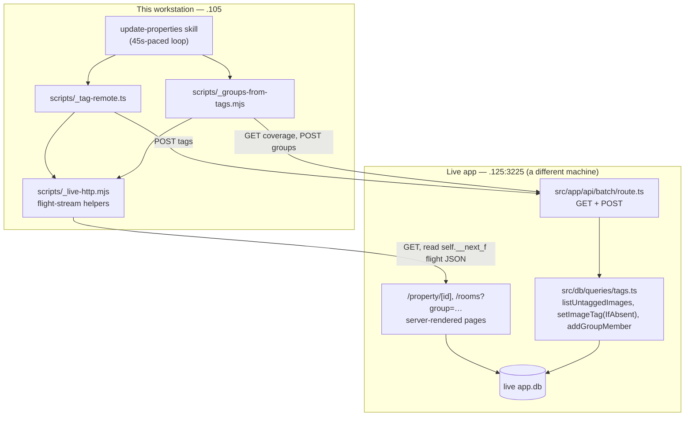
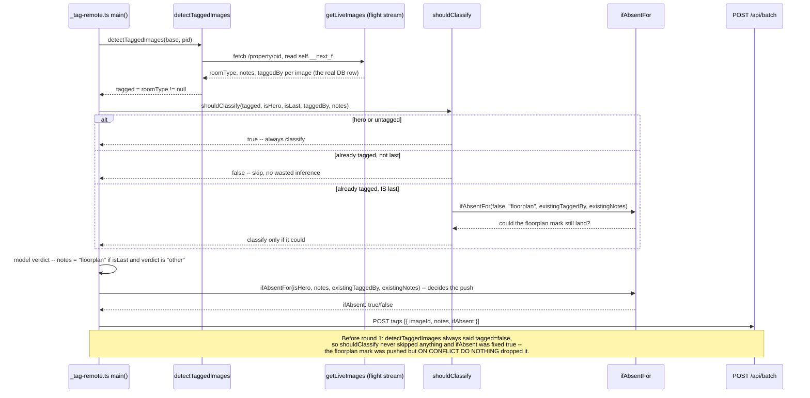

# Walkthrough: fix three defects found in the 2026-08-23 tagging round

**Branch:** `fix/tagging-round-defects` · **Base:** `main` @ `e7e636f` · No commit
exists yet — every anchor below is `path:line` against the working tree as it
stands at time of writing, not a commit hash. If a line has since shifted,
trust the function/variable name over the number.

Three independent defects were found while closing out one round of the
`update-properties` skill: a floorplan mark silently discarded on push, a
group-membership guard that doesn't exist where it needs to, and 19 untagged
images nothing over HTTP can name. All three are fixed. **What this document
is really about** is that fixing the first one twice created two more Majors
that no one asked for, and the shape of that — not the individual diffs — is
what a reviewer needs walked through before opening the file list.

**Out of scope, stated in the brief and held to:** no capability that removes
a group membership (the 31 duplicate memberships already on the live app are
left in place, deliberately); no change to `addGroupMember`, `tagStatus`, or
`isVisibleImage`/`isPropertyPhoto` semantics; no re-tagging or re-harvesting
during this run; no attempt at the 48 properties with no stored floorplan at
all (needs a WAF-paced Domain pass with the user present).

## Architecture

`_tag-remote.ts` and `_groups-from-tags.mjs` never open `data/app.db` — this
round's standing rule is that the local DB is read-only and every write goes
to `.125` over `POST /api/batch`. Reading current state back also has to go
over HTTP, which is why both scripts route through `_live-http.mjs` rather
than a query import.

## Sequence — a last-position, already-tagged, non-hero image

This is the flow all three review rounds live in, so it is the one worth
walking rather than the untagged-image happy path.

## Change table

| File | Change | Notes |
| --- | --- | --- |
| `scripts/_tag-remote.ts` | `detectTaggedImages` re-sourced from the flight stream; `shouldClassify`, `ifAbsentFor`, `roomTypeFor` extracted as exported pure predicates; `isMain` entrypoint guard added | The whole three-round story lives here — see The flow / Decisions |
| `scripts/_groups-from-tags.mjs` | `groupInfoByLabel` reads `/api/batch`'s structured `groups` JSON instead of scraping `/rooms` chip HTML; `currentMemberProperties` reads `/rooms?group=<id>`'s flight-stream `columns`; `filterNewCandidates`/`buildRoomGroup` extracted as exported pure functions; `main()` fails closed (exit 1, no output file) when membership can't be verified | The per-property duplicate guard this run adds |
| `scripts/_live-http.mjs` | `extractArray` gains `opts.throwOnMissing`, now throwing on **two** distinct unparseable shapes (anchor absent; anchor present but the array never closes) instead of returning `[]` for both | The shared parse-failure signal both scripts' fail-closed guards depend on |
| `src/app/api/batch/route.ts` | `GET` gains `untaggedImages: { images, note }`, sourced from the existing `listUntaggedImages()`, `absPath` stripped | Purely additive — see Hard constraints in Decisions |
| `.claude/skills/update-properties/SKILL.md` | Step 4's `ifAbsent` description corrected in both places it appears; the invariant now stated once with a cross-reference | The operating procedure the user reads before running the script; it described the pre-fix, defective behaviour as safe |
| `.claude/review/conventions.md` | New entry: the one-image-per-property-per-group invariant has no owner at the write boundary | Recorded so the three producers' duplicated logic isn't re-argued as a finding next round |
| `package.json` | `test` script gains the four new suites | Wiring only — see Tests for why this mattered more than it looks |
| `test/tag-rules.test.ts` (new) | Unit coverage for `shouldClassify`/`ifAbsentFor`/`roomTypeFor` across all three rounds' branches | See Tests |
| `test/tag-remote-detect.test.ts` (new) | Regression fixture proving `detectTaggedImages` reads the flight stream, not a badge regex, and carries `roomType`/`notes`/`taggedBy` through by value | See Tests |
| `test/group-guard.test.ts` (new) | Unit coverage for the pure `filterNewCandidates` | See Tests |
| `test/groups-from-tags.test.ts` (new) | Subprocess test against a stub HTTP server: fails closed on both unparseable shapes, succeeds and writes the correct payload when membership is verifiable | See Tests |
| `test/batch.test.ts` | +120 lines: pre-existing `GET /api/batch` keys checked by value against direct SQL (not a same-run baseline), `absPath` absence, the `untagged`/`untaggedImages` divergence demonstrated with a real hero-only row | See Tests |
| `.claude/agent-memory/sidekick/MEMORY.md`, `react_hydration_comment_markers.md`, `same_run_baseline_pitfall.md`, `scripts_dir_untested.md` | Ignore this — agent memory bookkeeping, not part of the change |

## The flow

| Entrypoint | Trigger | First changed file it reaches |
| --- | --- | --- |
| `node scripts/_tag-remote.ts` | Run manually from the `update-properties` skill, 45s WAF-paced spacing, one property per loop iteration | `scripts/_tag-remote.ts:69` (`detectTaggedImages`) |
| `node scripts/_groups-from-tags.mjs` | Run once per round after tagging, over the tag payloads `_tag-remote.ts` just produced | `scripts/_groups-from-tags.mjs:44` (`groupInfoByLabel`) |

Both talk to the live app at `192.168.68.125:3225` only; neither opens
`data/app.db`. `main()` in `_tag-remote.ts` (`scripts/_tag-remote.ts:170-288`)
loops each pass-1 harvest entry, resolves it to a live `propertyId` off the
scraped home grid, calls `detectTaggedImages` for that property, and for each
image decides via `shouldClassify` (`:100-110`) whether to spend a model call
on it at all. Where it does, the verdict decides `notes` (`:256-260`) and the
row is pushed with `ifAbsent: ifAbsentFor(...)` (`:273`) — that single call is
what `POST /api/batch`'s `tags` handler (`src/app/api/batch/route.ts:121-127`)
uses to choose between `setImageTagIfAbsent` (an `ON CONFLICT DO NOTHING`
insert) and `setImageTag` (a full upsert of `room_type`/`confidence`/`notes`).

`main()` in `_groups-from-tags.mjs` (`scripts/_groups-from-tags.mjs:125-169`)
reads this round's tag payloads for the lowest-ordinal photo per room per
property (`readBestByProperty`, `:89-104`), then for each of the six room
labels asks `groupInfoByLabel` (`:44-51`) for the group's id and, if the group
already exists, `currentMemberProperties` (`:72-76`) for who is already in it.
`buildRoomGroup` (`:115-123`) is the pure decision the two network calls feed:
it calls `filterNewCandidates` (`:85-87`), which is the entire per-property
guard this file adds.

## Decisions

### Defer healing the 31 duplicate group memberships

Prevent further growth only; leave the 31 duplicates already on the live app
in place. Every mechanism that could remove one is a new *destructive*
capability on `POST /api/batch`, which is deliberately unauthenticated on the
LAN (`CLAUDE.md`: "a token here would lock one of two doors"). That is a
security-posture decision belonging to the user, not to a run fixing a
cosmetic defect — the symptom is 31 of 443 columns showing two stacked
thumbnails instead of one, because `groupByProperty` (`src/db/queries/rooms.ts`)
keys by `propertyId`, so no property renders twice and no count is inflated.

Three healing mechanisms were considered and rejected: making `addGroupMember`
replace-per-property (turns the only writer of `similarity_group_members` into
a destructive one, reachable from an unauthenticated endpoint); adding an
explicit `groupRemove`/`replace` payload section (genuinely better, but still
a delete path on that same endpoint — the user's call, not this run's); and
re-tagging the stale representative to `exclude` (hides the symptom by
corrupting a room tag, worse than the blemish).

**A fourth option surfaced in review and was rejected for a different reason.**
The requirements lane found that narrowing `filterNewCandidates` to "skip only
when this property already has a member whose `roomType` matches the group
heading" would heal by *addition* — no delete capability, no non-goal
violated, and the data (`roomType`) is already fetched and discarded. It was
rejected anyway: for the 10 known mismatch cases it would *add* a second
member, which is the exact symptom this run exists to stop creating. That is a
different requirement from the brief's, and the reviewing lane said so itself.
**What was accepted from that finding** is that the original deferral reasoning
had made this choice implicitly — recording "leave the 31" reads as covering
the duplicates, when it in fact also commits to every wrong representative
image being permanent. That is now stated explicitly rather than left
implicit, and is one of the two open questions below.

### Guard in the producer, not in the writer

The per-property guard (`filterNewCandidates`) lives in
`_groups-from-tags.mjs`, matching what `_group-topup.ts:20-29` and
`_build-groups.ts:11-16,27-32` already do — three producers implementing one
convention rather than two-plus-an-exception. Moving the invariant into
`addGroupMember` so every caller inherits it is the architecturally better
home, and is recorded in `.claude/review/conventions.md` as a deliberate,
examined deviation rather than an oversight: it is the same destructive-write
problem as the healing options above, wearing a tidier hat. **Do not raise the
duplication across the three producers as a finding while that constraint
holds** — see the conventions entry.

### Reuse `listUntaggedImages` rather than write a new query

`GET /api/batch`'s new `untaggedImages` key spreads the shared-layer
`listUntaggedImages()` (`src/db/queries/tags.ts:20-47`) rather than a
purpose-built query returning just `{imageId, propertyId}`. The repo's stated
convention is that the CLI and the endpoint share `src/db/queries/` so the two
cannot drift; a second, narrower definition of "untagged" would be a second
place that answer could go stale.

### The definitional mismatch is surfaced, not reconciled

`listUntaggedImages` filters `t.image_id IS NULL` — no tag row at all.
`tagStatus().untagged` (the pre-existing key) is `total - count(room_type IS
NOT NULL)` — it also counts an `image_tags` row that exists but has a null
`room_type`, which `scripts/hero-set.ts:42`'s hero-only insert can create
locally. Reconciling the two definitions was an explicit non-goal (it would
touch `tagStatus`, which feeds `byRoom` and existing coverage checks where the
looser reading is arguably more correct), so the new key nests `images` and a
`note` (`src/app/api/batch/route.ts:226-231`) stating plainly that
`untaggedImages.images` can be shorter than `untagged` — rather than letting a
caller told only "19" believe a list of 15 was the complete set.

### `arch-002`, recorded rather than re-argued: no owner at the write boundary

`.claude/review/conventions.md` gained an entry this run (quoted above under
"guard in the producer"): the one-image-per-property-per-group invariant has
no single owner because moving it to `addGroupMember` would make that
function's only writer destructive, and it is reachable from the
deliberately-unauthenticated `POST /api/batch`. This is examined and accepted,
not an oversight — if the user later authorises a destructive write path, the
invariant collapses to one place and the three producers reduce to candidate
selection.

## Highlight — reading the RSC flight stream as a data-access channel

Both scripts read `self.__next_f.push([1,"..."])` chunks out of a server-
rendered page's raw HTML (`scripts/_live-http.mjs:31-38`, `fetchFlightFlat`)
rather than calling any endpoint. **This will read as a hack to a reviewer who
hasn't seen it in this repo before, so the reason it exists is worth stating
plainly rather than discovering by reading the code.** `src/app/property/[id]/
page.tsx` calls `getPropertyImages(id)` server-side and passes the full result
— the exact DB `roomType`/`notes`/`taggedBy`/`confidence` columns, not a
rendered badge — into client components. Next.js serialises that whole array
verbatim into the page's flight stream, so reading it directly is *more*
precise than reconstructing "is this tagged" from a rendered `` badge:
it is the DB row, not an approximation of it.

That approximation is exactly what round 1's `tech-001` was: the badge regex
this replaced matched the 400 characters after the *first* occurrence of an
image id in the document, which is always inside a `next/image` `imagesrcset`
preload with no badge text nearby — the real badge sits 17 occurrences later
on the same page. Measured live: 114 of 114 images across 5 properties came
back "untagged" though every one was in fact tagged. There is no other route
available either — `Node`/`Playwright` are 403'd by Domain's own WAF (a
different, unrelated constraint recorded in the `update-properties` skill),
and no endpoint under `src/app/api/` enumerates raw image rows or per-property
group membership. The flight stream is the only source of ground truth
reachable over plain HTTP.

`_live-http.mjs`'s own header comment (`scripts/_live-http.mjs:1-29`) records
this reasoning and a known, inherent limitation shared by both approaches: only
*visible* images (`isVisibleImage()`, aspect/size-filtered) ever reach the
client, so an image that is neither `exclude`-tagged nor visibility-heuristic-
passing, and carries no tag row at all, is invisible to *any* HTTP scan of a
rendered page. That gap is exactly Change 3.

## The round-cap limitation, stated plainly

`ROUND` may not exceed 3 in this repo's review loop, and this run used all
three. **Two behaviour changes — `tech-006` and `tech-007` — shipped in round
3 without any review lane ever seeing them**, because the round that produced
them was also the last one that could run a lane. `tech-006` is `ifAbsentFor`
gaining its `existingNotes === "hero"` branch
(`scripts/_tag-remote.ts:145-154`), and `tech-007` is `shouldClassify`'s
`isLast` exemption being narrowed to ask `ifAbsentFor` directly rather than
re-deriving the machine/hand partition itself (`scripts/_tag-remote.ts:100-
110`). `reviewer-verify`'s independent check (Phase 8) traced both by hand
before sign-off and found them correct, but that is not the same guarantee as
an adversarial review lane looking for what it misses — verification confirms
a fix does what it claims, it does not go looking for the thing nobody named.
This is an honest limitation of stopping at round 3, not something to gloss
over: a reviewer reading this PR should know that these two specific
behaviours are, structurally, less scrutinised than everything else in the
diff.

## The pattern across three rounds

Worth naming explicitly, because it is the actual shape of this change and not
visible from any single round's diff: **each round found that the previous
round's fix was correct about the thing it named and silent about its
neighbour.**

1. **The diff entering round 1** closed defect 1 — the dropped floorplan mark
   — by making the push conditional (`ifAbsent: true` → `ifAbsent: false` for
   the last-position candidate). That fix leaned on an existing guard,
   `if (im.tagged && !isHero) continue`, to keep the new overwrite path away
   from real hand-tagged images. The guard was inert: its `im.tagged`
   detector — a badge-regex scrape — had never once returned true against the
   live app's markup, measured as 114 of 114 false negatives across 5
   properties. **Round 1** caught this as `tech-001` and fixed it by
   re-sourcing `im.tagged` from the flight stream — the real DB row — instead
   of the regex.
2. **Round 2** found that repairing the detector had a side effect nobody had
   named: with the guard now genuinely firing, `shouldClassify`'s "already
   tagged, skip" rule ran for the first time — and it runs *before*
   classification, so a last-position photo that already carried a
   `room_type` was dropped from the payload before it could ever be marked
   `notes: "floorplan"`. That silently disabled the feature Change 1 exists to
   deliver. `tech-004`/`req-002` measured it: 19 of 25 sampled live properties
   have exactly this shape. The fix carries `notes`/`taggedBy` through the
   skip and lets the last image past it the way the hero already does, gating
   `ifAbsent` on whether the existing tag is machine- or hand-written. The
   lead's own notes recorded not catching this while verifying round 1's fix
   by mutation — the mutation proved the guard now fires, which was precisely
   the thing that broke the feature. A passing regression test and a working
   guard were both true and both beside the point.
3. **Round 3** found the fix for *that* protects `room_type` but not `notes`
   (`tech-006` — a floorplan mark could still destroy an existing
   `notes='hero'`), and that the parse-failure signal in `extractArray` moved
   to the right home in round 2 but only half of it moved: `tech-005`/
   `arch-005` found `extractArray` has two silent-empty exits (anchor absent,
   and anchor present but the array literal never closes/truncated), and only
   the first was covered by `throwOnMissing`.

Three rounds, the same shape three times. That is the argument for the rounds
having existed, not a criticism of any one of them.

## Where to look to review this

In priority order:

1. `scripts/_tag-remote.ts:100-154` — `shouldClassify` and `ifAbsentFor`
   together. This pair is the entire three-round spine above; confirm they
   cannot desynchronise — `shouldClassify`'s `isLast` branch calls
   `ifAbsentFor` directly (`:109`) rather than re-deriving the machine/hand
   partition itself, which is what makes `tech-007` unable to recur.
2. `scripts/_live-http.mjs:60-111` — `extractArray`. Confirm both silent-empty
   exits (`:63-68` anchor absent, `:92-99` array never closes) throw under
   `opts.throwOnMissing`, and that the default (`opts = {}`) path used by
   `getLiveImages` is unchanged.
3. `scripts/_groups-from-tags.mjs:125-158` — `main()`'s fail-closed guard.
   Confirm a caught error from `groupInfoByLabel` or `currentMemberProperties`
   really does `process.exit(1)` with no output file written, for every room,
   not just the first one iterated.
4. `src/app/api/batch/route.ts:207-231` — the `untaggedImages` block. Confirm
   `absPath` is destructured away (`:212`) and every pre-existing response key
   is otherwise untouched.
5. `test/groups-from-tags.test.ts:145-222` — the subprocess test. Confirm the
   two negative cases assert **both** a nonzero exit *and* that no output file
   was written, and that the positive case's fixture includes a candidate that
   actually differs between the case-fold-works and case-fold-broken paths
   (`:124-132` — this is what makes `tests-004`'s regression protection real
   rather than decorative).

## Tests

**23 suites registered in `package.json`'s `test` script (`package.json:12`),
all green.** This mattered more than it looks: `notes.md` records that the four
new suites were written and initially *not* wired into that script, so `npm
test` reported green without running any of them; caught by reading the script
rather than trusting the pass line.

**`test/tag-rules.test.ts`** unit-tests the three pure predicates extracted
from `_tag-remote.ts` — `shouldClassify`, `ifAbsentFor`, `roomTypeFor` — across
every branch named by all three rounds: the hero and untagged exemptions, the
`tech-004` already-tagged-last-machine-owned case, the `tech-007`
already-tagged-last-hand-owned case, and the `tech-006` existing-hero-marker
case. No network harness — these are pure functions, extracted specifically so
they're reachable without one.

**`test/tag-remote-detect.test.ts`** is `tech-001`'s regression guard: a
constructed (not captured) HTML fixture reproducing the exact
preload-then-badge distance that made the old regex miss every real tag, plus
a flight chunk carrying the real DB columns. Asserts `detectTaggedImages`
reads the flight stream and carries `roomType`/`notes`/`taggedBy` through *by
value*, not just the boolean — `tests-005` (round 3) found the boolean alone
wouldn't catch a `notes`/`taggedBy` field swap, since both are `string | null`
and `tsc` can't distinguish them.

**`test/group-guard.test.ts`** unit-tests `filterNewCandidates` directly — the
entire invariant Change 2 adds — with no network harness, because it's pure.

**`test/groups-from-tags.test.ts`** is the one suite that needs a subprocess:
it spawns the real script as a child process against a stub `node:http`
server, because a real server hosted in the test process can't answer the
child's requests while `spawnSync` blocks the event loop — the test's own
header records this was confirmed empirically (a `spawnSync` version "passed"
in ~15s against both correct and deliberately-broken guard code, because it
was really timing out). It covers both of `extractArray`'s fail-closed shapes
(anchor absent, array truncated) and a positive case engineered so the
case-fold-works and case-fold-broken paths produce genuinely different output
(`tests-004`'s fix — the first version of this fixture had only one candidate,
which produced an identical payload either way and made the regression guard
decorative).

**`test/batch.test.ts`** (+120 lines) upgrades the `GET /api/batch` coverage
check from type-only to value-checked against direct SQL — **not** a same-run
"before" snapshot, because a same-run baseline is produced by the same
(possibly regressed) code under test and a uniform corruption would pass both
sides of that comparison identically (verified by mutation: swapping
`propertyComAuUrl`/`yearBuilt` corrupts the baseline call and every later call
the same way). It also proves the `untagged`/`untaggedImages` divergence is
real by inserting an actual hero-only `image_tags` row and confirming it's
excluded from the list but still counted in `untagged`.

**Deliberately not covered, stated rather than silently absent:** `main()` in
both `_tag-remote.ts` and `_groups-from-tags.mjs` needs a live app and a local
vision model to run, and `scripts/` is untested by convention in this repo (no
test file imports any of its 49 files other than through the exported pure
functions above). So the argument order at the two call sites that feed the
predicates — `shouldClassify(im.tagged, isHero, isLast, im.taggedBy,
im.notes)` and `ifAbsentFor(isHero, notes, im.taggedBy, im.notes)` in
`scripts/_tag-remote.ts`'s `main()` (`:241`, `:273`) — is checked by inspection
only. Both trailing parameters are `string | null`, so a swap would type-check
without failing anything. Verified correct by reading; not a gap this run
closes, and not new — it's the same boundary the repo already accepts for
every other `scripts/` entrypoint.

## Open questions

- **The `listUntaggedImages` / `tagStatus` definitional mismatch is real and I
  do not know its size on prod.** `listUntaggedImages` filters "no tag row at
  all"; `tagStatus` counts "no `room_type`". A row with a tag row but a NULL
  `room_type` appears in the count and not the list. A live scan found zero
  visible images in that state, and the batch `tags` section rejects a missing
  `roomType`, so it is probably empty on prod — but `scripts/hero-set.ts:42`
  can create exactly that row locally. If the exposed list is shorter than the
  count, that gap is the second class, and a caller told only "19" would
  wrongly believe a list of 15 was complete.
- Whether the 31 existing duplicates are worth a dedicated removal capability
  at all, or whether they should simply be left until some future round
  rebuilds the groups from scratch.
