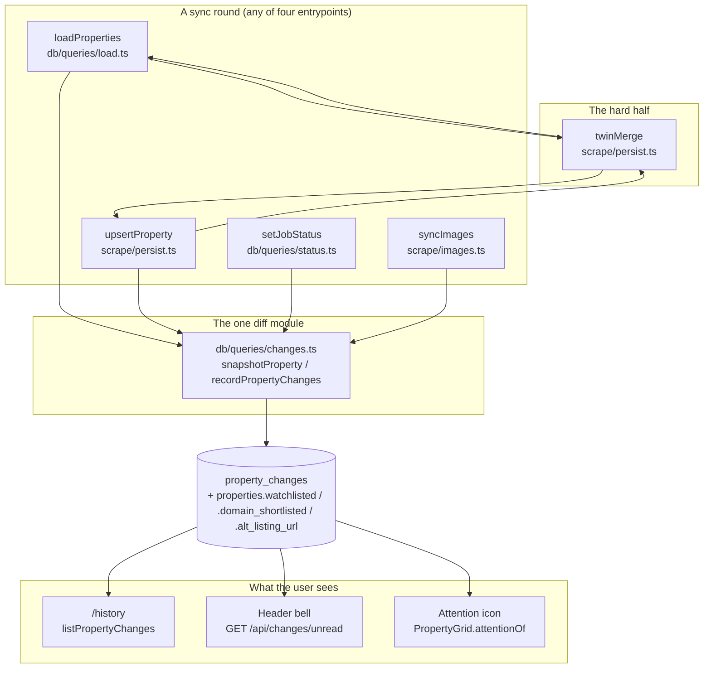

# Walkthrough: watchlist, `/history`, and the attention icon

**Branch:** `feat/watchlist-history-attention` off `features` · finished with a
**local merge back into `features`**, no PR (standing user instruction). No
commit exists yet on this branch beyond `features`' own tip (`6110fb1`) —
every anchor below is `path:line` against the working tree, not a commit hash.

Three features were asked for: a shared watchlist with an in-app notification,
a `/history` page of every property change, and an attention icon for
to-view/top-30 properties missing from the Domain shortlist. All three shipped
and are the easy half of this document. **What the document is actually about**
is that the change log carries one invariant — *"re-running an identical sync
adds zero rows"* — and getting there took three review rounds plus one
escalation to the user, because the first two fixes were each correct about
the defect they named and silent about the one they created next door.

**Out of scope, stated in the brief and held to:** no backfill of history (the
page is legitimately empty until the next sync); no scraper/Domain browser
work — "Domain shortlist" here means the storage + write path only, not the
harvest; no per-profile watchlist; no per-change read/unread rows; no auth on
the new `POST /api/batch` section (the endpoint has none anywhere else on this
LAN); no change to `shortlist_tag` semantics.

## Architecture



## Sequence — a dual-listed house, sync round N and N+1

This is the flow all three review rounds live in.

```mermaid
sequenceDiagram
    participant L as loadProperties
    participant T as twinMerge
    participant C as recordPropertyChanges
    participant H as /history

    Note over L,T: Round N: Domain listing exists; REA feed item for the same address arrives
    L->>T: twinMerge(canonicalId, rea-item, set)
    T->>T: cross-source, canonical still live -> GAP-FILL ONLY
    T-->>L: { set: gaps-only, log: false }
    L->>L: db.update(properties) with the gap-filled set
    L--xC: log:false -- recordPropertyChanges is NOT called
    Note over L,H: /history gains nothing this round -- correct, nothing changed

    Note over L,T: Round N+1: identical REA payload arrives again
    L->>T: twinMerge(canonicalId, rea-item, set)
    T-->>L: { set: gaps-only (already filled -> empty), log: false }
    L->>L: db.update with an empty/no-op set
    Note over L,C: Zero rows -- the invariant holds

    Note over L,T: Contrast: Domain listing is later withdrawn
    L->>T: twinMerge(canonicalId, rea-item, set)
    T->>T: isDelisted(canonical) is now true -> OVERWRITE + LOG
    T-->>L: { set: full overwrite, log: true }
    L->>C: recordPropertyChanges(id, before)
    C->>H: property_changes rows -- the surviving listing can now correct the row
```

## Change table

| File | Change | Notes |
| --- | --- | --- |
| `src/db/schema.ts`, `src/db/ddl.ts` | `property_changes` table + index; `properties.watchlisted`, `.domain_shortlisted`, `.alt_listing_url` via `pendingMigrations` | Purely additive, idempotent — see Decisions |
| `src/db/queries/changes.ts` (new) | `snapshotProperty`, `recordPropertyChanges`, `unreadWatchlistChangeCount` — the one diff module | The spine — see The flow |
| `src/db/queries/load.ts` | `loadProperties` snapshots before write, calls `twinMerge`, logs unless the merge says not to | Entrypoint 1 |
| `src/scrape/persist.ts` | `twinMerge` (new) + `upsertProperty`'s three branches wired to snapshot/log | Entrypoint 2, and the hard half |
| `src/db/queries/status.ts` | `findProperty` now matches `alt_listing_url`; `setJobStatus` snapshots/logs | Entrypoint 3 |
| `src/scrape/images.ts` | `syncImages` snapshots/logs around the photo insert loop | Entrypoint 4 |
| `src/db/queries/properties.ts` | `ListingUrls`/`saleStatusOf` (the one delisted-derivation), `getSaleStatus`/`isDelisted` re-signatured, `listPropertyChanges` (new), `PropertyListItem` strips `altListingUrl` | Feeds `/history`, the grid, the detail page and `changes.ts` from one function |
| `src/app/history/page.tsx` (new) | Newest-first feed, offset pagination, empty-state copy naming the no-backfill decision | See Decisions — pagination |
| `src/app/api/changes/unread/route.ts` (new) | `GET` count / `POST` watermark, shared not per-profile | Backs the header bell |
| `src/components/NotificationBadge.tsx` | Extracted `useUnreadCount`/`Bell`, now renders two bells | Share bell unchanged in behaviour |
| `src/components/WatchToggle.tsx`, `ClearWatchWatermark.tsx` (new) | Detail-page star; watermark-clear side effect on `/history?watch=1` | Minimal client leaves — see Decisions |
| `src/components/PropertyGrid.tsx` | Star toggle + attention icon on **both** `PropertyCard` and `PropertyRow`; `top30Ids`/`attentionOf`/`watchedOf`/`setWatched` | `req-001` fix folded in — see Decisions |
| `src/lib/property-filters.ts`, `src/components/MapView.tsx` | `watchFilter` in `FilterState`, `watchedOf` in `FilterCtx`, `MapView` supplies its accessor | The shared filter module doing its job |
| `src/db/queries/shortlist.ts` (new), `scripts/shortlist-set.ts` (new) | `setDomainShortlist` full replace, `npm run shortlist:set` | Storage/write path only, per the brief |
| `src/app/api/batch/route.ts` | New `shortlist` section, applied after `properties` | |
| `src/app/api/properties/[id]/route.ts` | `watchlisted`/`domainShortlisted` added to the PATCH allow-list | User-set fields, excluded from change detection like the brief's other user fields |
| `scripts/_feed-load.ts` | Seven fields changed from `?? null` to `?? undefined`/`|| undefined` | The caller-side half of `tech-005` — see Decisions |
| `.claude/review/conventions.md` | Three new entries: the twin-merge rules (the ingest-path leak recorded as a subsection of it), the REA-first false negative, and an unrelated stale-`.next` build-cache caveat | |
| `test/changes.test.ts`, `test/history-limit.test.ts`, `test/shortlist.test.ts` (all new), `test/batch.test.ts`, `test/ingest.test.ts`, `test/property-filters.test.ts` | See Tests | |
| `docs/architecture.drawio`, `.claude/agent-memory/**` | Ignore this — diagram touch-up and agent memory bookkeeping, not part of the change |

## The flow

| Entrypoint | Trigger | First changed file it reaches |
| --- | --- | --- |
| `loadProperties` | `npm run load`, harvest scripts, `POST /api/batch`'s `properties` section | `src/db/queries/load.ts:110` |
| `upsertProperty` | `POST /api/ingest`, `npm run scrape` | `src/scrape/persist.ts:184` |
| `setJobStatus` | `mark-sold`/`mark-withdrawn` CLIs, `POST /api/batch`'s `sold`/`withdrawn` sections | `src/db/queries/status.ts:39` |
| `syncImages` | Any of the above, when a payload carries images | `src/scrape/images.ts:68` |

All four follow the same two-line idiom: snapshot the tracked fields *before*
the write, do the write, then hand the snapshot to
`recordPropertyChanges` (`src/db/queries/changes.ts:110`). Follow
`loadProperties` (`src/db/queries/load.ts:84`) as the representative case: it
resolves the row by URL or by `findTwinByAddress` (`src/scrape/persist.ts:51`),
snapshots at line 110, then — this is the hop worth slowing down for — asks
`twinMerge` (`src/scrape/persist.ts:109`) how the write may land whenever the
match came from the twin lookup rather than the URL lookup
(`src/db/queries/load.ts:185`). `twinMerge` returns both the `set` to write and
a `log` boolean; line 206 obeys both — `recordPropertyChanges` only runs when
`twinMerge` says the write is real news. `upsertProperty`
(`src/scrape/persist.ts:144`) does the identical dance in its twin branch
(`:203-206`); its plain by-URL branch (`:184-188`) and its fresh-insert branch
(`:209-215`) always log, because there is no merge decision to make there.

`snapshotProperty` (`src/db/queries/changes.ts:57`) is the one place the
tracked-field list exists — thirteen columns plus `saleStatus` (delegated to
`getSaleStatus`, not re-derived) and a live `COUNT(*)` over `images`. Diffing
happens through `normalize()` (`:91`), which collapses everything to
string-or-null before comparing: this is the line the whole feature stands on,
because a re-read row can differ from a written one by JS type alone (`1` vs
`"1"`) and a strict compare would put a spurious row on `/history` for every
property on every sync. `/history` (`src/app/history/page.tsx`) reads the
result back through `listPropertyChanges`
(`src/db/queries/properties.ts:579`), and the header bell
(`src/components/NotificationBadge.tsx`) polls
`GET /api/changes/unread` against `unreadWatchlistChangeCount`
(`src/db/queries/changes.ts:150`) — the same table, joined against
`watchlisted` this time instead of unfiltered.

## Decisions

### One diff module, four call sites, identical two lines

`FIELD_NAMES` (`src/db/queries/changes.ts:34`) is the only place the tracked
set is written down. The alternative considered was a per-call-site logger
taking an explicit field list — rejected outright, because four copies of the
tracked-field set is exactly the drift the brief forbids. A brand-new property
(`before === null`) gets one synthetic `listing: null → "new"` row rather than
thirteen near-identical ones (`:122-125`) — a deliberate reading of "all the
changes to all properties," flagged to the requirements lane rather than
shipped silently, and accepted.

### The twin merge: three rounds, each fix correct and each fix incomplete

This is the run's actual center of gravity, so it's told in the order it
happened rather than just the rules that came out the other end.

**The diff entering review overwrote everywhere.** A twin match — same house,
other source — copied every non-null field from the newcomer onto the
canonical row, the way `upsertProperty`'s comment used to read: *"only
overwrite with values the newcomer actually has."* That is fine for a genuinely
new value and wrong for a dual-listed house: the secondary source writes its
own wording every sync, the canonical listing loads by URL next and finds a
value it never wrote, logs a change back to its own wording, and the twin
writes its wording again the round after. Reproduced live: 4 → 10 → 16 → 22
phantom rows over four identical rounds (`tech-001`, round 1).

**Round 1's fix was "stop logging on the twin branch,"** leaving the merge
itself still a blind overwrite. Correct for the named defect on the repeat
test it was built against, and wrong for the underlying problem: the twin
still rewrote the canonical row's wording every sync, silently, just without a
paper trail telling anyone. **The implementer who applied it volunteered this
before anyone asked** — measured that a dual-listed house whose sources
disagree still never converges, because the canonical listing's own next
reload finds a value it never wrote and logs a change back to its own wording,
forever.

**The next attempt made the merge gap-fill-only instead of overwriting, and
round 2 found it broke two different things at once.** `req-003`
(requirements) argued a house withdrawn from Domain but still live on REA
would now freeze at whatever the canonical listing last said, with no
mechanism to un-freeze once the canonical side stops being loaded — correctly
escalating the fix itself rather than the symptom. `tech-004` (technical, the
same round) found gap-fill-only also froze a *same-source* relisting: a house
relisted under a new URL on the same site is a twin match too, so its price
and inspection time stuck at the withdrawn listing's values, `external_id`
froze with them, and a later `markSold` on the relisting threw `No property
for <url>` instead of resolving it.

**`req-003` went to the user**, who chose the shape now in force and added a
rule of their own (`"active on one source means active in this app"`).
`tech-004` didn't need the user — a relisting is unambiguously new information
regardless of that rule, so it was fixed directly by carving same-source
matches back out to overwrite-and-log. The four rules, as `twinMerge`
implements them (`src/scrape/persist.ts:109-131`):

1. **Same-source match (a relisting under a new URL): overwrite, and log.**
   `incoming.sourceSite === current.sourceSite` (`:116-118`) — a relisting is
   genuinely new information; nothing else will ever correct a frozen one,
   because the old URL never returns in the feed.
2. **Cross-source, canonical still live: gap-fill only, never log.**
   (`:128-130`) — a column already populated by the canonical listing is left
   alone; only a `null` gets filled. This is what makes convergence possible at
   all: nothing ever overwrites, so nothing ever has to be corrected back.
3. **Cross-source, canonical delisted: overwrite, and log.** (`:126`) — once
   `isDelisted(current)` is true, the canonical URL is never loaded by URL
   again, so there is nothing left to oscillate, and freezing the row would
   keep stale data the surviving listing could have corrected.
4. **Delisted only when every known URL is; `sold` is terminal on any of
   them.** Lives in `saleStatusOf` (`src/db/queries/properties.ts:69`), the
   single derivation now used by the grid, the map, the detail page, and
   `changes.ts`'s own `sale_status` field — there is no second definition of
   "delisted" left in the tree.

Each round's remedy is visible in `test/changes.test.ts`: the round-1 defect at
lines 233–273 (a twin attach and a repeat round both add exactly one row, not
one per field), the round-3 rules at lines 358–508 (relisting overwrite,
gap-fill-while-live, overwrite-once-delisted, sold-terminal-on-either-side).

### `findProperty` learned to resolve `alt_listing_url` — outside the brief, flagged rather than silent

Rule 4 has a default: an unmarked URL reads as live. No existing write path
could ever mark the alt URL sold/withdrawn, so shipping rule 4 alone would have
made every row with an alt permanently non-delisted — a sold house sitting in
the active grid with no badge, `hideDelisted` unable to hide it. `findProperty`
and `setJobStatus` (`src/db/queries/status.ts:23-39`) now match on either URL
and record the status against the *caller's* URL, not the row's canonical one.
The implementer surfaced this rather than doing it quietly, which is why it got
reviewed (round 3) rather than shipping unexamined.

`sold` being terminal on *either* URL (rule 4, second half) is a narrower call
the lead made alone: whether the REA round marks its own URL sold could not be
verified from this worktree (its scripts live on the `realestate` branch), and
a sold house is not "active" anywhere — the narrowing cannot contradict the
user's own rule in either direction.

### `PropertyListItem` strips `altListingUrl` at both levels, not one

`Omit<Property, "rawJson" | "description" | "altListingUrl">`
(`src/db/queries/properties.ts:25`) only changes the *type*; the runtime
spread that builds each row still had to be told separately. It now reads
`.map(({ rawJson: _raw, description: _desc, altListingUrl, ...p }) => ...)`
(`:376`) — without `altListingUrl` added there, the field would still have
serialised into the RSC payload for ~290 rows despite the type omitting it
(round 3 caught this as a "good catch," not a finding). Same reasoning as the
pre-existing `rawJson`/`description` strip this file already documents.

### `setDomainShortlist` is a full replace, guarded against "nothing matched"

A round-1 finding (`sec-001`) treated as a Major despite its Minor label: a
non-empty URL list where *nothing* matched fell through to the same branch as
an intentionally empty list, clearing `domain_shortlisted` for every Domain
property on the strength of one typo'd URL — on an endpoint with no auth.
`setDomainShortlist` (`src/db/queries/shortlist.ts:41-47`) now short-circuits
that case to `cleared: 0` before it can reach the clear-all branch.

### Pagination: the growing-`?limit=` decision didn't survive review

The original call was that "Load more" would re-render with a bigger `limit`
rather than an `offset`, reasoning that a server component can't accumulate
two fetches without client-side pagination state (which the brief rules out).
That reasoning is sound and is why `/history` has no client state today — but
the growing-limit *mechanism* it produced dead-ended at the 2000-row cap
(`tech-006`, round 2): once `limit` hits 2000, `Math.min(limit, 2000)` re-caps
every further request to the same 2000 newest rows, so "Load more" renders
forever and never reaches an older row. The page now pages by `?offset=`
instead (`src/app/history/page.tsx:57-62`), with a fixed `PAGE_SIZE` and a
`Newer` link so it isn't a one-way trapdoor. `listPropertyChanges` already
accepted an `offset` parameter before this fix — the page had simply never
passed it.

### The attention icon covers both layouts, and is scoped to Domain-sourced rows

The first pass computed `attentionOf` inline, only in the gallery/compact
branch (`req-001`) — a user in list view got none of requirement 3, and its
*absence* reads as "nothing needs attention," which is worse than the feature
being missing outright. `attentionOf` (`src/components/PropertyGrid.tsx:949`)
is now one `useCallback` shared by `PropertyCard` and `PropertyRow` (used at
`:1401` and `:1416`). It gates on `p.sourceSite === "domain"`
(`req-002`/`req-004`): `domainShortlisted` can never be 1 for a `source_site
= 'rea'` row, so without the gate every REA property would carry a permanent,
unactionable warning. The accepted trade, recorded in `conventions.md`: a
house first sighted on REA gets no icon at all, even if it would otherwise
qualify — fixing that needs the row to know it also has a Domain URL, which
`alt_listing_url` only made possible later in this same run.

`top30Ids` (`:934`) is computed once over the *full*, non-delisted list — not
the filtered view (typing in search can't change who's in the top 30) and not
including sold/withdrawn rows (a sold listing doesn't need chasing). The
delisted exclusion is a free choice, recorded here because it narrows the
brief's literal `vibeRank <= 30` formula and was flagged by independent
verification as worth a line rather than left in a code comment alone.

### `MapView` had to change, and that's the filter contract working

`watchFilter` went into `FilterState` and `watchedOf` into `FilterCtx`
(`src/lib/property-filters.ts:32,200`), which forced `MapView` to supply
`p.watchlisted === 1` (`src/components/MapView.tsx:141`). That file's own doc
comment says a filter added to the grid can't silently go missing from the
map — `MapView` failing to compile without the new accessor is the contract
doing its job, not collateral damage from an unrelated file.

## Where to look to review this

In priority order:

1. `src/scrape/persist.ts:109-131` (`twinMerge`) against
   `test/changes.test.ts:275-508`. This is the whole three-round story;
   confirm the four rules can't desynchronize from `saleStatusOf`
   (`src/db/queries/properties.ts:69-77`), the only other place "delisted"
   is decided.
2. `src/db/queries/changes.ts:90-140` (`normalize`, `recordPropertyChanges`).
   Confirm the `try/catch` really can't lose an upsert — `test/changes.test.ts:550-558`
   drops the table mid-run to prove it — and that `before === null` is the
   only path to the synthetic `listing` row.
3. `src/app/history/page.tsx:44-62` plus
   `test/history-limit.test.ts:158-201`. Confirm offset paging reaches a row
   that `limit` alone provably cannot (`bulk0`), and that the guard rejects
   `"1e21"`/`"-5"` for both `limit` and `offset`.
4. `src/db/queries/shortlist.ts:41-47`. Confirm the all-unmatched case really
   short-circuits before the clear-all branch — this endpoint has no auth.
5. `src/components/PropertyGrid.tsx:949-952` and its two call sites
   (`:1401`, `:1416`). Confirm both tile layouts compute `attentionOf`
   identically rather than one recomputing its own version.

## Tests

**Three new suites, wired into `package.json`'s `test` script**
(`test/changes.test.ts`, `test/shortlist.test.ts`, `test/history-limit.test.ts`),
plus targeted additions to `test/batch.test.ts`, `test/ingest.test.ts` and
`test/property-filters.test.ts`. All pass; independent verification re-ran
every one of them plus `npx tsc --noEmit` and `npm run build`, both clean.

**`test/changes.test.ts`** drives the four real write paths rather than
inserting rows by hand, because the point is that those paths log correctly,
not that the table can hold a row. It pins, in order: the zero-rows-on-no-op
invariant (a no-op `loadProperties` adds nothing), the single synthetic
`listing` row for a new property, one row per field for a genuine multi-field
change, zero rows for the user-excluded `description`, `normalize()`'s `1`/`"1"`
equivalence (constructed directly, since every real write path already
coerces through SQLite's column affinity before it could differ), `sale_status`
through the real `markSold`/`markWithdrawn`, both twin-merge regressions
(overwrite-forever and freeze-forever) with a five-round repeat to prove
convergence, the relisting-overwrite rule with a three-round repeat, and the
never-throws guarantee by dropping `property_changes` mid-test and confirming
the property upsert still lands.

**`test/history-limit.test.ts`** covers `listPropertyChanges` directly
(newest-first order, the `watchedOnly` filter, joined address/price/thumbnail
via a real photo so `pickHero` is genuinely exercised) and the page's
`?limit=`/`?offset=` guards, including the over-2000-rows regression
(`tech-006`) that proves paging reaches a row `limit` alone cannot.

**`test/shortlist.test.ts`** and `test/batch.test.ts`'s new block cover
`setDomainShortlist`'s full-replace/idempotent/unknown-URL-not-an-error
behaviour, and that an unmatched URL doesn't fall through to clear-everything.

**Deliberately not covered, stated rather than silently absent:** no test
renders the new UI — the star toggle, the ⚠ badge, the watch chip, the two
header bells. `tsc` and `build` are the only evidence for these. Risk is
judged low (`button` is already in `PropertyGrid`'s `INTERACTIVE_SEL`, so the
new star can't hijack card navigation, and the compare checkbox's accessible
name is unchanged by the markup restructure), and `npm run test:ui` — the
brief's own "slow, optional" check — was not run for this reason but would
close it. Also not covered: the `upsertProperty`/ingest-path phantom-row leak
below has no regression test, because there is nothing yet to regress against.

## Known limitations, stated rather than fixed

- **The ingest path (`upsertProperty`, so `/api/ingest` and `npm run scrape`)
  still leaks ~1 phantom row per divergent field per round** for a
  cross-source twin whose sources disagree — measured 2/round for a
  REA-canonical row whose Domain twin supplies `agent_name`/`agency_name`.
  The equivalent leak on the *load* path was fixed at the caller
  (`scripts/_feed-load.ts` now sends `undefined` instead of `?? null` for
  seven fields, five of them tracked). The ingest path can't take the same
  fix: `src/scrape/adapters/rea.ts` assigns explicit `null` for every field an
  adapter failed to find, so `NormalizedProperty` cannot distinguish "not
  observed" from "observed as absent" by the time it reaches `upsertProperty`.
  Closing this needs either a by-URL write-semantics change or a wider
  `NormalizedProperty` — both larger than the feature that surfaced them.
- **The attention icon has a REA-first false negative**, described under
  Decisions above: a house first sighted on realestate.com.au never shows the
  icon, even once it would otherwise qualify, because `domainShortlisted`
  gating needs a Domain URL to reason about and `sourceSite` never changes on
  a twin merge.
- **`/history` is not backfilled.** It is legitimately empty until the next
  sync writes the first rows — stated in the page's own empty-state copy, not
  just here.

## Open questions

- The attention icon will fire for every to-view / top-30 Domain-sourced
  property until a Domain harvest round actually populates
  `domain_shortlisted`. That is correct behaviour for an empty column but will
  look like a bug on day one. Worth a line in the merge message.
